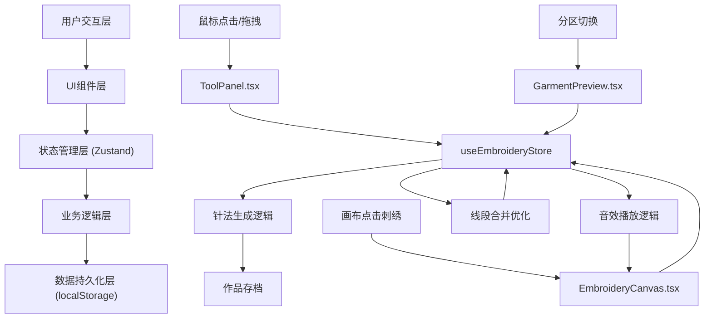

## 1. 架构设计



## 2. 技术描述
- **前端框架**：React@18 + TypeScript@5
- **构建工具**：Vite@5
- **状态管理**：Zustand@4
- **画布渲染**：react-konva@18 + konva@9
- **动画库**：framer-motion@11
- **数据持久化**：localStorage
- **初始化工具**：vite-init

## 3. 项目文件结构与调用关系

| 文件路径 | 职责 | 依赖/调用 |
|----------|------|-----------|
| `package.json` | 项目依赖与脚本配置 | 无 |
| `vite.config.js` | Vite构建配置，base: './' | 无 |
| `tsconfig.json` | TypeScript严格模式配置 | 无 |
| `index.html` | 入口页面，背景#5a3a2a，思源宋体 | 无 |
| `src/store.ts` | 全局状态：分区、纹样、颜色、针法、针迹、针数 | 无 |
| `src/App.tsx` | 主组件：织案场景布局，数据初始化，状态汇总 | store.ts, ToolPanel, EmbroideryCanvas, GarmentPreview |
| `src/components/ToolPanel.tsx` | 工具面板：纹样库、色盘、针法、重置 | store.ts |
| `src/components/EmbroideryCanvas.tsx` | 刺绣画布：react-konva渲染，针法生成，针数统计 | store.ts, 针法工具函数 |
| `src/components/GarmentPreview.tsx` | 衣片预览：四分区展示，纹样缩略图 | store.ts |
| `src/utils/stitches.ts` | 针法生成工具函数 | 无 |
| `src/utils/audio.ts` | 音效播放工具函数 | 无 |
| `src/types/index.ts` | TypeScript类型定义 | 无 |
| `src/data/patterns.ts` | 纹样模拟数据 | 无 |

**数据流向**：
```
用户操作 → ToolPanel/GarmentPreview/EmbroideryCanvas → 
store状态更新 → EmbroideryCanvas重新渲染 → 
针数达标 → 完成动画 + 音效 → 四分区完成 → 呈览弹窗 → localStorage存档
```

## 4. 核心类型定义

```typescript
// src/types/index.ts
export type GarmentZone = 'collar' | 'sleeve' | 'front' | 'skirt';
export type PatternType = 'dragon' | 'phoenix' | 'fire' | 'algae';
export type StitchType = 'plain' | 'oblique' | 'laid' | 'rolling';
export type ThreadColor = {
  name: string;
  value: string;
};

export interface StitchLine {
  id: string;
  points: number[];
  color: string;
  strokeWidth: number;
  stitchType: StitchType;
}

export interface ZoneState {
  pattern: PatternType;
  color: string;
  stitchType: StitchType;
  stitches: StitchLine[];
  stitchCount: number;
  targetCount: number;
  completed: boolean;
}

export interface EmbroideryState {
  selectedZone: GarmentZone;
  zones: Record<GarmentZone, ZoneState>;
  isCompletionAnimating: boolean;
  allCompleted: boolean;
}
```

## 5. 性能优化策略

### 5.1 线段合并优化
- 画布同时显示不超过5000条线段
- 超出时自动合并最早10%的线段为一条粗线段（线宽3px，颜色取平均色）
- 使用requestAnimationFrame确保帧率≥30fps

### 5.2 渲染性能
- 使用react-konva的Layer分离静态与动态元素
- 针迹生成与渲染延迟≤8ms
- 完成动画采用CSS opacity动画而非重绘

## 6. 数据持久化
- 存档key: `embroidery_archives`
- 存档数据结构：
```typescript
interface Archive {
  id: string;
  createdAt: number;
  zones: Record<GarmentZone, {
    pattern: PatternType;
    color: string;
    stitchType: StitchType;
    stitchCount: number;
    completed: boolean;
  }>;
}
```
