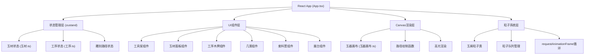

## 1. 架构设计


## 2. 技术描述
- **前端框架**：React@18 + TypeScript@5 + Vite@5
- **状态管理**：zustand@4
- **动画库**：framer-motion@11 + CSS Animations
- **构建工具**：Vite@5，base路径'./'
- **渲染技术**：Canvas 2D API用于雕刻路径和粒子
- **样式方案**：原生CSS + CSS Variables，避免Tailwind以保证精细纹理控制
- **字体**：楷体（KaiTi），系统字体回退

## 3. 文件结构
```
├── package.json
├── index.html
├── vite.config.js
├── tsconfig.json
└── src/
    ├── main.tsx
    ├── App.tsx
    ├── 玉材.ts
    ├── 工序.ts
    ├── 玉器画布.ts
    ├── 界面组件.ts
    ├── types.ts
    └── styles/
        └── global.css
```

## 4. 数据模型定义

### 4.1 玉材类型
```typescript
interface 玉材类型 {
  id: string;
  名称: string;
  颜色: string;
  硬度: [number, number]; // 摩氏硬度范围
  纹理CSS: string; // radial-gradient纹理
}
```

### 4.2 工具类型
```typescript
interface 工具类型 {
  id: string;
  名称: string;
  快捷键: string;
  刀法: '阴线' | '阳纹' | '透雕' | '浮雕' | '钻孔';
  笔触宽度: number;
  深度: number;
  颜色: string;
  图标: string;
}
```

### 4.3 工序类型
```typescript
type 工序阶段 = '切割' | '雕刻' | '抛光';

interface 工序状态 {
  当前阶段: 工序阶段;
  选中工具: 工具类型 | null;
  粒子队列: 粒子类型[];
}
```

### 4.4 雕刻路径
```typescript
interface 雕刻路径 {
  id: string;
  工具ID: string;
  刀法: string;
  点数组: { x: number; y: number }[];
  颜色: string;
  宽度: number;
  深度: number;
}
```

### 4.5 粒子类型
```typescript
interface 粒子类型 {
  id: number;
  x: number;
  y: number;
  vx: number;
  vy: number;
  大小: number;
  颜色: string;
  生命值: number;
  最大生命: number;
}
```

## 5. 核心模块说明

### 5.1 玉材模块 (玉材.ts)
- 定义五种玉材的静态数据
- zustand store管理选中的玉材和玉料状态
- 导出玉材数组和选择/放置玉料的actions

### 5.2 工序模块 (工序.ts)
- 管理切割/雕刻/抛光三阶段切换
- 工具列表和刀法参数定义
- 粒子队列管理（添加、更新、清理）
- requestAnimationFrame动画循环

### 5.3 玉器画布模块 (玉器画布.ts)
- Canvas组件负责玉器渲染
- 雕刻路径记录和重绘
- 高光跟随鼠标效果
- 玉料变形（切割分离、初坯成形、抛光放大）
- 导出绘制函数供外部调用

### 5.4 界面组件模块 (界面组件.ts)
- 左侧工具架组件
- 右侧工序木牌组件
- 玉材选择面板组件
- 几案操作区组件
- 废料筐和展台组件
- 拖拽交互、悬停提示实现

## 6. 性能优化策略
1. **粒子池**：对象池模式复用粒子，避免频繁GC
2. **离屏Canvas**：雕刻路径预渲染到离屏canvas
3. **节流**：鼠标移动事件节流处理
4. **粒子上限**：最多300个粒子，超出时移除最旧的
5. **分层渲染**：背景、玉料、路径、粒子分层绘制
6. **requestAnimationFrame**：统一动画循环，避免多重定时器

## 7. 交互实现要点
1. **拖拽API**：HTML5 Drag and Drop API实现玉材和工具拖拽
2. **鼠标绘制**：mousedown/mousemove/mouseup事件监听绘制路径
3. **碰撞检测**：判断切割路径是否贯穿玉料
4. **坐标转换**：Canvas坐标与屏幕坐标转换
5. **悬停提示**：CSS :hover + transition实现0.3秒延迟提示
