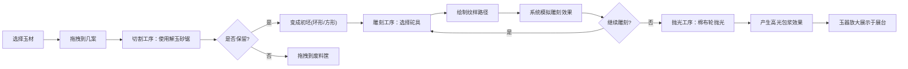

## 1. 产品概述
本项目是一款模拟明代苏州玉工碾玉成器的交互式Web应用，用户可以体验从璞玉到精美玉器的完整制作流程，感受中国传统玉器工艺的魅力。
- 核心目标：通过沉浸式交互体验，让用户了解古代玉器制作的五道工序（切割、研磨、钻洞、刻纹、抛光）
- 目标用户：传统文化爱好者、艺术学习者、普通网民
- 市场价值：传播中国传统工艺文化，提供寓教于乐的交互体验

## 2. 核心 Features

### 2.1 功能模块
1. **玉材选择**：右侧面板展示五种玉材，支持拖拽到操作区
2. **切割工序**：使用解玉砂锯切割石料，产生断裂效果和玉屑粒子
3. **雕刻工序**：选择不同砣具在玉料表面绘制纹样，模拟各种刀法效果
4. **抛光工序**：使用棉布轮抛光玉器，产生高光和包浆效果
5. **成果展示**：完成的玉器放大展示在中央展台

### 2.2 页面详情
| 页面名称 | 模块名称 | 功能描述 |
|-----------|-------------|---------------------|
| 主页面 | 玉材选择面板 | 五种玉材展示，悬停显示名称和硬度，拖拽到操作区 |
| 主页面 | 操作几案 | 中央70%区域，紫檀木纹理，放置玉料进行加工 |
| 主页面 | 工具架 | 左侧深色木架，四把雕刻工具可选择 |
| 主页面 | 工序木牌 | 右侧竖排木牌，显示当前工序状态 |
| 主页面 | 粒子系统 | 玉屑飞溅动画，requestAnimationFrame实现 |
| 主页面 | 雕刻画布 | Canvas/SVG绘制雕刻路径，支持多种刀法叠加 |
| 主页面 | 废料筐 | 右下角竹筐图标，拖拽废弃玉料 |
| 主页面 | 展台 | 中央展示完成抛光的玉器 |

## 3. 核心流程

## 4. 界面设计

### 4.1 设计风格
- **整体风格**：明代苏州作坊风格，古雅精致
- **主色调**：深棕色紫檀木#4a2e1b、竹编帘幕#d4c9a8、米白绢布#f5f0e1
- **辅助色**：玉材五色（乳白#f5f0e1、灰绿#7a9b7a、深黑#2a2a2a、浅黄#e6d5a8、暗红#8b3a3a）
- **强调色**：金色描边、木牌刻字浅黄#e6d5a8
- **字体**：楷体（KaiTi），呼应古典风格
- **纹理**：檀木条纹（repeating-linear-gradient）、竹编缝隙、玉材石纹（radial-gradient）

### 4.2 页面设计概要
| 模块名称 | UI元素 | 样式描述 |
|-----------|-------------|-------------|
| 背景 | 竹编帘幕 | 重复平铺缝隙线条，颜色#d4c9a8透光效果 |
| 几案 | 操作区 | 深色紫檀木#4a2e1b，占屏幕中间70%，檀木条纹纹理 |
| 玉材面板 | 玉材展示 | 右侧竖排，五种颜色方块，悬停显示tooltip |
| 工具架 | 工具展示 | 左侧深色木架，四把工具图标，悬停0.3秒显示名称 |
| 工序木牌 | 状态指示 | 竖排木牌#5d3a1a，刻字#e6d5a8，当前工序金色描边 |
| 雕刻区 | 素白绢布 | 米白#f5f0e1，位于几案中央 |
| 废料筐 | 竹筐图标 | 右下角，接受拖拽的废弃玉料 |
| 展台 | 玉器展示 | 中央区域，抛光完成玉器放大1.2倍 |

### 4.3 交互细节
- **拖拽**：玉材和工具支持HTML5拖拽，光标变为十字准星
- **悬停**：工具悬停0.3秒显示名称和快捷键提示
- **粒子**：每刀产生20-30个玉屑粒子，重力下落0.6秒消失，总数≤300
- **动画**：棉布轮旋转、锯子弓弦砂粒闪点、高光随鼠标移动
- **刀法效果**：V形阴线、U形浅槽、平底宽槽、圆形孔洞，以不同颜色区分

### 4.4 响应式设计
- 桌面端优先设计，支持1280px及以上分辨率
- 移动端简化布局，保留核心交互功能
- 触摸操作支持（长按替代悬停）

## 5. 技术约束
- 使用TypeScript + React + Vite构建
- 状态管理使用zustand
- 动画使用framer-motion和CSS动画
- 粒子系统使用requestAnimationFrame
- 雕刻路径使用Canvas或SVG实现
- 性能要求：60fps流畅度，粒子总数≤300
