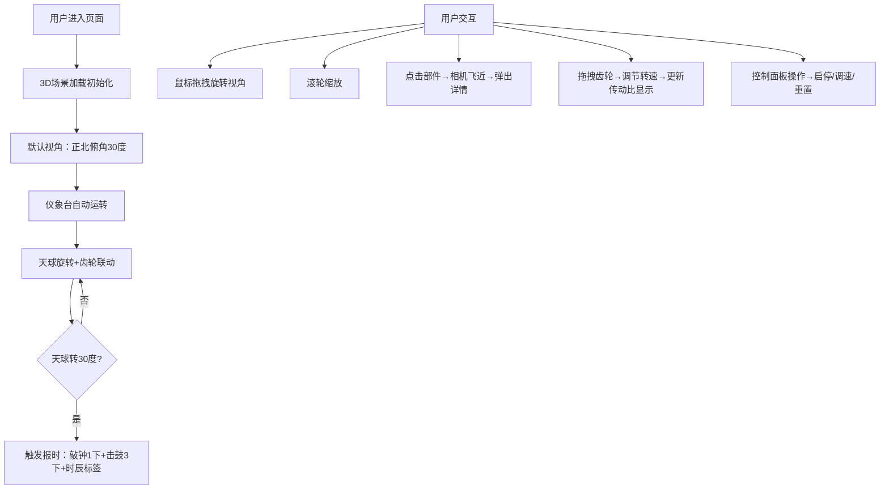

## 1. 产品概述
古代水运仪象台三维交互可视化应用，模拟北宋司天监天文台的水运仪象台运作。用户以第一人称视角观察浑象天球自动运转、水力驱动的报时机构，并通过交互调节运行速度，沉浸式体验中国古代天文科技成就。

## 2. 核心功能

### 2.1 用户角色
| 角色 | 注册方式 | 核心权限 |
|------|----------|----------|
| 访客 | 无需注册 | 3D场景浏览、部件交互、速度调节、视角控制 |

### 2.2 功能模块
1. **主3D场景**：水运仪象台完整模型（五层木阁、浑象天球、报时木人、齿轮组、水轮）
2. **天体运行模拟**：浑象天球自动旋转，模拟天体周日视运动
3. **报时系统**：木人按时辰敲钟击鼓，显示时辰标签
4. **齿轮传动交互**：可拖拽齿轮调节转速，观察联动效果
5. **控制面板**：启动/暂停、速度调节、时辰显示、视角重置
6. **部件详情**：点击部件弹出浮窗显示名称与功能说明

### 2.3 页面详情
| 页面名称 | 模块名称 | 功能描述 |
|---------|----------|----------|
| 主场景 | 仪象台3D模型 | 构建12单位高五层木阁，砖石台基，斗拱屋檐结构 |
| 主场景 | 浑象天球 | 直径3单位，绘制28宿星点及银河带，自动旋转周期可调（2-30秒） |
| 主场景 | 报时木人 | 第二层级两尊木人，每30度（一个时辰）触发敲钟击鼓动画 |
| 主场景 | 齿轮传动 | 第三层4个铜齿轮（12/24/36/48齿），可单独拖拽调节转速 |
| 主场景 | 视角控制 | 鼠标拖拽旋转（360度水平，0-80度俯仰），滚轮缩放（5-25单位） |
| 主场景 | 部件交互 | 点击部件相机平滑飞近（0.4秒），弹出半透明浮窗说明 |
| 控制面板 | 启动/暂停 | ▶/⏸ emoji按钮切换运行状态 |
| 控制面板 | 速度调节 | 滑块0.1x-10x，步长0.1，古铜色轨道金色滑块 |
| 控制面板 | 时辰显示 | 与报时同步更新十二时辰汉字 |
| 控制面板 | 重置视角 | 回到正北俯角30度，距离15单位 |

## 3. 核心流程

## 4. 用户界面设计

### 4.1 设计风格
- **主色调**：深褐木纹#5d3a1a、浅木纹#8b7355、古铜色#8b5e3c
- **点缀色**：金色#ffd700、暖黄#f5c542、浅米#e6d5b8
- **背景色**：深夜深蓝#1a1a2e
- **材质风格**：宋代木构建筑风格，木纹+青铜质感，星点发光效果
- **动效风格**：framer-motion平滑过渡（0.15秒），按钮悬停放大1.05倍+提亮10%

### 4.2 页面设计概述
| 页面名称 | 模块名称 | UI元素 |
|---------|----------|--------|
| 主场景 | 3D渲染区 | 全屏Three.js画布，深夜星空背景，仪象台居中 |
| 主场景 | 浑象天球 | 白色发光星点，半透明白色银河带，自动旋转 |
| 主场景 | 报时木人 | 古装人形，持钟持鼓，敲击中古钟#d4af37，鼓#8b4513 |
| 主场景 | 齿轮组件 | 古铜色金属质感，金色发光高亮，按齿数比联动 |
| 主场景 | 部件浮窗 | 半透明木纹边框#5d3a1a，橙黄文字#f5c542 |
| 控制面板 | 悬浮面板 | 半透明黑底#1a1a1a（70%透明），圆形圆角，右下角悬浮 |
| 控制面板 | 控制按钮 | ▶/⏸ emoji，悬停放大1.05倍 |
| 控制面板 | 速度滑块 | 古铜色轨道，金色圆形滑块，显示当前倍数带"x"后缀 |
| 控制面板 | 时辰显示 | 暖黄#f5c542大号字体，与报时同步 |

### 4.3 响应式
- **桌面端**：全屏3D场景，控制面板右下角悬浮
- **移动端**（宽度<768px）：控制面板移至屏幕底部固定，高度缩小30%，3D模型整体缩小至70%

### 4.4 3D场景指引
- **环境**：深夜深蓝#1a1a2e背景，模拟星空环境，营造天文台夜晚氛围
- **光照**：多光源系统——环境光（暖白色0.3强度）+ 方向光（模拟月光，冷白色0.6强度，投射阴影）+ 点光源（浑象内部发光，暖白色0.8强度）
- **相机设置**：PerspectiveCamera，fov 60度，初始位置(0, 8, 15)，看向原点。OrbitControls：minDistance 5，maxDistance 25，minPolarAngle 0.17（10度），maxPolarAngle 1.4（80度）
- **交互与动画**：所有旋转使用requestAnimationFrame驱动，齿轮按齿数比联动计算，相机平滑移动使用lerp插值
- **后处理**：Bloom效果增强星点和齿轮高光，SSAO增强场景深度感
- **性能预算**：总面数控制在5万面以内，draw call < 50，帧率稳定45fps以上

## 5. 性能要求
- **帧率**：全速10x运行时稳定45fps以上
- **内存**：不超过300MB
- **响应**：齿轮联动计算延迟<50ms
- **音效**：Web Audio API合成800Hz钟声和200Hz鼓声
