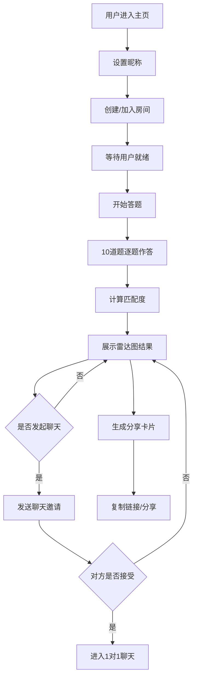

## 1. 产品概述

MatchMinds 是一款基于趣味问答和回合制对战的多人社交匹配应用，旨在解决社交中匹配效率低、话题冷启动难的问题。通过共同答题和匹配度计算，帮助用户快速找到兴趣、观点最契合的伙伴。

- 目标用户：需要拓展社交圈、寻找志同道合伙伴的年轻人群体
- 核心价值：通过游戏化答题降低社交门槛，基于真实观点的匹配提高社交质量

## 2. 核心功能

### 2.1 用户角色

| 角色 | 注册方式 | 核心权限 |
|------|---------|---------|
| 普通用户 | 匿名/昵称登录 | 加入房间、参与答题、查看匹配、发起聊天、生成分享卡片 |

### 2.2 功能模块

1. **主页**：房间创建/加入、用户昵称设置、在线人数展示
2. **答题房间**：题目展示、倒计时进度条、选项交互、即时反馈
3. **匹配结果页**：圆环雷达图、高匹配用户列表、分享卡片生成
4. **聊天页面**：实时消息列表、共同点面板、聊天邀请通知

### 2.3 页面详情

| 页面名称 | 模块名称 | 功能描述 |
|---------|---------|---------|
| 主页 | 房间入口 | 创建房间、输入房间号加入、设置昵称 |
| 主页 | 在线状态 | 显示当前在线人数、热门房间列表 |
| 答题房间 | 题目展示 | 随机抽取10道题目，每题4个选项，15秒限时 |
| 答题房间 | 倒计时组件 | 渐变色进度条，最后3秒红色闪烁 |
| 答题房间 | 选项交互 | 点击弹起动画，即时对错反馈 |
| 匹配结果页 | 雷达图 | 圆环雷达图展示与各用户匹配度 |
| 匹配结果页 | 聊天邀请 | 点击用户弧段发起聊天邀请 |
| 匹配结果页 | 分享卡片 | 生成包含头像、匹配用户、社交文案的分享卡片 |
| 聊天页面 | 消息列表 | 实时滚动消息，虚拟滚动优化性能 |
| 聊天页面 | 共同点面板 | 动态显示答案一致的题目，新消息时闪烁提示 |

## 3. 核心流程

用户进入应用 → 设置昵称 → 创建/加入房间 → 等待其他用户加入 → 开始答题（10道题，每题15秒）→ 系统计算匹配度 → 查看雷达图和匹配结果 → 点击高匹配用户发起聊天 → 对方接受后进入1对1聊天 → 游戏结束生成分享卡片

## 4. 界面设计

### 4.1 设计风格

- **主题**：深色渐变背景（#1a1a2e 到 #16213e 垂直渐变）
- **主色调**：#667eea（紫色系）
- **卡片效果**：磨砂玻璃效果（background: rgba(255,255,255,0.1)，backdrop-filter: blur(10px)）
- **按钮风格**：圆角8px，hover背景色加深，0.2-0.4秒ease-out过渡动画
- **字体**：现代无衬线字体，搭配特色标题字体
- **动效**：弹性动画、渐变过渡、闪烁提示、淡入上升效果

### 4.2 页面设计概览

| 页面名称 | 模块名称 | UI元素 |
|---------|---------|--------|
| 主页 | 房间入口 | 玻璃卡片、渐变按钮、输入框、头像选择 |
| 答题房间 | 倒计时进度条 | #ff6b6b 到 #48dbfb 渐变色，最后3秒红色闪烁 |
| 答题房间 | 选项卡片 | 弹起动画（spring stiffness 180 damping 12），正确#2ecc71边框勾号，错误#e74c3c边框叉号 |
| 匹配结果页 | 雷达图 | 圆环内圈小图标标注偏好，外圈彩色弧段表示用户，悬停高亮膨胀10px |
| 匹配结果页 | 分享卡片 | 圆角12px，阴影0 4px 12px rgba(0,0,0,0.1)，渐变边框头像 |
| 聊天页面 | 消息气泡 | 己方右对齐蓝色#3498db，对方左对齐白色#ffffff，浅灰#f5f6fa背景 |
| 聊天页面 | 共同点面板 | 匹配度从高到低排列，新消息时#fff3cd闪烁0.5秒 |

### 4.3 响应式设计

- **大屏（>=1024px）**：两栏布局，左侧消息列表，右侧共同点面板
- **平板（768-1023px）**：聊天界面上下排列
- **手机（<768px）**：全宽卡片堆叠，字体最小12px，按钮最小44x44px触摸区域

### 4.4 交互细节

- **聊天邀请横幅**：从右侧滑入0.3秒ease-out，包含"接受"和"婉拒"按钮
- **Toast提示**：从顶部滑入0.3秒，停留2秒后滑出
- **虚拟滚动**：消息列表只渲染可见区域DOM，最多保留50条历史消息
- **WebSocket实时通信**：延迟低于200ms，10人以上在线时帧率不低于45fps
