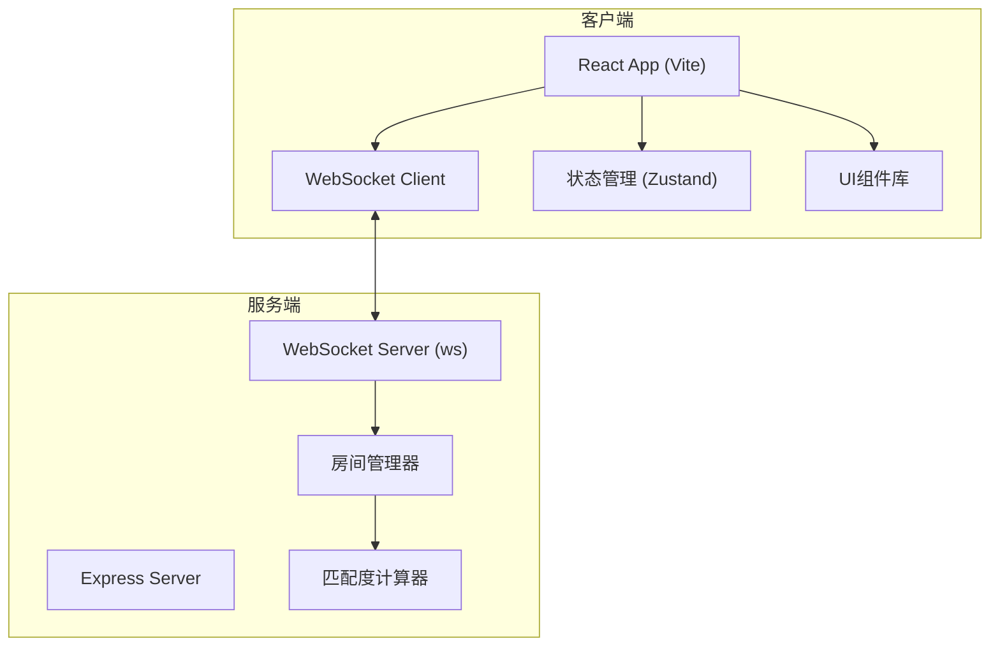
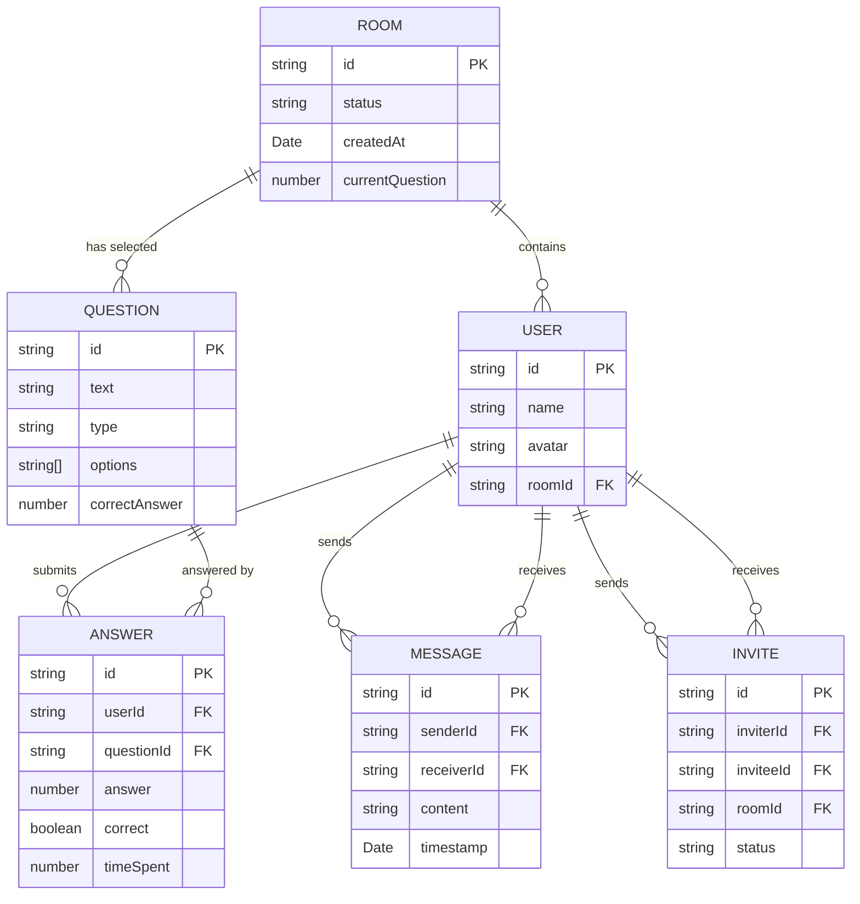

## 1. 架构设计



## 2. 技术描述

- **前端**：React 18 + TypeScript + Vite + Tailwind CSS + Zustand
- **后端**：Express 4 + ws（WebSocket库）+ TypeScript
- **构建工具**：Vite 5
- **路由**：React Router DOM v6
- **状态管理**：Zustand
- **图标**：Lucide React
- **动画**：Framer Motion
- **数据传输**：WebSocket（ws库）

## 3. 目录结构

```
├── package.json
├── vite.config.ts
├── tsconfig.json
├── index.html
├── server/
│   ├── main.ts              # Express+WebSocket服务端入口
│   └── roomManager.ts       # 房间管理模块
├── shared/
│   └── types.ts             # 前后端共享类型定义
└── client/
    └── src/
        ├── App.tsx          # 主组件+路由
        ├── main.tsx         # 入口文件
        ├── index.css        # 全局样式
        ├── store/
        │   └── useStore.ts  # Zustand状态管理
        ├── hooks/
        │   ├── useWebSocket.ts
        │   └── useVirtualScroll.ts
        ├── pages/
        │   ├── Home.tsx
        │   ├── QuizRoom.tsx
        │   ├── MatchResult.tsx
        │   └── ChatRoom.tsx
        ├── components/
        │   ├── CountdownBar.tsx
        │   ├── QuestionCard.tsx
        │   ├── OptionButton.tsx
        │   ├── RadarChart.tsx
        │   ├── ShareCard.tsx
        │   ├── ChatMessage.tsx
        │   ├── CommonGroundPanel.tsx
        │   ├── InviteBanner.tsx
        │   └── Toast.tsx
        └── utils/
            ├── questions.ts    # 题库数据
            ├── matchCalculator.ts
            └── animations.ts
```

## 4. 路由定义

| 路由 | 页面 | 用途 |
|------|------|------|
| `/` | Home | 主页，创建/加入房间 |
| `/room/:roomId` | QuizRoom | 答题房间 |
| `/result/:roomId` | MatchResult | 匹配结果页 |
| `/chat/:roomId/:userId` | ChatRoom | 1对1聊天页面 |

## 5. API 与 WebSocket 消息定义

### WebSocket 消息类型

```typescript
// 客户端发送
type ClientMessage =
  | { type: 'JOIN_ROOM'; payload: { roomId: string; userName: string; avatar: string } }
  | { type: 'LEAVE_ROOM'; payload: { roomId: string } }
  | { type: 'START_GAME'; payload: { roomId: string } }
  | { type: 'SUBMIT_ANSWER'; payload: { roomId: string; questionIndex: number; answer: number; timeSpent: number } }
  | { type: 'SEND_MESSAGE'; payload: { roomId: string; targetUserId: string; content: string } }
  | { type: 'SEND_INVITE'; payload: { roomId: string; targetUserId: string } }
  | { type: 'RESPOND_INVITE'; payload: { roomId: string; inviterId: string; accepted: boolean } };

// 服务端发送
type ServerMessage =
  | { type: 'ROOM_JOINED'; payload: { roomId: string; users: User[] } }
  | { type: 'USER_JOINED'; payload: { user: User } }
  | { type: 'USER_LEFT'; payload: { userId: string } }
  | { type: 'GAME_STARTING'; payload: { countdown: number } }
  | { type: 'QUESTION'; payload: { question: Question; index: number; total: number; startTime: number } }
  | { type: 'ANSWER_RESULT'; payload: { userId: string; questionIndex: number; correct: boolean } }
  | { type: 'ALL_ANSWERS'; payload: { questionIndex: number; answers: { userId: string; answer: number; correct: boolean }[] } }
  | { type: 'MATCH_RESULT'; payload: { matches: MatchResult[]; radarData: RadarData } }
  | { type: 'CHAT_INVITE'; payload: { inviter: User; roomId: string } }
  | { type: 'INVITE_RESPONSE'; payload: { accepted: boolean; chatPartner: User } }
  | { type: 'NEW_MESSAGE'; payload: { message: ChatMessage } }
  | { type: 'ERROR'; payload: { message: string } };
```

### 数据类型定义

```typescript
interface User {
  id: string;
  name: string;
  avatar: string;
  roomId: string;
  answers: { questionIndex: number; answer: number; correct: boolean }[];
}

interface Question {
  id: string;
  text: string;
  type: 'preference' | 'opinion' | 'fact';
  options: string[];
  correctAnswer: number;
  icon: string;
}

interface MatchResult {
  userId: string;
  userName: string;
  userAvatar: string;
  matchPercentage: number;
  commonAnswers: { questionIndex: number; answer: number; questionText: string; optionText: string }[];
}

interface ChatMessage {
  id: string;
  senderId: string;
  senderName: string;
  content: string;
  timestamp: number;
}

interface RadarData {
  categories: string[];
  selfScores: number[];
  users: { userId: string; userName: string; color: string; scores: number[] }[];
}
```

## 6. 数据模型

### 6.1 实体关系图



### 6.2 题库初始化数据

```typescript
// 生活偏好题
const preferenceQuestions = [
  { text: '周末更倾向什么活动？', options: ['宅家追剧', '户外运动', '朋友聚会', '独自阅读'], icon: 'calendar' },
  { text: '更喜欢哪种类型的电影？', options: ['科幻/动作', '爱情/文艺', '喜剧/综艺', '悬疑/恐怖'], icon: 'film' },
  { text: '旅行时更喜欢？', options: ['规划详尽的跟团游', '自由行随心逛', '户外探险', '美食探店'], icon: 'plane' },
];

// 观点态度题
const opinionQuestions = [
  { text: '对AI取代工作的看法？', options: ['乐观，会创造新机会', '担忧，会造成失业潮', '中性，技术发展必然', '不确定，走一步看一步'], icon: 'brain' },
  { text: '是否支持异地恋？', options: ['支持，真爱不受距离限制', '不支持，陪伴很重要', '看具体情况', '没经历过，不好说'], icon: 'heart' },
  { text: '工作和生活能分开吗？', options: ['完全可以', '做不到，总会混在一起', '尽量分开', '没想过这个问题'], icon: 'briefcase' },
];

// 事实判断题
const factQuestions = [
  { text: '哪个国家面积最大？', options: ['中国', '美国', '俄罗斯', '加拿大'], correctAnswer: 2, icon: 'globe' },
  { text: '水的化学式是？', options: ['H2O2', 'H2O', 'CO2', 'O2'], correctAnswer: 1, icon: 'droplets' },
  { text: '光速大约是多少？', options: ['30万公里/秒', '15万公里/秒', '50万公里/秒', '10万公里/秒'], correctAnswer: 0, icon: 'zap' },
  { text: '世界上最长的河流是？', options: ['亚马逊河', '长江', '尼罗河', '密西西比河'], correctAnswer: 2, icon: 'waves' },
];
```

## 7. 性能优化

1. **虚拟滚动**：聊天消息列表只渲染可见区域DOM，使用`useVirtualScroll`钩子实现
2. **WebSocket消息节流**：高频消息合并发送，减少重绘
3. **React.memo**：对频繁渲染的组件（如消息列表项、雷达图扇区）进行memo优化
4. **requestAnimationFrame**：动画和倒计时使用RAF确保流畅
5. **防抖/节流**：用户输入、滚动事件添加适当的防抖节流处理
6. **内存管理**：聊天历史最多保留50条，及时清理过期数据
