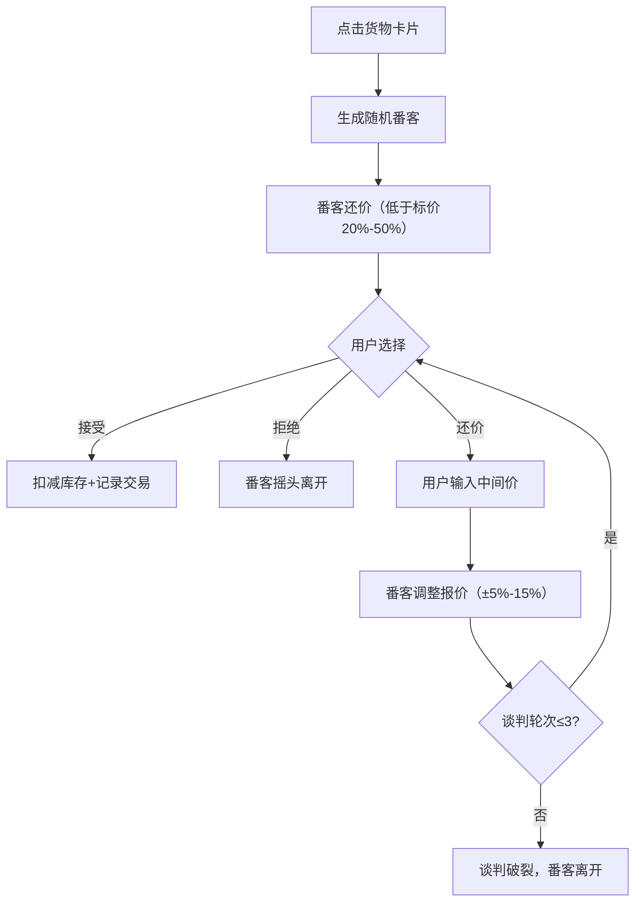
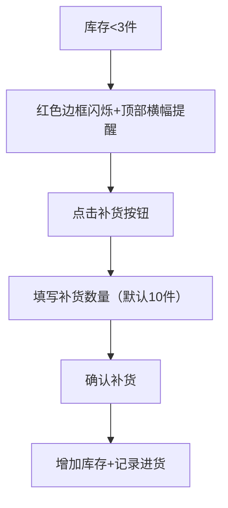
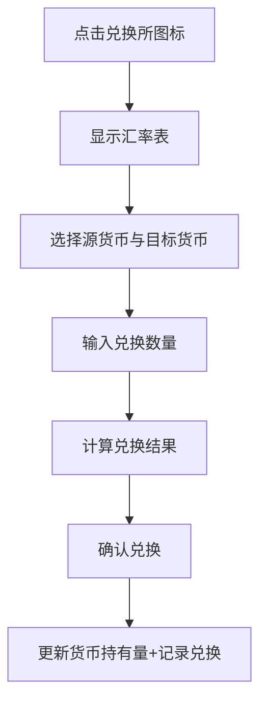

## 1. 产品概述

本应用构建一个基于浏览器的唐代长安西市胡商货摊管理系统，模拟粟特或波斯商人在长安西市管理异域货物的进销存与客户账目，支持多货币结算与实时汇率换算。

- **目标用户**：对唐代商业文化感兴趣的玩家、历史爱好者
- **核心价值**：沉浸式体验唐代丝绸之路贸易，学习古代商业运作
- **市场定位**：教育娱乐类Web应用，兼具历史科普与经营模拟元素

## 2. 核心功能

### 2.1 用户角色

| 角色 | 登录方式 | 核心权限 |
|------|----------|----------|
| 胡商玩家 | 直接进入 | 货物管理、交易谈判、账目查询、货币兑换、库存补货 |

### 2.2 功能模块

1. **主界面**：摊头招牌、每日盈亏横幅、货架网格、交易与账目面板
2. **货架管理**：12种货物展示、库存预警、补货操作、货物详情
3. **讨价还价系统**：番客随机生成、多轮谈判、交易记录
4. **账目系统**：多货币结算、自动汇率换算、按日分组统计
5. **货币兑换**：三向货币兑换、实时更新持有量、兑换记录

### 2.3 页面详情

| 页面名称 | 模块名称 | 功能描述 |
|----------|----------|----------|
| 主界面 | 摊头招牌 | 显示"粟特商号"招牌、当前日期、天气 |
| 主界面 | 盈亏横幅 | 实时滚动显示当日盈亏金额，绿盈红亏 |
| 主界面 | 货架网格 | 4行3列展示12种货物，含图标、库存、单价 |
| 主界面 | 交易面板 | 番客头像、还价信息、谈判按钮 |
| 主界面 | 账目面板 | 交易记录列表、按日分组、日统计、可折叠 |
| 主界面 | 兑换所 | 货币兑换模态窗、汇率表、兑换操作 |
| 货物详情 | 详情卡片 | 进货记录、售出记录、累计盈亏 |

## 3. 核心流程

### 3.1 交易谈判流程

### 3.2 补货流程

### 3.3 货币兑换流程

## 4. 用户界面设计

### 4.1 设计风格

- **主色调**：羊皮纸色 `#f5e6c8`（背景）、深胡桃木色 `#5d3a1a`（货架）、木纹色 `#b5835a`（滚动条）
- **强调色**：盈利绿 `#27ae60`、亏损红 `#c0392b`、番客背景 `#d4b89a`
- **卡片样式**：圆角8px，柔和阴影 `box-shadow: 0 2px 8px rgba(0,0,0,0.15)`
- **字体**：思源宋体（Google Fonts），契合唐代文化氛围
- **交互反馈**：卡片悬停放大1.05倍上移、按钮按压缩放0.95、动画帧率55-60fps
- **整体风格**：唐代西域风格，复古雅致，兼具实用性与沉浸感

### 4.2 页面设计概览

| 页面名称 | 模块名称 | UI元素 |
|----------|----------|--------|
| 主界面 | 摊头招牌 | 木质牌匾风格，书法字体"粟特商号"，两侧悬挂灯笼装饰 |
| 主界面 | 盈亏横幅 | 羊皮纸卷轴样式，数字滚动动画，绿/红色区分盈亏 |
| 主界面 | 货架网格 | 深胡桃木色底板，4x3网格，货物卡片悬停放大效果 |
| 主界面 | 交易面板 | 从右侧滑入动画，番客头像（CSS绘制），谈判按钮按压反馈 |
| 主界面 | 账目面板 | 可折叠，木纹色滚动条，按日期分组折叠 |
| 主界面 | 兑换所 | 莎草纸卷状SVG图标，模态窗淡入动画 |
| 货物详情 | 详情卡片 | framer-motion淡入效果，进货/售出记录表格 |

### 4.3 响应式设计

- **桌面端（>768px）**：左侧货架（4x3）+ 右侧交易与账目面板
- **平板/移动端（≤768px）**：上方货架（2x6）+ 下方交易与账目面板
- **触摸优化**：增大点击区域，按钮最小44x44px，滑动手势支持

### 4.4 动画效果

- **货物卡片**：悬停时 `scale(1.05) translateY(-4px)`，过渡0.2s ease
- **库存预警**：边框红色闪烁动画，周期0.5秒，`@keyframes pulse-red`
- **交易面板**：从右侧滑入 `translateX(100%) → translateX(0)`，0.3s ease-out
- **详情卡片**：framer-motion AnimatePresence，淡入缩放 `opacity: 0→1, scale: 0.9→1`
- **番客反应**：接受时点头动画，拒绝时摇头动画，使用CSS transform
- **盈亏横幅**：数字滚动效果，使用framer-motion的animate数值过渡
