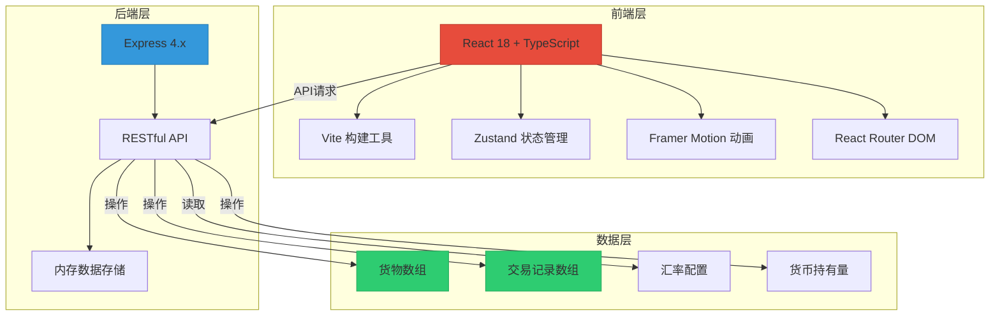
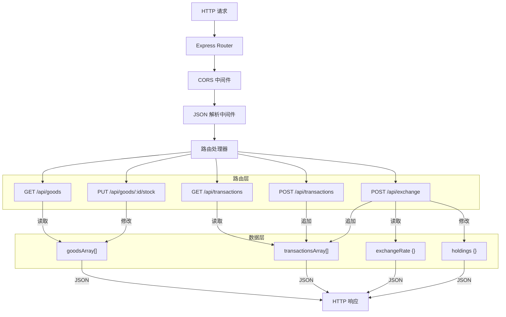
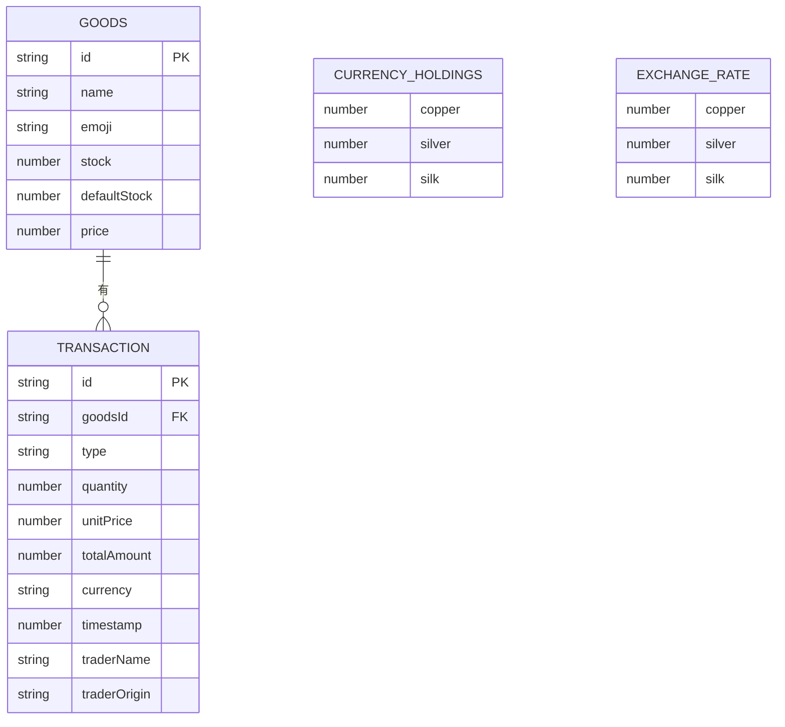

## 1. 架构设计



## 2. 技术描述

- **前端**：React 18 + TypeScript 5 + Vite 5
- **状态管理**：Zustand 4（选择性订阅避免全量重渲染）
- **动画库**：Framer Motion 11（流畅动画，60fps）
- **路由**：React Router DOM 6
- **后端**：Express 4.x（Node.js）
- **数据存储**：内存数组模拟（无需数据库）
- **代码分割**：React.lazy + Suspense 延迟加载非首屏组件
- **构建工具**：Vite 5（热更新，快速构建）

### 2.1 目录结构

```
auto40/
├── .trae/documents/          # 项目文档
├── server/
│   └── index.ts              # Express 后端入口
├── src/
│   ├── components/           # React 组件
│   │   ├── Header.tsx        # 摊头招牌与盈亏横幅
│   │   ├── ShelfGrid.tsx     # 货架网格
│   │   ├── GoodsCard.tsx     # 货物卡片
│   │   ├── GoodsDetail.tsx   # 货物详情弹窗
│   │   ├── TradePanel.tsx    # 交易面板
│   │   ├── ForeignTrader.tsx # 番客组件
│   │   ├── AccountPanel.tsx  # 账目面板
│   │   └── ExchangeModal.tsx # 货币兑换模态窗
│   ├── types/
│   │   └── index.ts          # TypeScript 类型定义
│   ├── utils/
│   │   ├── currency.ts       # 货币换算工具
│   │   └── mock.ts           # 模拟数据生成
│   ├── App.tsx               # 主组件
│   ├── store.ts              # Zustand 全局状态
│   ├── api.ts                # API 请求封装
│   └── main.tsx              # React 入口
├── index.html                # HTML 入口
├── package.json
├── tsconfig.json
└── vite.config.js
```

### 2.2 调用关系与数据流向

```
用户交互 → React 组件 → Zustand Actions → API 层 → Express 后端
                ↑                                        ↓
                └────────────── 状态更新 ←─────────────── JSON 响应
```

1. **App.tsx** → 组合 Header + ShelfGrid + TradePanel + AccountPanel
2. **GoodsCard.tsx** → 点击触发 store.selectGoods()，展开详情或启动交易
3. **TradePanel.tsx** → 调用 store.addTransaction() 更新库存和交易记录
4. **ExchangeModal.tsx** → 调用 store.exchangeCurrency() 更新货币持有量
5. **store.ts** → 通过 api.ts 调用后端接口，同步前端状态

## 3. 路由定义

| 路由 | 用途 |
|------|------|
| `/` | 主界面，包含所有功能模块 |
| `*` | 404 重定向至首页 |

## 4. API 定义

### 4.1 TypeScript 类型

```typescript
// 货物类型
interface Goods {
  id: string;
  name: string;
  emoji: string;
  stock: number;
  defaultStock: number;
  price: number; // 铜钱单价
  purchaseRecords: PurchaseRecord[];
  saleRecords: SaleRecord[];
}

// 交易记录
interface Transaction {
  id: string;
  goodsId: string;
  goodsName: string;
  type: 'purchase' | 'sale' | 'exchange';
  quantity: number;
  unitPrice: number; // 铜钱
  totalAmount: number; // 铜钱
  currency: 'copper' | 'silk' | 'silver';
  timestamp: number;
  traderName?: string;
  traderOrigin?: string;
}

// 汇率
interface ExchangeRate {
  copper: number;   // 1文铜钱
  silver: number;   // 1两白银 = 1000文
  silk: number;     // 1匹丝绸 = 10两白银 = 10000文
}

// 货币持有量
interface CurrencyHoldings {
  copper: number;
  silver: number;
  silk: number;
}

// 番客
interface ForeignTrader {
  id: string;
  name: string;
  origin: string;
  skinColor: string;
  clothingColor: string;
}
```

### 4.2 后端 API 接口

| 方法 | 路径 | 描述 | 请求体 | 响应 |
|------|------|------|--------|------|
| GET | `/api/goods` | 获取货物列表 | - | `Goods[]` |
| GET | `/api/goods/:id` | 获取单个货物详情 | - | `Goods` |
| PUT | `/api/goods/:id/stock` | 更新货物库存 | `{ amount: number, type: 'in' | 'out' }` | `Goods` |
| GET | `/api/transactions` | 获取交易记录 | - | `Transaction[]` |
| POST | `/api/transactions` | 添加交易记录 | `Omit<Transaction, 'id' | 'timestamp'>` | `Transaction` |
| GET | `/api/exchange-rate` | 获取汇率 | - | `ExchangeRate` |
| GET | `/api/holdings` | 获取货币持有量 | - | `CurrencyHoldings` |
| POST | `/api/exchange` | 货币兑换 | `{ from: Currency, to: Currency, amount: number }` | `{ success: boolean, holdings: CurrencyHoldings }` |
| POST | `/api/purchase` | 进货操作 | `{ goodsId: string, quantity: number, cost: number }` | `Goods` |

## 5. 服务器架构图



## 6. 数据模型

### 6.1 实体关系图



### 6.2 初始化数据（Mock Data）

```typescript
// 初始货物数据
const initialGoods: Goods[] = [
  { id: '1', name: '胡椒', emoji: '🌶️', stock: 15, defaultStock: 10, price: 120, purchaseRecords: [], saleRecords: [] },
  { id: '2', name: '肉桂', emoji: '🪵', stock: 20, defaultStock: 10, price: 80, purchaseRecords: [], saleRecords: [] },
  { id: '3', name: '蓝宝石', emoji: '💎', stock: 8, defaultStock: 10, price: 5000, purchaseRecords: [], saleRecords: [] },
  { id: '4', name: '红宝石', emoji: '❤️', stock: 5, defaultStock: 10, price: 8000, purchaseRecords: [], saleRecords: [] },
  { id: '5', name: '丝绸', emoji: '🧣', stock: 25, defaultStock: 10, price: 1500, purchaseRecords: [], saleRecords: [] },
  { id: '6', name: '香料', emoji: '✨', stock: 18, defaultStock: 10, price: 200, purchaseRecords: [], saleRecords: [] },
  { id: '7', name: '琉璃杯', emoji: '🍷', stock: 12, defaultStock: 10, price: 3000, purchaseRecords: [], saleRecords: [] },
  { id: '8', name: '羚羊角', emoji: '🦌', stock: 6, defaultStock: 10, price: 600, purchaseRecords: [], saleRecords: [] },
  { id: '9', name: '象牙', emoji: '🐘', stock: 3, defaultStock: 10, price: 10000, purchaseRecords: [], saleRecords: [] },
  { id: '10', name: '珊瑚', emoji: '🪸', stock: 10, defaultStock: 10, price: 2500, purchaseRecords: [], saleRecords: [] },
  { id: '11', name: '沉香', emoji: '🪔', stock: 7, defaultStock: 10, price: 3500, purchaseRecords: [], saleRecords: [] },
  { id: '12', name: '翡翠', emoji: '💚', stock: 4, defaultStock: 10, price: 15000, purchaseRecords: [], saleRecords: [] },
];

// 初始汇率
const exchangeRate: ExchangeRate = {
  copper: 1,
  silver: 1000,  // 1两白银 = 1000文
  silk: 10000,   // 1匹丝绸 = 10两白银
};

// 初始货币持有量
const initialHoldings: CurrencyHoldings = {
  copper: 50000,   // 5万文
  silver: 50,      // 50两
  silk: 10,        // 10匹
};

// 番客名字库
const traderNames = ['阿里', '哈桑', '易卜拉欣', '穆萨', '萨利赫', '阿巴斯', '马哈茂德', '优素福', '奥马尔', '艾哈迈德'];
const traderOrigins = ['大食', '回鹘', '波斯', '天竺', '昆仑', '倭马亚', '阿拔斯', '吐蕃'];
const skinColors = ['#d4a574', '#c68642', '#8d5524', '#e0ac69', '#f1c27d'];
const clothingColors = ['#1a1a2e', '#16213e', '#0f3460', '#533483', '#7b2cbf'];
```
