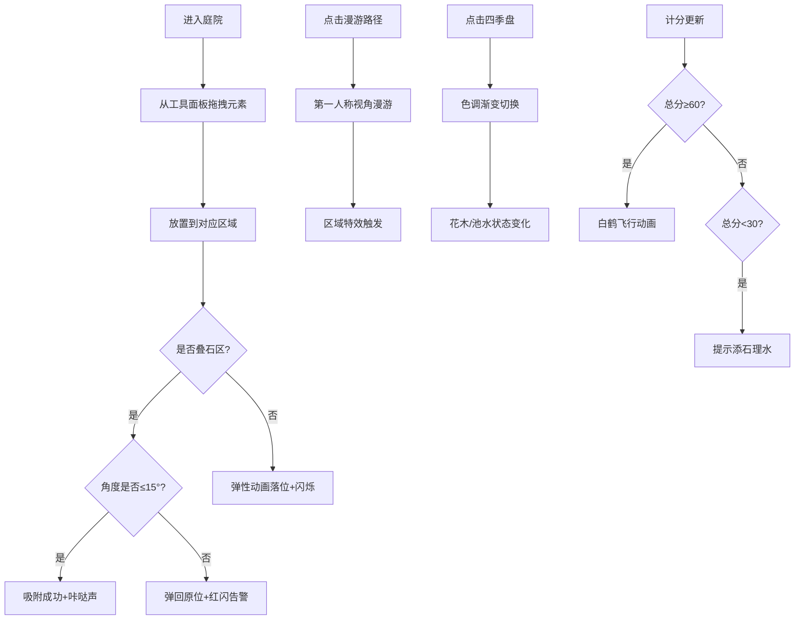

## 1. 产品概述

本项目是一个沉浸式古代假山园林交互体验应用，让用户以明代《园冶》主人的身份，在虚拟庭院中通过叠山理水、植木造亭，体验中国传统造园艺术的精髓。用户可拖拽太湖石堆叠假山、开挖池沼、种植花木，沿着曲径漫游观赏四季光影变化下的山水意境。

- **核心价值**：传承中国古典园林艺术，以数字化交互形式展现"天人合一"的造园理念
- **目标用户**：园林艺术爱好者、传统文化研究者、游戏化教育场景

## 2. 核心功能

### 2.1 用户角色
| 角色 | 注册方式 | 核心权限 |
|------|----------|----------|
| 园主 | 无需注册 | 完整的造园、漫游、四季切换体验权限 |

### 2.2 功能模块
1. **主庭院场景**：10x8米CSS 3D庭院，含四大编辑区域（叠石区、水池区、花木区、亭台区）
2. **叠石系统**：太湖石拖拽放置、三层峰石堆叠吸附、角度检测与音效反馈
3. **漫游系统**：第一人称路径漫游、镜头自动偏转、区域特效触发
4. **四季系统**：色调切换、花开花落、池水变化、过渡动画
5. **计分系统**：造园评分、白鹤飞行动画、低分区提示

### 2.3 页面详情
| 页面名称 | 模块名称 | 功能描述 |
|----------|----------|----------|
| 主场景页 | 庭院3D场景 | CSS 3D变换构建10x8米庭院，青砖地面灰瓦围墙 |
| 主场景页 | 工具面板 | 右侧可拖拽元素面板，含太湖石、花木、水池、亭台 |
| 主场景页 | 叠石区 | 5块太湖石放置、最多3层堆叠吸附、角度检测 |
| 主场景页 | 水池区 | 椭圆形水面、水波纹动画、倒影效果 |
| 主场景页 | 花木区 | 牡丹、梅花、松竹三组花木，四季状态切换 |
| 主场景页 | 亭台区 | 四角攒尖亭，路径终点 |
| 主场景页 | 漫游路径 | 青石板曲径，点击触发第一人称漫游 |
| 主场景页 | 四季控制盘 | 右上角圆形扇形控制盘，春夏秋冬色调切换 |
| 主场景页 | 计分板 | 左上角"叠石造境"计分，白鹤触发提示 |

## 3. 核心流程

用户进入庭院 → 从右侧面板拖拽元素到对应区域 → 叠石区可多层堆叠（检测角度+音效）→ 点击路径触发漫游 → 切换四季观赏变化 → 积分累计触发白鹤动画/低分提示

## 4. 用户界面设计

### 4.1 设计风格
- **主色调**：石绿#4a7c59、赭石#9b7b5a、米白#f5f0e1，呼应青绿山水画
- **背景**：浅灰宣纸纹理，CSS repeating-linear-gradient模拟纸帘纹
- **按钮/面板**：手绘感圆角矩形(border-radius:6px)，边框#6b5a4a，浅棕半透明阴影
- **字体**：楷体/仿宋，数字使用古风花字(font-variant: oldstyle-nums)，标题使用文征明小楷
- **动画**：弹性动画(cubic-bezier(0.34, 1.56, 0.64, 1))，四季过渡1.2秒带模糊效果

### 4.2 页面设计概述
| 页面名称 | 模块名称 | UI元素 |
|----------|----------|--------|
| 主场景页 | 庭院布局 | CSS 3D透视，青砖网格地面，灰瓦围墙，10:8比例 |
| 主场景页 | 四大区域 | 半透明虚线边框标识，hover高亮提示 |
| 主场景页 | 工具面板 | 右侧竖向排列，元素缩略图带手绘边框 |
| 主场景页 | 漫游路径 | 青石板渐变虚线，从园门到亭台再绕回 |
| 主场景页 | 四季控制盘 | 圆形四色扇形，点击有涟漪效果 |
| 主场景页 | 计分板 | 仿古卷轴样式，篆体"叠石造境"标题 |
| 主场景页 | 白鹤动画 | 8只SVG白鹤沿路径飞行，4秒后消失 |
| 主场景页 | 提示文字 | 篆体浮动文字，半透明渐显渐隐 |

### 4.3 响应式
- **桌面端(1024px-1920px)**：使用clamp()和min()实现庭园比例自动缩放
- **平板端(768px-1024px)**：工具面板宽度压缩，字体大小自适应
- **移动端(<768px)**：右侧工具面板改为底部横向滚动条，庭园缩放适配屏幕宽度

### 4.4 3D场景构建
- **CSS 3D变换**：使用transform-style: preserve-3d、perspective构建场景
- **庭院结构**：10x8米地面、四周3米高围墙、围墙顶部灰瓦
- **透视相机**：默认俯视45度角，漫游时切换第一人称视角
- **元素层次**：z-index分层管理，地面(0)→路径(1)→区域(2)→元素(3-5)→UI(10+)

## 5. 性能要求
- 漫游帧率≥50fps，使用requestAnimationFrame控制
- 拖拽响应延迟≤50ms
- 连续3帧耗时>20ms时自动降级粒子效果（花瓣从20减至5）
- 所有动画使用CSS transform和opacity，避免触发重排重绘
