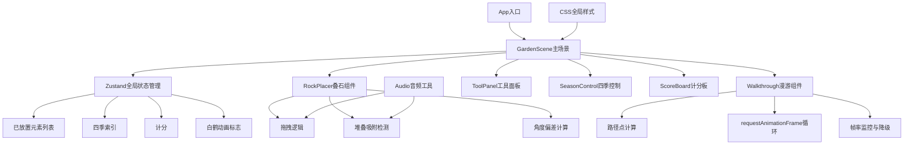

## 1. 架构设计



## 2. 技术描述

* **前端框架**：React 18 + TypeScript 5 + Vite 5

* **状态管理**：Zustand 4

* **动画库**：Framer Motion 11

* **路由**：React Router DOM 6（单页应用）

* **音频**：Web Audio API原生实现

* **3D效果**：CSS 3D Transform（不使用Three.js，纯CSS实现）

* **构建工具**：Vite 5，base路径设为'./'

## 3. 目录结构

```
├── src/
│   ├── GardenScene.tsx          # 主庭院场景组件
│   ├── Components/
│   │   ├── RockPlacer.tsx       # 叠石区组件
│   │   ├── Walkthrough.tsx      # 漫游路径组件
│   │   ├── ToolPanel.tsx        # 工具面板组件
│   │   ├── SeasonControl.tsx    # 四季控制盘组件
│   │   ├── ScoreBoard.tsx       # 计分板组件
│   │   ├── PondArea.tsx         # 水池区组件
│   │   ├── PlantArea.tsx        # 花木区组件
│   │   └── PavilionArea.tsx     # 亭台区组件
│   ├── store/
│   │   └── gardenStore.ts       # Zustand全局状态
│   ├── styles/
│   │   └── garden.css           # 全局样式
│   ├── utils/
│   │   └── audio.ts             # 音频工具
│   ├── types/
│   │   └── garden.ts            # 类型定义
│   ├── App.tsx
│   ├── main.tsx
│   └── index.css
├── index.html
├── vite.config.js
├── tsconfig.json
└── package.json
```

## 4. 类型定义

```typescript
// src/types/garden.ts
export interface Position {
  x: number;
  y: number;
  z: number;
}

export interface RockElement {
  id: string;
  type: 'taihu' | 'peak';
  position: Position;
  rotation: number;
  scale: number;
  layer: number;
  color: string;
  clipPath: string;
}

export interface PlantElement {
  id: string;
  type: 'peony' | 'plum' | 'pine';
  position: Position;
  season: number;
}

export interface PondElement {
  id: string;
  position: Position;
  width: number;
  height: number;
  opacity: number;
}

export interface PavilionElement {
  id: string;
  position: Position;
  rotation: number;
}

export type GardenElement = RockElement | PlantElement | PondElement | PavilionElement;

export type Season = 0 | 1 | 2 | 3; // 春夏秋冬

export interface GardenState {
  rocks: RockElement[];
  plants: PlantElement[];
  pond: PondElement | null;
  pavilion: PavilionElement | null;
  currentSeason: Season;
  score: number;
  showCraneAnimation: boolean;
  showLowScoreHint: boolean;
  isWalkthroughActive: boolean;
  walkthroughPosition: Position;
  walkthroughRotation: number;
}
```

## 5. 核心数据模型

### 5.1 Zustand Store

```typescript
// src/store/gardenStore.ts
import { create } from 'zustand';
import { GardenState, RockElement, PlantElement, Season } from '../types/garden';

interface GardenActions {
  addRock: (rock: RockElement) => void;
  removeRock: (id: string) => void;
  updateRock: (id: string, updates: Partial<RockElement>) => void;
  addPlant: (plant: PlantElement) => void;
  setPond: (pond: PondElement | null) => void;
  setPavilion: (pavilion: PavilionElement | null) => void;
  setSeason: (season: Season) => void;
  calculateScore: () => void;
  triggerCraneAnimation: () => void;
  startWalkthrough: (targetPosition: Position) => void;
  updateWalkthrough: (position: Position, rotation: number) => void;
  endWalkthrough: () => void;
}

export const useGardenStore = create<GardenState & GardenActions>((set, get) => ({
  // 初始状态...
  // 方法实现...
}));
```

### 5.2 漫游路径点

```typescript
// 从园门→亭台→水池→园门的路径点
export const WALKOUGH_PATH: Position[] = [
  { x: 9.5, y: 0, z: 4 },    // 园门入口
  { x: 8, y: 0, z: 2 },      // 叠石区前
  { x: 6, y: 0, z: 1 },      // 花木区前
  { x: 4, y: 0, z: 1 },      // 亭台前
  { x: 2, y: 0, z: 2 },      // 水池边
  { x: 2, y: 0, z: 5 },      // 水池另一侧
  { x: 5, y: 0, z: 6 },      // 叠石区后
  { x: 8, y: 0, z: 6 },      // 回园门
  { x: 9.5, y: 0, z: 4 },    // 回到园门
];
```

## 6. 性能优化策略

1. **帧率监控**：Walkthrough组件中使用performance.now()记录每帧耗时，连续3帧>20ms时降低粒子数量
2. **CSS优化**：所有动画使用transform和opacity，避免触发layout
3. **虚拟列表**：工具面板元素较多时使用虚拟滚动
4. **防抖节流**：拖拽事件使用requestAnimationFrame节流
5. **状态分片**：Zustand使用selectors避免不必要的重渲染
6. **will-change**：对频繁变换的元素添加will-change提示浏览器优化

## 7. 无障碍与兼容性

* 支持键盘导航（Tab切换元素，Enter放置）

* 语义化HTML标签

* 颜色对比度符合WCAG AA标准

* 动画可通过prefers-reduced-motion检测禁用

* 兼容Chrome 90+、Firefox 88+、Safari 14+

