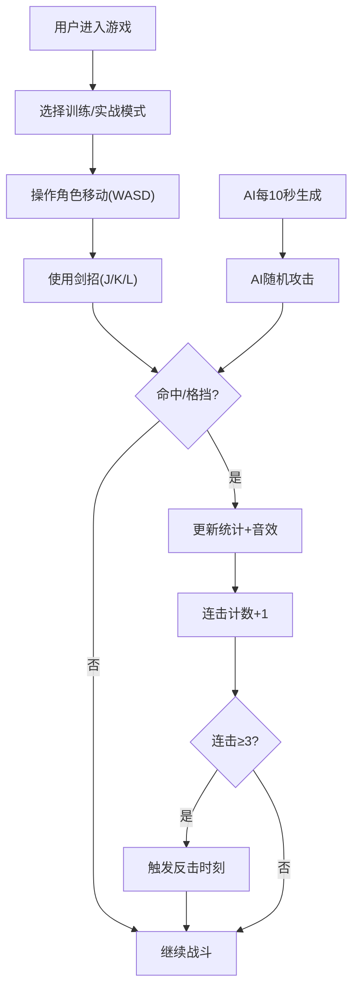

## 1. 产品概述

唐代剑术对战互动游戏应用，在浏览器中模拟古代击剑对战与招式学习，解决传统剑术教学中招式衔接、步法变换和对战策略难以直观演示和反复练习的问题。

- 核心用途：剑术招式学习与对战模拟
- 目标用户：剑术爱好者、武术学习者、游戏玩家
- 产品价值：提供沉浸式、可反复练习的剑术学习与对战体验

## 2. 核心功能

### 2.1 用户角色
| 角色 | 注册方式 | 核心权限 |
|------|----------|----------|
| 普通用户 | 无需注册 | 操作角色对战、学习剑招、切换训练/实战模式 |

### 2.2 功能模块
1. **演武场主场景**：仿唐演武场渲染，角色与AI对战
2. **剑招学习面板**：三种基础剑招（刺、劈、撩）SVG示意图与自动演示
3. **对战统计面板**：实时显示命中、格挡、连击数
4. **模式切换控制**：训练模式与实战模式切换

### 2.3 页面详情
| 页面名称 | 模块名称 | 功能描述 |
|---------|----------|----------|
| 主对战页面 | 演武场场景 | 青石板地面、木质围栏、红灯笼背景，角色移动与战斗 |
| 主对战页面 | 剑招面板 | SVG招式图，点击后角色自动演示连招 |
| 主对战页面 | 控制面板 | 训练/实战模式切换按钮，对战统计数据展示 |

## 3. 核心流程

## 4. 用户界面设计

### 4.1 设计风格
- **主色调**：木色#8b5a2b、红色#c0392b、金色#ffd700
- **按钮风格**：浮雕风格，border:2px solid #5d3a1a，悬停渐变为金色
- **字体**：思源宋体（楷体用于剑招名称）
- **布局风格**：三栏布局（左侧控制、中间演武场、右侧剑招面板）
- **视觉效果**：剑招发光残影（CSS filter:drop-shadow）、屏幕抖动、背景渐变

### 4.2 页面设计概述
| 页面名称 | 模块名称 | UI元素 |
|---------|----------|--------|
| 主对战页面 | 演武场场景 | 青石板CSS纹理、木质围栏、红灯笼装饰、火柴人角色、发光残影 |
| 主对战页面 | 剑招面板 | SVG招式小人、楷体剑招名称、点击交互反馈 |
| 主对战页面 | 控制面板 | 浮雕按钮、统计数字、连击特效提示 |

### 4.3 响应式设计
- 桌面端：三栏布局（左20%/中60%/右20%）
- 移动端（<768px）：两列布局，右侧面板与左侧按钮各占一行，角色区域居中
- 触控优化：按钮最小44px可点击区域

### 4.4 视觉特效
- 剑招残影：白色发光轨迹，0.2秒渐隐
- 命中反馈：屏幕轻微抖动（transform: translate 3px 1px 0.3s）
- 金属碰撞音效：Web Audio API生成短促叮当声
- 受击后仰：对手受击后0.3秒后仰动画
- 无敌状态：角色周身金色光晕
