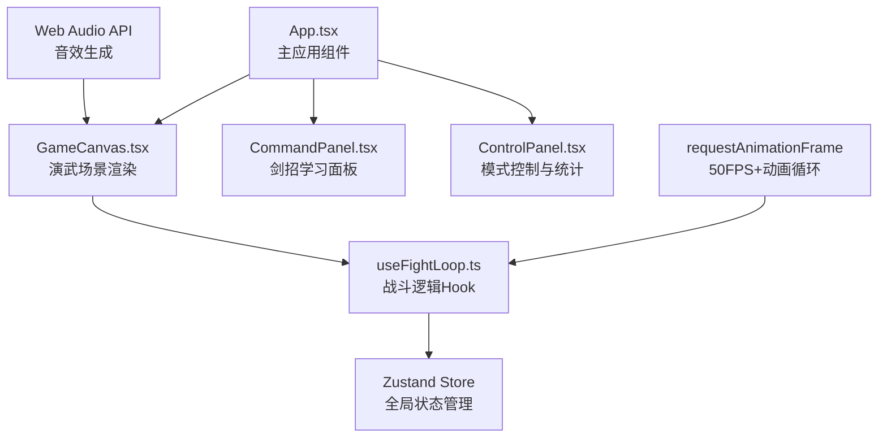

## 1. 架构设计



## 2. 技术描述

* **前端框架**：React\@18 + TypeScript

* **构建工具**：Vite

* **动画库**：framer-motion

* **状态管理**：zustand

* **音效**：Web Audio API

* **字体**：思源宋体（Google Fonts）

## 3. 目录结构

```
src/
├── App.tsx              # 主应用组件
├── components/
│   ├── GameCanvas.tsx   # 演武场场景组件
│   ├── CommandPanel.tsx # 剑招面板组件
│   └── ControlPanel.tsx # 控制面板组件
├── hooks/
│   └── useFightLoop.ts  # 战斗循环Hook
└── store/
    └── useGameStore.ts  # Zustand状态管理
```

## 4. 数据模型

### 4.1 角色状态

```typescript
interface Character {
  id: string;
  x: number;
  y: number;
  health: number;
  isPlayer: boolean;
  currentAction: 'idle' | 'thrust' | 'chop' | 'block' | 'hit' | 'stunned';
  actionFrame: number;
  facing: 'left' | 'right';
  isInvincible: boolean;
  invincibleTimer: number;
}
```

### 4.2 游戏状态

```typescript
interface GameState {
  mode: 'training' | 'combat';
  player: Character;
  opponent: Character | null;
  stats: {
    hits: number;
    blocks: number;
    combo: number;
  };
  screenShake: number;
  opponentSpawnTimer: number;
  actionQueue: Action[];
}
```

### 4.3 剑招定义

```typescript
interface SwordMove {
  id: 'thrust' | 'chop' | 'upward';
  name: string;
  description: string;
  frames: FrameData[];
  damage: number;
  duration: number;
}
```

## 5. 核心技术点

### 5.1 战斗循环（useFightLoop）

* 使用requestAnimationFrame实现50

