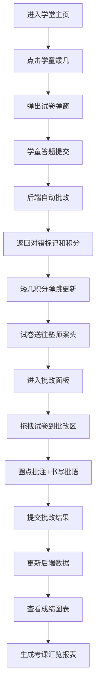

## 1. 产品概述

本产品是一款基于浏览器的古代私塾学堂师生考课与诗文批注管理全栈Web应用，让用户以明代乡塾塾师的身份，在模拟的古代私塾场景中管理学童的课业、批改诗文试卷、记录月考成绩，并通过积分榜和成绩曲线图洞察学童学业进退。

- 核心目标：通过沉浸式的古代私塾场景，提供完整的教学管理体验，涵盖课业布置、试卷批改、成绩追踪等核心教学环节
- 目标用户：对传统文化教育有兴趣的用户，教育类应用使用者，以及需要场景化教学管理工具的用户
- 产品价值：融合传统文化元素与现代Web技术，提供独具特色的教学管理体验

## 2. 核心功能

### 2.1 用户角色
| 角色 | 注册方法 | 核心权限 |
|------|----------|----------|
| 塾师 | 无需注册，直接使用 | 布置课业、批改试卷、评定等第、查看成绩报表、管理积分 |

### 2.2 功能模块
1. **学堂主页**：九格学童矮几展示、塾师高案、待批试卷堆叠、积分实时更新
2. **课业布置与答题**：诗文章句试卷生成、在线答题、自动批改、积分计算
3. **批改面板**：试卷拖拽展开、圈点批注、批语书写、等第评定
4. **成绩图表**：成绩折线图、积分榜、月考趋势分析、考课汇览报表

### 2.3 页面详情
| 页面名称 | 模块名称 | 功能描述 |
|----------|----------|----------|
| 学堂主页 | 学童矮几九宫格 | 展示9名学童信息，包含姓名、总积分、本周新增积分、油灯动画 |
| 学堂主页 | 塾师高案 | 展示待批试卷堆叠（最多5份），点击进入批改面板 |
| 课业布置 | 试卷弹窗 | 竖排仿古试卷，五言律诗填空/对联/断句题，提交后自动批改 |
| 批改面板 | 试卷拖拽区 | 从堆叠区拖拽试卷到中央批改区，展开动画效果 |
| 批改面板 | 圈点批注工具 | 鼠标拖拽绘制红色椭圆圈选，支持永久标记 |
| 批改面板 | 批语输入 | 仿古竖排批语框，最多50字，超出提醒 |
| 成绩图表 | 折线图 | Recharts绘制近五次月考趋势，每条线绑定学童颜色 |
| 成绩图表 | 积分榜 | 按总积分排序，前三名奖牌，连续第一金星标记 |
| 成绩图表 | 今日汇览 | 弹窗展示考课汇总报表，支持一键复制 |

## 3. 核心流程

## 4. 用户界面设计

### 4.1 设计风格
- **主色调**：米黄#f5f0e6，深褐#5d3a1a，青灰#7a8b7a
- **高亮色**：朱红#c0392b，石青#2a5a8b
- **按钮样式**：仿古卷轴风格，圆角4px，hover时色彩过渡0.3秒
- **字体**：思源宋体（Source Han Serif），仿古竖排布局
- **布局风格**：九宫格+高案式格局，左侧2/3为学童区，右侧1/3为塾师区
- **装饰元素**：油灯火焰动画、纸质纹理、麻绳分隔线、卷轴展开动画
- **图标风格**：使用emoji（🏆🏅🎖️✨↑↓→）和纯CSS绘制元素

### 4.2 页面设计概述
| 页面名称 | 模块名称 | UI元素 |
|----------|----------|--------|
| 学堂主页 | 学童矮几 | 深木色背景、青砖地面、麻绳分隔、油灯火焰动画、积分弹跳数字 |
| 学堂主页 | 孔子像卷轴 | 墙面居中悬挂，卷轴展开动画 |
| 学堂主页 | 待批试卷堆叠 | 淡黄宣纸色、边缘做旧、轻微模糊阴影、错位3px堆叠 |
| 试卷弹窗 | 仿古卷面 | 竖排文字、填空下划线、提交按钮、卷轴卷起动画 |
| 批改面板 | 圈点工具 | 红色半透明椭圆、随机旋转2-5度、鼠标拖拽绘制 |
| 批改面板 | 批语框 | 竖排输入、字符计数、超数红色闪烁 |
| 成绩图表 | 折线图 | Recharts折线、悬浮tooltip、名次箭头标记 |
| 成绩图表 | 积分榜 | 奖牌emoji、金星闪烁、降序排列 |
| 成绩图表 | 汇览弹窗 | 卷轴纹样背景、顶部滚下动画、复制按钮 |

### 4.3 响应式
- 桌面优先（768px以上）：左侧九宫格2:1右侧高案布局
- 平板适配：缩小卡片间距，保持九宫格布局
- 移动端（768px以下）：自动折叠为单列纵向流式布局，学童区在上，高案区在下

### 4.4 动画规范
- 所有过渡动画使用framer-motion，easeInOut曲线，持续时间≤0.6秒
- 积分变化：数字弹跳+0.3秒渐入
- 试卷卷起：0.5秒动画
- 试卷展开：0.3秒动画
- 弹窗卷轴展开：clip-path从0%到100%，0.4秒动画
- 油灯火焰：径向渐变微粒飘散，0.8秒循环
- 按钮hover：0.3秒色彩过渡
