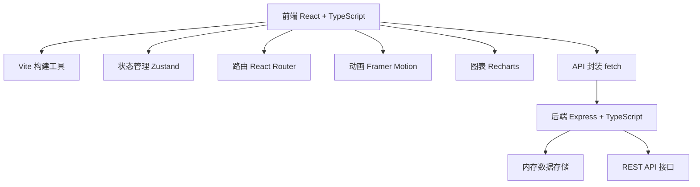

## 1. 架构设计

```mermaid
graph TD
    A["前端 React + TypeScript"] --> B["Vite 构建工具"]
    A --> C["状态管理 Zustand"]
    A --> D["路由 React Router"]
    A --> E["动画 Framer Motion"]
    A --> F["图表 Recharts"]
    A --> G["API 封装 fetch"]
    G --> H["后端 Express + TypeScript"]
    H --> I["内存数据存储"]
    H --> J["REST API 接口"]
```

## 2. 技术描述

* **前端**：React 18 + TypeScript 5 + Vite 5

* **状态管理**：Zustand 4

* **路由**：React Router DOM 6

* **动画库**：Framer Motion 11

* \*\*图表库

