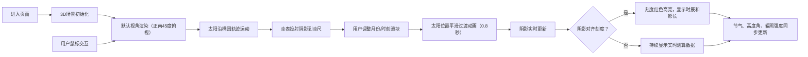

## 1. 产品概述

古代日晷与圭表测影3D交互可视化项目，让用户化身元代天文观测官郭守敬，在登封观星台上通过圭表测影推算节气与时刻，直观感受中国古代天文学的伟大成就。

- 核心目标：通过沉浸式3D交互，科普中国古代圭表测影的天文原理
- 目标用户：天文爱好者、历史文化爱好者、学生群体
- 市场价值：将传统文化与现代科技结合，打造寓教于乐的科普教育产品

## 2. 核心功能

### 2.1 用户角色

| 角色 | 注册方式 | 核心权限 |
|------|----------|----------|
| 访客用户 | 无需注册 | 自由浏览3D场景、调整观测参数、查看测算结果 |

### 2.2 功能模块

1. **3D观星台场景**：青石台基、石质圭表、圭尺刻度、太阳光源
2. **交互控制系统**：鼠标拖拽旋转视角、滚轮缩放、右键平移
3. **观测参数调节**：月份滑块（1-12月）、时刻滑块（辰时-酉时）
4. **实时测算显示**：时辰名称、影长数值、节气名称、太阳高度角、辐照强度
5. **视觉特效系统**：太阳脉冲动画、阴影投射、时辰刻度高亮

### 2.3 页面详情

| 页面名称 | 模块名称 | 功能描述 |
|---------|----------|----------|
| 主页面 | 3D场景渲染 | Three.js构建20单位见方的观星台院落，包含圭表、圭尺、太阳光源 |
| 主页面 | 相机控制 | OrbitControls实现360度环绕、缩放、平移，默认正南45度俯视 |
| 主页面 | 太阳运动 | 沿椭圆轨迹从东向西移动，带动阴影实时伸缩旋转 |
| 主页面 | 控制面板 | 底部半透明卷轴样式，包含月份和时刻滑块，显示测算数据 |
| 主页面 | 时辰高亮 | 阴影对齐刻度时红色高亮，显示"午时三刻"等时辰名称和影长 |

## 3. 核心流程

## 4. 用户界面设计

### 4.1 设计风格

- **主色调**：仿古宣纸色#f5f0e1（背景）、青石色#9a8a7a（台基）、深灰色#7a7a7a（圭表）、浅褐色#d9c9b9（圭尺）
- **强调色**：红色#c0392b（印章按钮边框）、亮红色#e74c3c（刻度高亮）、金黄色#ffd700（太阳）
- **按钮样式**：印章样式，方形红色边框，点击有按压凹陷效果
- **字体**：思源宋体（Google Fonts），整体呈现古籍质感
- **布局风格**：3D场景居中全屏，底部悬浮控制面板（卷轴样式）
- **视觉层次**：宣纸纹理背景 → 3D场景 → 半透明控制面板 → 高亮提示

### 4.2 页面设计概述

| 页面名称 | 模块名称 | UI元素 |
|---------|----------|--------|
| 主页面 | 3D场景 | 青石台基、石质圭表（高6宽0.8）、圭尺（长14宽1.2）、太阳球体（脉冲动画）、动态阴影 |
| 主页面 | 控制面板 | 顶部卷轴展开动画、半透明黑底白字、月份滑块（1-12）、时刻滑块（辰-酉）、数据显示区域 |
| 主页面 | 数据显示 | 时辰名称（红色高亮）、影长尺寸（三尺七寸格式）、24节气名称、太阳高度角（度）、辐照强度（1-100） |
| 主页面 | 印章按钮 | 方形红色边框#c0392b、按压动画效果 |

### 4.3 响应式设计

- **设计策略**：Desktop-first，最小宽度768px适配平板
- **断点设计**：
  - ≥1024px：全屏3D场景，控制面板固定底部宽度80%
  - 768px-1024px：控制面板宽度90%，字体适当缩小
- **触摸优化**：滑块支持触摸拖动，3D场景支持触摸手势旋转缩放

### 4.4 3D场景指导

- **环境**：仿古宣纸色调天空盒，柔和环境光，模拟日光散射效果
- **光照**：
  - 主光源：太阳（黄色#ffd700，带阴影投射）
  - 环境光：柔和白光，强度0.3，模拟天空散射
  - 阴影：半透明黑色0.3，PCFSoftShadowMap，边缘模糊
- **相机设置**：
  - 初始位置：正南方向（0, 15, 15）
  - 目标点：场景中心（0, 0, 0）
  - 视场角：45度
  - 控制：OrbitControls，enableDamping=true
- **核心元素**：
  - 台基：20×20×0.5立方体，#9a8a7a
  - 圭表：6×0.8×0.8立方体，#7a7a7a，位于东南角（8, 3, -8）
  - 圭尺：14×1.2×0.1立方体，#d9c9b9，沿南北方向铺设
  - 刻度线：圭表侧面每单位一条横纹，圭尺12时辰阴刻文字
- **交互动画**：
  - 太阳位置变化：0.8秒补间动画（framer-motion）
  - 太阳大小：0.9-1.0倍随机脉冲动画
  - 控制面板进入：顶部卷轴卷起展开动画
  - 刻度高亮：红色闪烁过渡效果
- **性能**：帧率≥30FPS，使用instancedMesh优化刻度线，阴影贴图尺寸1024
