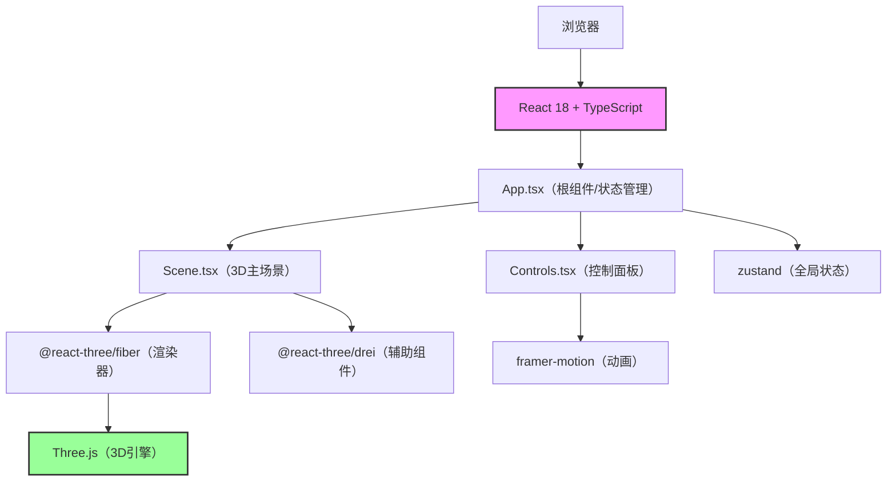

## 1. 架构设计



## 2. 技术描述

* **前端框架**：React\@18 + TypeScript\@5 + Vite\@5

* **3D引擎**：three\@0.160，@react-three/fiber\@8，@react-three/drei\@9

* **动画库**：framer-motion\@11

* **状态管理**：zustand\@4

* **构建工具**：Vite\@5，@vitejs/plugin-react\@4

* **样式方案**：内联样式 + framer-motion动画

* **无后端**，纯前端应用

## 3. 目录结构

```
src/
├── App.tsx          # 根组件，状态管理，场景初始化
├── Scene.tsx        # 3D主场景，圭表、圭尺、太阳、阴影
├── Controls.tsx     # 底部控制面板，滑块和数据显示
└── store/
    └── useAstroStore.ts  # zustand天文状态管理
```

## 4. 核心数据模型

### 4.1 天文计算常量

```typescript
// 24节气（按太阳黄经15度划分）
const SOLAR_TERMS = [
  { name: '小寒', longitude: 285 },
  { name: '大寒', longitude: 300 },
  { name: '立春', longitude: 315 },
  { name: '雨水', longitude: 330 },
  { name: '惊蛰', longitude: 345 },
  { name: '春分', longitude: 0 },
  { name: '清明', longitude: 15 },
  { name: '谷雨', longitude: 30 },
  { name: '立夏', longitude: 45 },
  { name: '小满', longitude: 60 },
  { name: '芒种', longitude: 75 },
  { name: '夏至', longitude: 90 },
  { name: '小暑', longitude: 105 },
  { name: '大暑', longitude: 120 },
  { name: '立秋', longitude: 135 },
  { name: '处暑', longitude: 150 },
  { name: '白露', longitude: 165 },
  { name: '秋分', longitude: 180 },
  { name: '寒露', longitude: 195 },
  { name: '霜降', longitude: 210 },
  { name: '立冬', longitude: 225 },
  { name: '小雪', longitude: 240 },
  { name: '大雪', longitude: 255 },
  { name: '冬至', longitude: 270 }
]

// 12时辰
const CHINESE_HOURS = [
  { name: '子', start: 23, end: 1 },
  { name: '丑', start: 1, end: 3 },
  { name: '寅', start: 3, end: 5 },
  { name: '卯', start: 5, end: 7 },
  { name: '辰', start: 7, end: 9 },
  { name: '巳', start: 9, end: 11 },
  { name: '午', start: 11, end: 13 },
  { name: '未', start: 13, end: 15 },
  { name: '申', start: 15, end: 17 },
  { name: '酉', start: 17, end: 19 },
  { name: '戌', start: 19, end: 21 },
  { name: '亥', start: 21, end: 23 }
]
```

### 4.2 Zustand 状态定义

```typescript
interface AstroState {
  month: number;      // 1-12月
  hour: number;     // 7-19时（辰时到酉时）
  sunPosition: [number, number, number];  // 太阳3D位置
  shadowLength: number;  // 影长（单位）
  solarTerm: string;    // 当前节气
  solarAltitude: number;  // 太阳高度角
  irradiance: number;  // 辐照强度 1-100
  currentHourName: string;  // 当前时辰名称
  highlightedMark: number | null;  // 高亮刻度索引
  setMonth: (month: number) => void;
  setHour: (hour: number) => void;
  calculateAstronomy: () => void;
}
```

## 5. 核心算法

### 5.1 太阳位置计算

```
太阳赤纬角 δ = 23.45 × sin(360 × (284 + N) / 365)

太阳时角 H = 15 × (小时 - 12)

太阳高度角 α = arcsin(sinφ × sinδ + cosφ × cosδ × cosH)

太阳方位角 A = arccos((sinδ - sinφ × sinα) / (cosφ × cosα))

其中：
- N 为一年中的第几天
- φ 为地理纬度（登封约34.5°N）
```

### 5.2 太阳3D位置转换

```
x = R × sin(方位角)
y = R × sin(高度角)
z = R × cos(方位角) × cos(高度角)

R = 20（天空半径）
```

### 5.3 影长计算

```
影长 L = 表高 h / tan(太阳高度角 α)
```

### 5.4 节气计算

```
太阳黄经 λ = 从春分点（0°）起算，每天约增加0.9856°

根据 λ 对24取余，确定当前节气
```

### 5.5 辐照强度估算

```
辐照强度 I = 100 × sin(太阳高度角 α) × 大气透射系数

大气透射系数取0.85
```

## 6. 性能优化策略

1. **阴影优化**：PCFSoftShadowMap，shadow\.mapSize.width/height = 1024
2. **刻度优化**：使用 InstancedMesh 渲染多条刻度线
3. **动画优化**：framer-motion 使用 will-change，避免重排重绘
4. **状态优化**：zustand 选择器模式，避免不必要重渲染
5. **渲染优化**：Three.js 开启 frustumCulling，合理设置 far/near
6. **帧率监控**：使用 drei 的 Stats 组件监控帧率

