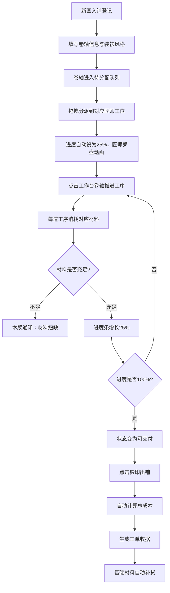

## 1. 产品概述

本产品是一款模拟北宋汴京大相国寺书画装裱工坊的全栈Web应用，用户以裱画铺掌柜的身份，管理待裱卷轴的登记、装裱进度跟踪、材料成本核算与最终交付记录，满足不同藏家对装裱风格的定制需求。

- **核心价值**：通过沉浸式古风界面与完整业务流程，让用户体验古代书画装裱工坊的经营乐趣
- **目标用户**：对传统文化、古风UI、经营模拟类应用感兴趣的用户

## 2. 核心特性

### 2.1 用户角色

| 角色 | 登录方式 | 核心权限 |
|------|----------|----------|
| 裱画铺掌柜 | 直接进入应用 | 卷轴登记、匠师指派、进度管理、成本核算、工单生成 |

### 2.2 功能模块

1. **工坊主视图**：左侧工位区、中央工作台、右侧材料库三栏布局
2. **卷轴登记系统**：新画入铺表单录入，支持装裱风格定制
3. **匠师指派系统**：拖拽分派装裱匠师到不同工位
4. **进度跟踪系统**：实时查看装裱进度，分步推进工序
5. **材料管理系统**：库存管理与消耗核算
6. **工单生成系统**：成本自动计算与收据生成

### 2.3 页面详情

| 页面名称 | 模块名称 | 功能描述 |
|-----------|-------------|---------------------|
| 工坊主页面 | 工位区 | 四张木工案，每案显示匠师头像与名下任务，支持拖拽分派 |
| 工坊主页面 | 工作台 | 当前选中卷轴详情、进度条、材料成本合计、生成工单按钮 |
| 工坊主页面 | 材料库 | 绢/宣纸/浆糊/天杆地轴库存余量显示，卷帘门式滑动抽屉 |
| 新画入铺弹窗 | 登记表单 | 作品名称、作者、年代、尺寸、破损等级、装裱风格录入 |
| 工单收据弹窗 | 收据展示 | 作品名、客户名、日期、成本、手写体签名、水印底纹 |

## 3. 核心流程

## 4. 用户界面设计

### 4.1 设计风格

- **主色调**：米黄色 (#e8dcc8) 作为背景主色，模拟宣纸质感
- **木构色**：深棕色 (#5d3a1a) 用于工案、边框、家具，体现木质结构
- **点缀色**：翠绿色 (#3a7d44) 用于匠师名牌和库存充足提示
- **警告色**：赭红色 (#8b3a3a) 用于报警和材料短缺提示
- **按钮样式**：仿古铜钱造型圆形按钮，悬停凸起，阴影变为古铜色 (#b87333)
- **字体**：思源宋体作为主要字体，体现古风韵味
- **布局风格**：三栏式工坊布局，左侧工位区、中央工作台、右侧材料库
- **动画风格**：卷帘式弹窗、旋转罗盘、进度条平滑过渡、材料数字增减微动画

### 4.2 页面设计概览

| 页面名称 | 模块名称 | UI元素 |
|-----------|-------------|----------|
| 工坊主页面 | 工位区 | 四张木工案、匠师头像、任务卡片、拖拽放置区、罗盘旋转动画 |
| 工坊主页面 | 工作台 | 织物纹理背景、卷轴详情卡片、进度条、材料消耗清单、铜钱按钮 |
| 工坊主页面 | 材料库 | 半透明卷帘门、库存列表、数字增减动画、低库存红色警示 |
| 新画入铺弹窗 | 表单 | 卷帘式打开动画、古风输入框、装裱风格选择器、破损等级滑块 |
| 工单收据弹窗 | 收据 | 米黄底纹、水印"装裱工坊"行书、手写签名、印章效果 |

### 4.3 响应式设计

- **桌面端**：三栏式水平布局，工位区4列网格
- **平板端**：两栏布局，材料库可折叠
- **手机端**：单栏垂直滚动布局，工位区改为垂直列表，支持上下滑动

### 4.4 性能指标

- **拖拽响应**：单次拖拽交互响应 ≤ 100毫秒
- **动画帧率**：进度更新动画保持 60fps 平滑感
- **DOM更新**：材料库存消耗后DOM更新延迟 ≤ 50毫秒
