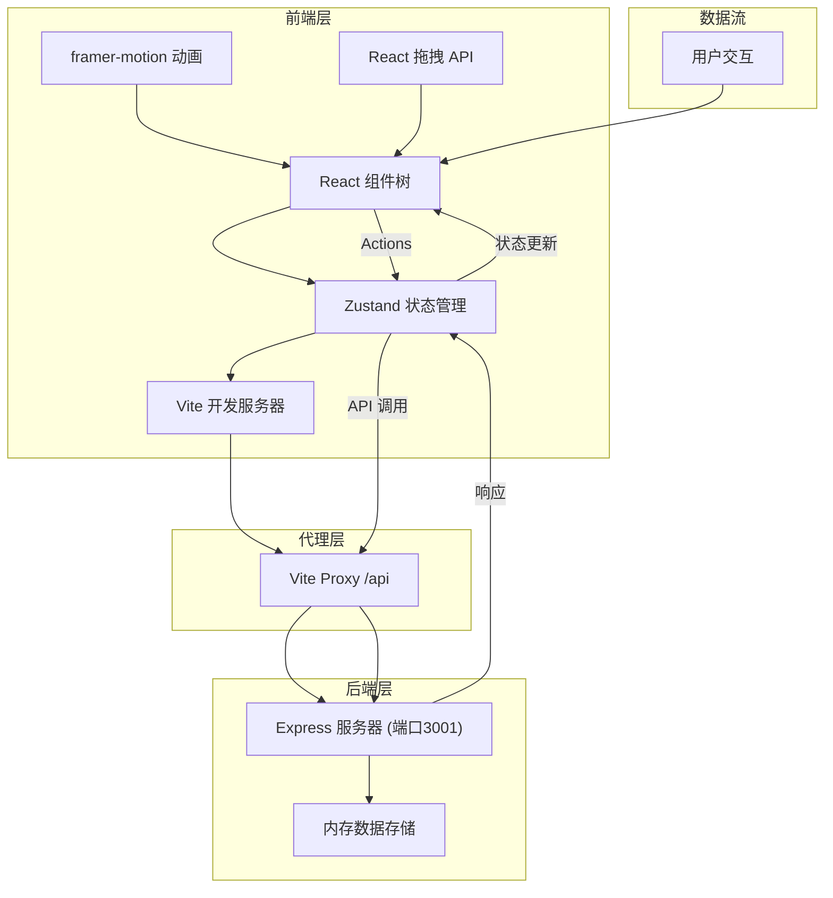
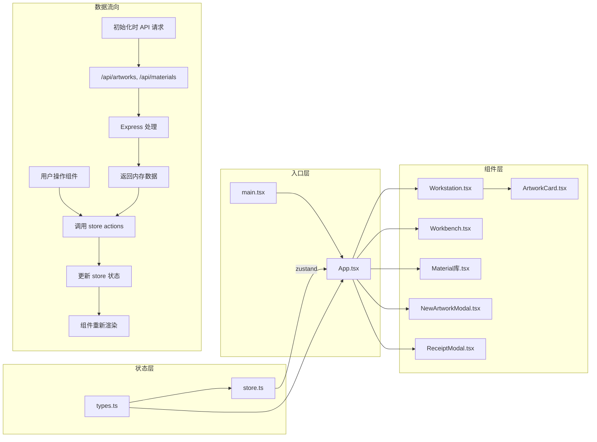
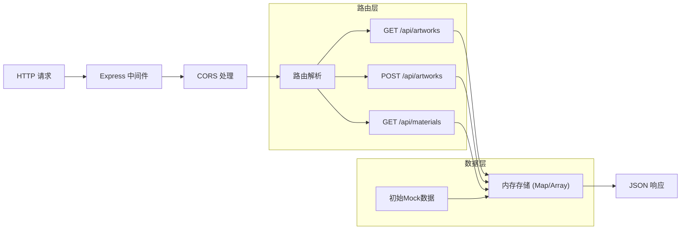

## 1. 架构设计



## 2. 技术描述

* **前端框架**：React 18 + TypeScript

* **构建工具**：Vite 5

* **状态管理**：Zustand 4

* **动画库**：framer-motion 11

* **后端框架**：Express 4

* **ID生成**：uuid 9

* **跨域处理**：cors 2

* **开发模式**：前后端分离，Vite 代理 API 请求到后端

## 3. 目录结构

```
d:\Solocoder\VersionFast\tasks\auto45\
├── package.json              # 项目依赖与脚本
├── vite.config.js           # Vite 构建配置
├── tsconfig.json            # TypeScript 配置
├── index.html               # 入口 HTML
├── src/
│   ├── types.ts             # 核心类型定义
│   ├── App.tsx              # 主应用组件
│   ├── store.ts             # Zustand 全局状态
│   ├── main.tsx             # 应用入口
│   ├── index.css            # 全局样式
│   ├── components/
│   │   ├── Workbench.tsx    # 工作台组件
│   │   ├── Workstation.tsx  # 工位组件
│   │   ├── Material库.tsx   # 材料库组件
│   │   ├── ArtworkCard.tsx  # 卷轴卡片组件
│   │   ├── NewArtworkModal.tsx  # 新画入铺弹窗
│   │   └── ReceiptModal.tsx # 工单收据弹窗
│   └── utils/
│       └── helpers.ts       # 工具函数
└── server/
    └── server.js            # Express 后端服务器
```

## 4. 文件调用关系与数据流

### 4.1 数据流图



### 4.2 核心文件说明

| 文件                               | 职责             | 依赖                        | 被依赖            |
| -------------------------------- | -------------- | ------------------------- | -------------- |
| `src/types.ts`                   | 定义核心接口与枚举      | 无                         | store.ts, 所有组件 |
| `src/store.ts`                   | Zustand 全局状态管理 | types.ts                  | App.tsx, 所有组件  |
| `src/App.tsx`                    | 主布局与组件调度       | store.ts, types.ts, 所有子组件 | main.tsx       |
| `src/components/Workbench.tsx`   | 中央工作台，进度管理     | store.ts, types.ts        | App.tsx        |
| `src/components/Workstation.tsx` | 工位区，拖拽分派       | store.ts, ArtworkCard.tsx | App.tsx        |
| `src/components/Material库.tsx`   | 材料库存展示         | store.ts                  | App.tsx        |
| `server/server.js`               | API 服务，内存数据    | express, cors, uuid       | 前端 API 调用      |

## 5. 核心类型定义

```typescript
enum ArtworkStatus {
  PENDING = 'pending',
  ASSIGNED = 'assigned',
  IN_PROGRESS = 'in_progress',
  COMPLETED = 'completed',
  DELIVERED = 'delivered'
}

enum StyleType {
  XUANHE = 'xuanhe',      // 宣和装
  ALBUM = 'album',        // 册页
  HAND_SCROLL = 'hand_scroll', // 手卷
  VERTICAL = 'vertical'   // 立轴
}

enum DamageLevel {
  MILD = 'mild',          // 轻微
  MODERATE = 'moderate',  // 中度
  SEVERE = 'severe',      // 较重
  CRITICAL = 'critical'   // 严重
}

enum ProcessStage {
  TUOXIN = 'tuoxin',      // 托芯
  CAIQIE = 'caiqie',      // 裁切
  FUBEI = 'fubei',        // 覆背
  ZHUANGZHOU = 'zhuangzhou' // 装轴
}

interface BookArtwork {
  id: string;
  title: string;
  artist: string;
  era: string;
  width: number;
  height: number;
  damageLevel: DamageLevel;
  styleType: StyleType;
  progress: number;
  assignedTo: ProcessStage | null;
  status: ArtworkStatus;
  materialCosts: MaterialCostRecord[];
  customerName: string;
  createdAt: string;
}

interface MaterialCostRecord {
  materialType: string;
  amount: number;
  unitPrice: number;
  stage: ProcessStage;
}

interface Materials {
  silk: number;       // 绢
  xuanPaper: number;  // 宣纸
  paste: number;      // 浆糊
  topRod: number;     // 天杆
  bottomRod: number;  // 地轴
}

interface MaterialPrices {
  silk: number;
  xuanPaper: number;
  paste: number;
  topRod: number;
  bottomRod: number;
}
```

## 6. API 定义

### 6.1 卷轴相关接口

#### GET /api/artworks

获取所有卷轴列表

**响应：**

```json
{
  "success": true,
  "data": [
    {
      "id": "uuid",
      "title": "溪山行旅图",
      "artist": "范宽",
      "era": "北宋",
      "width": 3,
      "height": 6,
      "damageLevel": "moderate",
      "styleType": "vertical",
      "progress": 0,
      "assignedTo": null,
      "status": "pending"
    }
  ]
}
```

#### POST /api/artworks

创建新卷轴

**请求体：**

```json
{
  "title": "作品名称",
  "artist": "作者",
  "era": "年代",
  "width": 3,
  "height": 6,
  "damageLevel": "mild",
  "styleType": "xuanhe",
  "customerName": "客户名"
}
```

### 6.2 材料相关接口

#### GET /api/materials

获取材料库存

**响应：**

```json
{
  "success": true,
  "data": {
    "silk": 50,
    "xuanPaper": 100,
    "paste": 30,
    "topRod": 20,
    "bottomRod": 20
  }
}
```

## 7. Store Actions

| Action               | 参数                                                                 | 功能                 |
| -------------------- | ------------------------------------------------------------------ | ------------------ |
| `addWork`            | artwork: Omit\<BookArtwork, 'id' \| 'progress' \| 'status' \| ...> | 添加新卷轴到待分配队列        |
| `assignArtwork`      | artworkId: string, stage: ProcessStage                             | 将卷轴分派到指定工位，进度设为25% |
| `updateProgress`     | artworkId: string, progress: number                                | 更新卷轴进度             |
| `consumeMaterial`    | type: keyof Materials, amount: number                              | 消耗指定数量的材料          |
| `setSelectedArtwork` | id: string \| null                                                 | 设置当前选中的卷轴          |
| `completeArtwork`    | artworkId: string                                                  | 标记卷轴为可交付状态         |
| `deliverArtwork`     | artworkId: string                                                  | 标记卷轴为已交付，计算成本      |
| `restockMaterials`   | 无                                                                  | 补充基础材料库存           |

## 8. 服务器架构



## 9. 性能优化策略

### 9.1 拖拽性能

* 使用 React 原生拖拽 API，避免重渲染

* 拖拽时使用 CSS transform 而非 top/left

* 防抖处理拖拽位置计算

### 9.2 动画性能

* 使用 framer-motion 的硬件加速动画

* 进度条动画使用 CSS transition

* 避免动画期间的重排重绘

### 9.3 状态更新优化

* Zustand 选择器模式，避免不必要重渲染

* 组件拆分，细粒度订阅状态

* 材料库存更新使用微任务批量处理

### 9.4 数据初始化

* 应用启动时并行请求 /api/artworks 和 /api/materials

* 请求失败时使用本地回退数据

* 使用 React Suspense 处理加载状态

