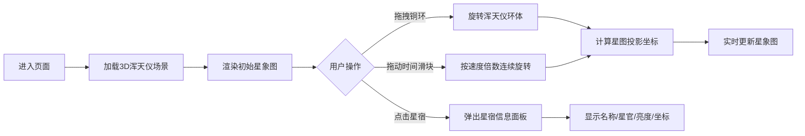

## 1. 产品概述

本产品是一款基于WebGL的3D交互式天文演示应用，重现明代观星台场景，让用户以钦天监监正的视角，通过操作古代浑天仪来理解赤道坐标系与恒星位置的对应关系。应用通过实时同步的浑天仪3D模型和2D星象图，生动展示中国古代二十八宿天文学体系。

- **核心价值**：将复杂的古代天文仪器与星象系统以直观的3D交互方式呈现，兼具教育意义与文化价值
- **目标用户**：天文爱好者、历史文化学习者、教育工作者

## 2. 核心功能

### 2.1 用户角色

| 角色 | 注册方式 | 核心权限 |
|------|----------|----------|
| 访客用户 | 无需注册 | 完整使用所有交互功能，查看星象信息 |

### 2.2 功能模块

1. **3D浑天仪场景**：完整的青铜浑天仪模型，包含底座、蟠龙柱、三层可旋转铜环
2. **2D星象图面板**：实时同步的二十八宿星图，标注主要星辰名称与亮度
3. **交互控制系统**：鼠标拖拽旋转、时间进度控制、速度调节
4. **星宿信息系统**：点击星宿查看详细信息面板

### 2.3 页面详情

| 页面名称 | 模块名称 | 功能描述 |
|----------|----------|----------|
| 主界面 | 3D浑天仪模型 | 三层铜环可独立拖拽旋转，带有缓动动画和惯性效果 |
| 主界面 | 星象图面板 | 右侧悬浮显示，实时根据浑天仪角度更新星图投影 |
| 主界面 | 时间控制条 | 底部水平滑块，支持十二时辰时间调节与速度倍数控制 |
| 主界面 | 星宿信息弹窗 | 点击星图上的星宿弹出详细信息，包含古风宣纸风格设计 |

## 3. 核心流程

## 4. 用户界面设计

### 4.1 设计风格

- **主题色调**：深紫蓝色渐变背景(#1a1a2e → #16213e)，古铜色(#b87333)浑天仪，金色(#ffd700)高亮
- **材质质感**：浑天仪使用MeshStandardMaterial，粗糙度0.3，金属度0.7，边缘发光效果
- **字体**：思源宋体（标题）、楷体（信息面板）
- **布局**：全屏3D场景 + 右侧悬浮面板 + 底部控制条
- **古风元素**：宣纸纹理信息面板、红色印章关闭按钮、十二地支标注

### 4.2 页面设计概述

| 页面名称 | 模块名称 | UI元素 |
|----------|----------|----------|
| 主界面 | 3D浑天仪 | 方形石台底座、四根蟠龙铜柱、六合仪(直径10)、三辰仪(直径8)、四游仪(直径6)、十二地支Sprite标签、红色窥管 |
| 主界面 | 星象图面板 | 350px宽度，半透明深蓝(#0d0d2b)背景，圆形星图半径180px，二十八宿连线，亮度分级星点 |
| 主界面 | 时间控制条 | 500px宽度，圆角20px，半透明黑色背景，金色圆形滑块(直径30px)，方形速度按钮(40x40px) |
| 主界面 | 信息弹窗 | 宣纸纹理(#f5e6cc)背景，墨色边框(#2c2c2c)，红色印章关闭按钮(半径20px) |

### 4.3 响应式设计

- **桌面端(≥768px)**：右侧350px星图面板，底部500px控制条
- **移动端(<768px)**：星图面板移至底部全宽(高度400px)，控制条缩小为300px宽

### 4.4 3D场景设计

- **环境**：深紫蓝色渐变背景，模拟夜空氛围
- **光照**：主光源DirectionalLight(强度0.8) + 环境光AmbientLight(强度0.4) + 点光源模拟星光
- **相机**：PerspectiveCamera，初始位置(0, 5, 15)，开启OrbitControls环绕观察
- **动画**：环体旋转使用framer-motion spring动画(0.5秒)，松开鼠标后惯性转动0.2秒
- **性能**：帧率稳定30fps以上，星图更新响应<50ms

## 5. 性能要求

- 3D场景渲染帧率 ≥ 30fps
- 星象图Canvas更新响应时间 < 50ms
- 鼠标拖拽环体无明显卡顿
- 移动端适配流畅运行
