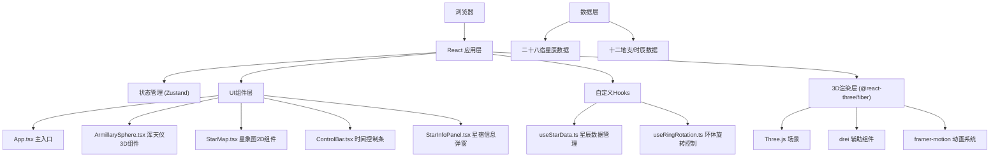

## 1. 架构设计



## 2. 技术描述

* **前端框架**：React\@18 + TypeScript

* **构建工具**：Vite\@5

* **3D渲染**：Three.js + @react-three/fiber + @react-three/drei

* **状态管理**：Zustand

* **动画库**：framer-motion

* **CSS方案**：TailwindCSS\@3 + 内联样式

* **无后端架构**：纯前端应用，数据静态内置

### 依赖清单

| 包名                   | 版本       | 用途               |
| -------------------- | -------- | ---------------- |
| react                | ^18.2.0  | 前端框架             |
| react-dom            | ^18.2.0  | DOM渲染            |
| typescript           | ^5.3.0   | 类型系统             |
| vite                 | ^5.0.0   | 构建工具             |
| @vitejs/plugin-react | ^4.2.0   | React插件          |
| three                | ^0.160.0 | 3D引擎             |
| @react-three/fiber   | ^8.15.0  | React Three.js绑定 |
| @react-three/drei    | ^9.92.0  | Three.js辅助组件     |
| framer-motion        | ^10.16.0 | 动画系统             |
| zustand              | ^4.4.0   | 状态管理             |
| tailwindcss          | ^3.4.0   | CSS框架            |

## 3. 核心数据结构

### 3.1 星辰数据定义

```typescript
interface Star {
  id: string;
  name: string;        // 星辰名称 (如"角宿一")
  mansion: string;     // 所属星官 (如"角宿")
  ra: number;          // 赤经 (度数 0-360)
  dec: number;         // 赤纬 (度数 -90 到 90)
  magnitude: number;   // 亮度等级 (1-6等星)
  isHighlighted: boolean;
}

interface Mansion {
  id: string;
  name: string;        // 二十八宿名称 (如"角宿")
  stars: Star[];
  symbol: string;      // 符号
}

interface RingRotation {
 六合仪: number;  // 外层环 0-360度
  三辰仪: number;  // 中层环 0-360度
  四游仪: number;  // 内层环 0-360度
}
```

### 3.2 全局状态定义

```typescript
interface AppState {
  ringRotations: RingRotation;
  currentTime: number;      // 当前时辰 0-12
  speedMultiplier: number;  // 速度倍数 1/2/5/10
  selectedStar: Star | null;
  highlightedRing: string | null;
  setRingRotation: (ring: keyof RingRotation, angle: number) => void;
  setCurrentTime: (time: number) => void;
  setSpeedMultiplier: (speed: number) => void;
  selectStar: (star: Star | null) => void;
  setHighlightedRing: (ring: string | null) => void;
}
```

## 4. 坐标转换算法

### 4.1 赤道坐标到屏幕坐标转换

```typescript
function equatorialToScreen(
  ra: number,           // 赤经
  dec: number,          // 赤纬
  ringRotations: RingRotation,
  centerX: number,
  centerY: number,
  radius: number
): { x: number; y: number; visible: boolean } {
  // 应用环体旋转修正
  const correctedRA = ra + ringRotations.六合仪 + ringRotations.三辰仪;
  const correctedDec = dec + ringRotations.四游仪 * 0.5;
  
  // 转换为弧度
  const raRad = (correctedRA * Math.PI) / 180;
  const decRad = (correctedDec * Math.PI) / 180;
  
  // 极坐标投影
  const projectedRadius = radius * (1 - Math.abs(correctedDec) / 90);
  const x = centerX + projectedRadius * Math.cos(raRad);
  const y = centerY - projectedRadius * Math.sin(raRad);
  
  // 可见性判断
  const visible = correctedDec > -30 && correctedDec < 90;
  
  return { x, y, visible };
}
```

### 4.2 窥管指向计算

```typescript
function getSightingDirection(ringRotations: RingRotation): { ra: number; dec: number } {
  // 四游仪决定赤纬方向，三辰仪+六合仪决定赤经方向
  const ra = (ringRotations.三辰仪 + ringRotations.六合仪) % 360;
  const dec = (ringRotations.四游仪 * 0.5) % 90;
  return { ra, dec };
}
```

## 5. 组件结构

```
src/
├── App.tsx                 # 主应用组件，Canvas容器
├── components/
│   ├── ArmillarySphere.tsx # 浑天仪3D组件
│   ├── StarMap.tsx         # 2D星象图Canvas组件
│   ├── ControlBar.tsx      # 底部时间控制条
│   ├── StarInfoPanel.tsx   # 星宿信息弹窗
│   ├── BronzeRing.tsx      # 铜环原子组件
│   ├── DragonPillar.tsx    # 蟠龙柱组件
│   └── StoneBase.tsx       # 石台底座组件
├── hooks/
│   ├── useStarData.ts      # 星辰数据管理Hook
│   └── useRingDrag.ts      # 环体拖拽控制Hook
├── store/
│   └── useAppStore.ts      # Zustand全局状态
├── data/
│   ├── stars.ts            # 二十八宿星辰数据
│   └── constellations.ts   # 星座连线数据
├── types/
│   └── index.ts            # TypeScript类型定义
└── utils/
    ├── coordinates.ts      # 坐标转换工具
    └── astronomy.ts        # 天文计算工具
```

## 6. 性能优化策略

1. **3D渲染优化**

   * 使用instancedMesh渲染重复几何体（十二地支标签）

   * 材质共享，避免重复创建MeshStandardMaterial

   * 合理设置像素比，限制最大像素比为2

2. **星图更新优化**

   * 使用requestAnimationFrame批量更新

   * 仅当旋转角度变化超过阈值时重绘

   * Canvas绘制采用离屏缓存静态元素

3. **动画优化**

   * framer-motion spring动画配置合理的阻尼参数

   * 避免动画期间频繁触发重渲染

   * 使用useMemo缓存计算结果

4. **状态更新优化**

   * Zustand状态选择器避免不必要重渲染

   * 旋转角度使用数值而非引用传递

   * 节流处理鼠标拖拽事件

