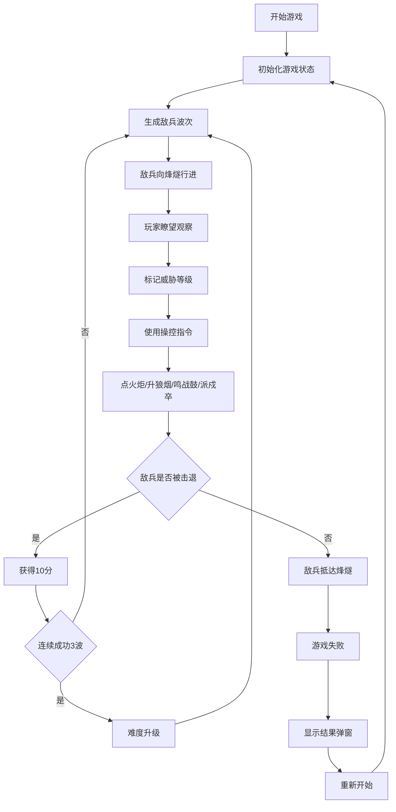

## 1. 产品概述

唐代边塞烽燧戍守策略模拟游戏，玩家扮演烽帅，通过瞭望、点火、鸣鼓和派遣戍卒来防御外敌入侵。

- 核心玩法：实时策略防御，管理烽火信号、瞭望敌情和调度戍卒换防
- 目标用户：对历史军事策略游戏感兴趣的玩家
- 市场价值：融合历史文化与策略游戏，提供沉浸式古代边塞防御体验

## 2. 核心功能

### 2.1 用户角色

| 角色 | 注册方式 | 核心权限 |
|------|----------|----------|
| 烽帅（玩家） | 无需注册，直接进入游戏 | 瞭望敌情、操控烽火、鸣鼓示警、派遣戍卒、标记威胁 |

### 2.2 功能模块

1. **瞭望区域**：边塞荒漠场景，敌兵行进动画，敌情信息显示，威胁等级标记
2. **操控面板**：点火炬、升狼烟、鸣战鼓、派戍卒四大指令，带冷却时间
3. **敌情系统**：波次自动生成敌兵，难度递增机制
4. **戍卒管理**：戍卒部署与召回，疲劳度系统
5. **计分系统**：得分统计，胜负判定，难度升级

### 2.3 页面详情

| 页面名称 | 模块名称 | 功能描述 |
|----------|----------|----------|
| 主游戏页面 | 瞭望区域 | 渲染边塞荒漠场景，敌兵动态行进，悬停显示人数距离，点击标记威胁等级 |
| 主游戏页面 | 操控面板 | 四个功能按钮，冷却时间显示，戍卒状态管理 |
| 主游戏页面 | 状态面板 | 分数显示、波次信息、戍卒数量、疲劳度 |
| 主游戏页面 | 游戏结果弹窗 | 胜利/失败提示，最终得分，重新开始 |

## 3. 核心流程

玩家进入游戏后，瞭望区域开始自动生成敌兵波次。玩家通过观察敌情，点击敌兵标记威胁等级，使用操控面板的四大指令进行防御。成功击退敌兵获得分数，连续成功3波后难度升级。若敌兵抵达烽燧则游戏失败。

## 4. 用户界面设计

### 4.1 设计风格

- **主色调**：土黄#d4c3a3、赭石#a67c52、暗红#8b0000、深木色#5d3a1a
- **点缀色**：火光橙#ff8c00至#ff4500渐变
- **按钮风格**：深木色底色，赭石边框，点击弹性按压效果（scale 0.95）
- **字体**：思源宋体，营造唐代古风
- **布局风格**：左侧60%瞭望区域，右侧40%操控面板，等距俯视视角（rotateX(35deg)）
- **视觉风格**：唐代边塞水墨风，沙地噪点纹理，烽燧台几何体组合，敌兵深色剪影

### 4.2 页面设计概述

| 页面名称 | 模块名称 | UI元素 |
|----------|----------|--------|
| 主游戏页面 | 瞭望区域 | 渐变天空#2a1a0a至#5a3a1a，黄沙#d4c3a3地面，烽燧台#a67c52土墙，敌兵6px黑色#1a1a1a小点，悬停提示框，标记发光圆圈 |
| 主游戏页面 | 操控面板 | 深木色#5d3a1a背景，纹理边框，四个功能按钮，冷却进度条，戍卒状态列表 |
| 主游戏页面 | 状态面板 | 分数显示，波次计数，戍卒数量，难度等级 |
| 主游戏页面 | 反馈效果 | 成功防御绿色闪光（0.5秒），失败屏幕震动模糊（0.3秒），鼓声脉冲动画 |

### 4.3 响应式

- **桌面端**：左侧60%瞭望区域，右侧40%固定操控面板
- **移动端（<768px）**：瞭望区域100%宽度，操控面板变为底部可收起抽屉（30%高度）
- **触摸优化**：按钮增大点击区域，支持触摸滑动部署戍卒

### 4.4 3D场景指导

- **环境**：夜间边塞荒漠，日落渐变天空，黄沙地面噪点纹理
- **视角**：等距俯视，CSS 3D变换 rotateX(35deg)
- **光影**：烽火台径向渐变脉动光晕，敌兵无阴影剪影风格
- **动画**：
  - 敌兵：requestAnimationFrame平滑移动
  - 烽火：径向渐变脉动，透明度呼吸效果
  - 狼烟：粒子系统向上飘散，透明度递减
  - 戍卒：队列移动动画
  - 反馈：屏幕震动、闪光效果
- **性能**：FPS ≥ 30，活动实体 ≤ 50，状态更新 ≤ 60次/秒

