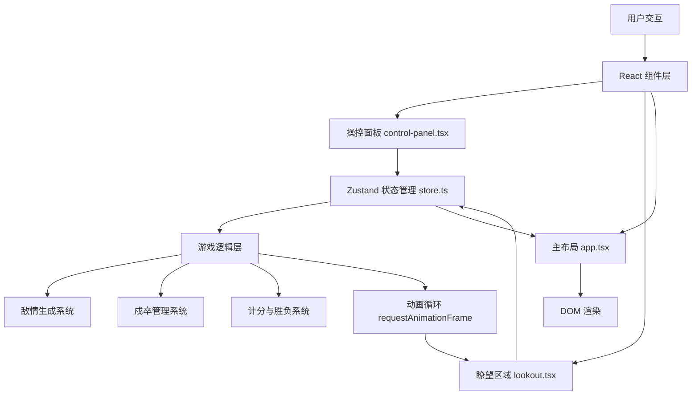
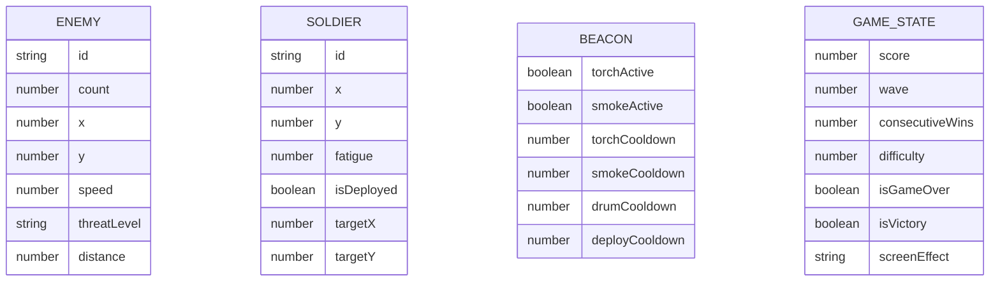

## 1. 架构设计



**数据流向说明**：
1. 用户在 `control-panel.tsx` 点击按钮 → 调用 `store.ts` 中的 action 更新状态
2. `store.ts` 状态变更 → 触发 `lookout.tsx` 和 `app.tsx` 重新渲染
3. `lookout.tsx` 从 `store.ts` 读取敌情、戍卒位置 → 渲染 Canvas/CSS 动画
4. 游戏循环 `requestAnimationFrame` → 更新敌兵位置 → 更新 `store.ts` → 触发重绘

## 2. 技术描述

- **前端框架**：React 18 + TypeScript
- **构建工具**：Vite 5
- **状态管理**：Zustand 4
- **动画库**：Framer Motion 11
- **初始化工具**：vite-init react-ts 模板
- **后端**：无，纯前端游戏
- **数据库**：无，状态存储于内存

## 3. 路由定义

| 路由 | 用途 |
|------|------|
| / | 游戏主页面 |

## 4. API 定义

无后端API，所有逻辑在前端实现。

## 5. 数据模型

### 5.1 数据模型定义



### 5.2 TypeScript 类型定义

```typescript
// 敌兵
interface Enemy {
  id: string;
  count: number;
  x: number;
  y: number;
  speed: number;
  threatLevel: 'green' | 'yellow' | 'red' | null;
  distance: number;
}

// 戍卒
interface Soldier {
  id: string;
  x: number;
  y: number;
  fatigue: number;
  isDeployed: boolean;
  targetX: number | null;
  targetY: number | null;
}

// 烽火台状态
interface Beacon {
  torchActive: boolean;
  smokeActive: boolean;
  torchCooldown: number;
  smokeCooldown: number;
  drumCooldown: number;
  deployCooldown: number;
}

// 游戏状态
interface GameState {
  score: number;
  wave: number;
  consecutiveWins: number;
  difficulty: number;
  isGameOver: boolean;
  isVictory: boolean;
  screenEffect: 'none' | 'success' | 'failure' | 'drum';
  enemies: Enemy[];
  soldiers: Soldier[];
  beacon: Beacon;
}
```

## 6. 文件结构与调用关系

```
src/
├── main.tsx                # 入口 → 挂载 App，引入样式
├── app.tsx                 # 主布局 → 接收 store 状态 → 分发给子组件
├── store.ts                # 状态管理 → 接收交互 → 更新状态 → 通知重绘
├── types.ts                # 类型定义
├── styles/
│   └── global.css          # 全局样式
├── scenes/
│   ├── lookout.tsx         # 瞭望区域 → 从 store 读取 → 渲染动画
│   └── control-panel.tsx   # 操控面板 → 用户点击 → 更新 store
├── hooks/
│   ├── useGameLoop.ts      # 游戏循环 Hook
│   └── useEnemySpawner.ts  # 敌兵生成 Hook
└── utils/
    ├── constants.ts        # 常量配置
    └── helpers.ts          # 辅助函数
```

**调用关系**：
- `main.tsx` → `app.tsx` → `store.ts`
- `app.tsx` → `lookout.tsx` (props: enemies, soldiers, beacon)
- `app.tsx` → `control-panel.tsx` (props: actions, beacon, soldiers)
- `useGameLoop.ts` → `store.ts` (更新敌兵位置、戍卒疲劳)
- `useEnemySpawner.ts` → `store.ts` (生成新敌兵波次)

## 7. 性能优化策略

1. **实体数量限制**：敌兵 + 戍卒 ≤ 50 个活动实体
2. **动画循环**：使用 `requestAnimationFrame`，状态更新 ≤ 60次/秒
3. **组件优化**：使用 `React.memo` 避免不必要重渲染
4. **状态分片**：Zustand 使用 selector 精确订阅需要的状态
5. **CSS 动画**：优先使用 CSS transforms 和 opacity 动画，避免触发重排
6. **内存管理**：及时清理已击退敌兵和闲置定时器

