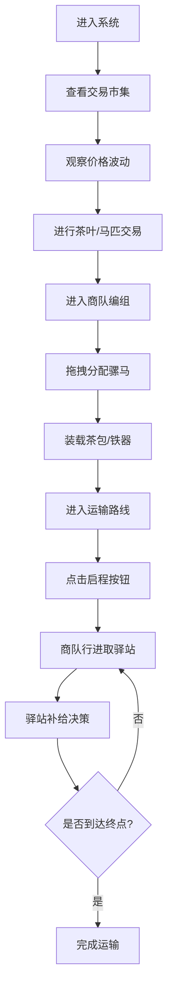

## 1. 产品概述
本产品是一个虚拟古代茶马互市交易管理与运输模拟的全栈Web应用，让用户以明代茶马司官员的身份，体验管理茶叶收购、马匹估价、商队编组及模拟从产地到边境驿站的完整运输过程。

- **核心目的**：通过沉浸式的界面和丰富的交互动画，重现古代茶马古道的贸易场景
- **目标用户**：历史爱好者、策略游戏玩家、教育场景学习者
- **市场价值**：融合历史教育与互动娱乐，提供独特的文化体验

## 2. 核心功能

### 2.1 用户角色
| 角色 | 登录方式 | 核心权限 |
|------|----------|----------|
| 茶马司官员 | 直接进入（模拟登录） | 管理茶叶收购、马匹交易、商队编组、运输调度 |

### 2.2 功能模块
1. **交易市集**：实时价格走势图表、茶叶与马匹交易、交易记录管理
2. **商队编组**：骡马拖拽分配、物资装载、负载监控
3. **运输路线**：拓扑地图展示、商队行进动画、驿站补给管理
4. **通知系统**：侧边通知栏、系统消息推送

### 2.3 页面详情
| 页面名称 | 模块名称 | 功能描述 |
|---------|----------|----------|
| 主面板 | 标签页切换 | 三个标签页水平滑动切换（0.3s动画），显示时间戳和库存总量 |
| 交易市集 | 价格走势图 | 茶叶（砖茶/散茶/饼茶）和马匹（河曲马/滇马/蒙古马）价格，X轴时辰（辰时-酉时），Y轴银两数，每2秒更新带抖动动画 |
| 交易市集 | 交易记录表格 | 显示交易时间、物品名称、数量、单价、总价，新记录从底部淡入 |
| 商队编组 | 骡马列表 | 显示品种、负重上限、速度，支持拖拽到编组区 |
| 商队编组 | 编组区 | 3x3网格布局，显示马匹缩略图和负载进度条（绿到红渐变） |
| 商队编组 | 物资库 | 茶包/铁器拖拽装载，超载80%时进度条橙色+图标抖动 |
| 运输路线 | 拓扑地图 | 雅安(起点)→康定→理塘→巴塘→拉萨(终点)，连线随海拔渐变 |
| 运输路线 | 商队动画 | 沿路线移动，速度由最慢马匹决定，到达驿站弹出补给窗口 |
| 运输路线 | 补给系统 | 30秒倒计时，显示剩余物资和折损率，选择补充物资 |
| 通知系统 | 侧边通知栏 | 垂直滚动消息列表，红/黄/蓝三色区分紧急/警告/信息，新消息从顶部滑入 |

## 3. 核心流程

## 4. 用户界面设计

### 4.1 设计风格
- **整体风格**：仿古羊皮纸风格，营造历史沉浸感
- **主色调**：米黄(#f4e8c1)、赭石(#8b5a2b)、墨绿(#2d5016)
- **按钮样式**：木纹纹理背景(#a0785a)、金色边框(#c8963e)、0.5s悬停放大效果
- **字体**：思源宋体（Google Fonts引入）
- **卡片动画**：0.6s从底部上浮入，纸张翻页声效（CSS keyframes实现）
- **布局**：左窄右宽两栏结构（左侧240px固定导航栏，右侧自适应内容区）
- **图标**：线描风格（茶壶、马蹄、商队旗帜等）

### 4.2 页面设计概述
| 页面名称 | 模块名称 | UI元素 |
|---------|----------|--------|
| 交易市集 | 价格走势图 | Recharts折线图、时辰X轴、银两Y轴、抖动动画 |
| 交易市集 | 交易记录 | 仿古表格、淡入动画、羊皮纸纹理背景 |
| 商队编组 | 骡马列表 | 卡片式展示、拖拽手柄、品种标签 |
| 商队编组 | 编组网格 | 3x3网格、进度条渐变、超载抖动效果 |
| 运输路线 | 拓扑地图 | SVG绘制、节点连线海拔渐变、商队图标动画 |
| 运输路线 | 补给弹窗 | 模态窗口、倒计时、物资选择 |
| 全局 | 侧边通知栏 | 固定宽度、三色消息、滑入动画 |
| 全局 | 导航栏 | 线描图标、当前页面高亮、底部tab响应式 |

### 4.3 响应式设计
- **桌面端**（>768px）：左侧240px固定导航栏，右侧内容区自适应
- **平板/移动端**（≤768px）：导航栏折叠为底部tab栏，内容区全宽
- **触控优化**：拖拽区域扩大，按钮最小尺寸48px

### 4.4 性能要求
- 价格图表更新帧率 ≥ 30fps
- 运输动画帧率 ≥ 24fps
- 初次加载时间 ≤ 2秒
