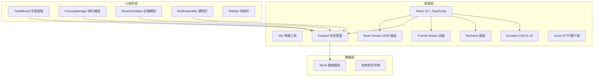

## 1. 架构设计



## 2. 技术描述

* **前端框架**：React 18 + TypeScript 5

* **构建工具**：Vite 5

* **路由管理**：react-router-dom 6

* **状态管理**：zustand 4

* **动画库**：framer-motion 11

* **图表库**：recharts 2

* **样式方案**：@emotion/react + @emotion/styled 11

* **HTTP客户端**：axios 1

* **设计风格**：仿古羊皮纸主题，自定义CSS变量

* **数据来源**：前端Mock数据，定时器模拟实时更新

## 3. 目录结构

```
src/
├── App.tsx                 # 主路由与全局状态协调
├── main.tsx                # 应用入口
├── components/
│   ├── TradeBoard.tsx      # 交易市集面板
│   ├── ConvoyManager.tsx   # 商队编组模块
│   ├── RouteSimulator.tsx  # 运输路线模拟
│   ├── NotificationBar.tsx # 侧边通知栏
│   ├── Sidebar.tsx         # 左侧导航栏
│   └── TabContainer.tsx    # 标签页容器（带动画）
├── store/
│   └── useStore.ts         # Zustand全局状态
├── types/
│   └── index.ts            # TypeScript类型定义
├── utils/
│   ├── mockData.ts         # Mock数据生成
│   └── constants.ts        # 常量配置
└── styles/
    ├── global.css          # 全局样式
    └── theme.ts            # 主题变量
```

## 4. 路由定义

| 路由      | 用途            |
| ------- | ------------- |
| /       | 主面板（默认显示交易市集） |
| /trade  | 交易市集          |
| /convoy | 商队编组          |
| /route  | 运输路线          |

## 5. 数据模型

### 5.1 数据模型定义

```mermaid
erDiagram
    TEA {
        string id "茶叶ID"
        string name "名称（砖茶/散茶/饼茶）"
        number basePrice "基础价格（银两）"
        number currentPrice "当前价格"
        number stock "库存量"
        string quality "品级"
    }
    
    HORSE {
        string id "马匹ID"
        string breed "品种（河曲马/滇马/蒙古马）"
        number basePrice "基础价格"
        number currentPrice "当前价格"
        number maxLoad "负重上限"
        number speed "速度"
        string thumbnail "缩略图"
    }
    
    TRADE_RECORD {
        string id "记录ID"
        string timestamp "交易时间"
        string itemName "物品名称"
        string itemType "类型（茶叶/马匹）"
        number quantity "数量"
        number unitPrice "单价"
        number totalPrice "总价"
    }
    
    CONVOY_SLOT {
        string id "槽位ID"
        HORSE horse "马匹"
        number currentLoad "当前负载"
        CARGO[] cargo "货物列表"
    }
    
    CARGO {
        string id "货物ID"
        string type "类型（茶包/铁器）"
        number weight "重量（0.5单位）"
    }
    
    ROUTE_NODE {
        string id "节点ID"
        string name "驿站名称"
        number x "地图X坐标"
        number y "地图Y坐标"
        number altitude "海拔高度"
        boolean isStart "是否起点"
        boolean isEnd "是否终点"
    }
    
    NOTIFICATION {
        string id "消息ID"
        string type "类型（紧急/警告/信息）"
        string message "消息内容"
        string timestamp "时间戳"
    }
```



### 5.2 核心类型定义

```typescript
// 茶叶类型
interface Tea {
  id: string;
  name: '砖茶' | '散茶' | '饼茶';
  basePrice: number;
  currentPrice: number;
  stock: number;
  quality: string;
}

// 马匹类型
interface Horse {
  id: string;
  breed: '河曲马' | '滇马' | '蒙古马';
  basePrice: number;
  currentPrice: number;
  maxLoad: number;
  speed: number;
  thumbnail: string;
}

// 交易记录
interface TradeRecord {
  id: string;
  timestamp: string;
  itemName: string;
  itemType: 'tea' | 'horse';
  quantity: number;
  unitPrice: number;
  totalPrice: number;
}

// 商队槽位
interface ConvoySlot {
  id: string;
  horse: Horse | null;
  currentLoad: number;
  cargo: CargoItem[];
}

// 货物
interface CargoItem {
  id: string;
  type: '茶包' | '铁器';
  weight: number;
}

// 路线节点
interface RouteNode {
  id: string;
  name: string;
  x: number;
  y: number;
  altitude: number;
  isStart: boolean;
  isEnd: boolean;
}

// 通知消息
interface Notification {
  id: string;
  type: 'urgent' | 'warning' | 'info';
  message: string;
  timestamp: string;
}

// 时辰
type TimePeriod = '辰时' | '巳时' | '午时' | '未时' | '申时' | '酉时';

// 价格数据点
interface PriceDataPoint {
  time: TimePeriod;
  砖茶: number;
  散茶: number;
  饼茶: number;
  河曲马: number;
  滇马: number;
  蒙古马: number;
}
```

## 6. 性能优化策略

1. **图表性能**：使用Recharts的isAnimationActive控制动画，memo化价格数据组件
2. **动画性能**：Framer Motion使用transform和opacity属性，避免layout thrashing
3. **拖拽性能**：使用requestAnimationFrame优化拖拽更新，debounce处理负载计算
4. **懒加载**：组件按路由拆分，非关键资源延迟加载
5. **状态优化**：Zustand使用selector避免不必要的重渲染
6. **字体优化**：使用font-display: swap预加载思源宋体

