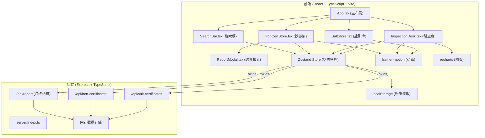
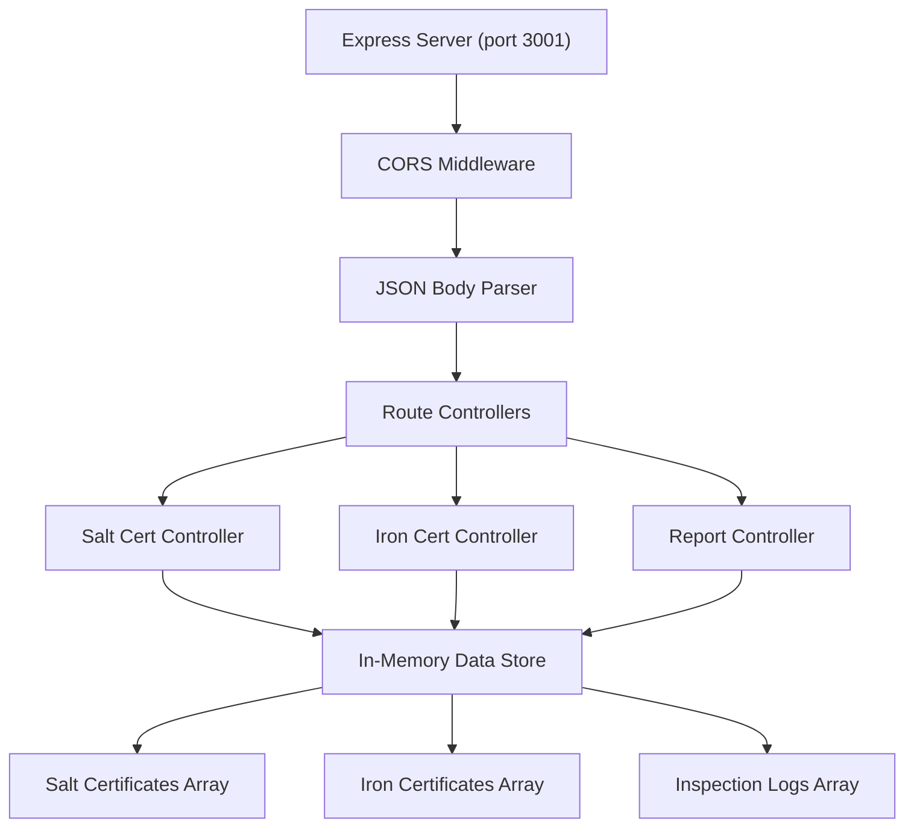
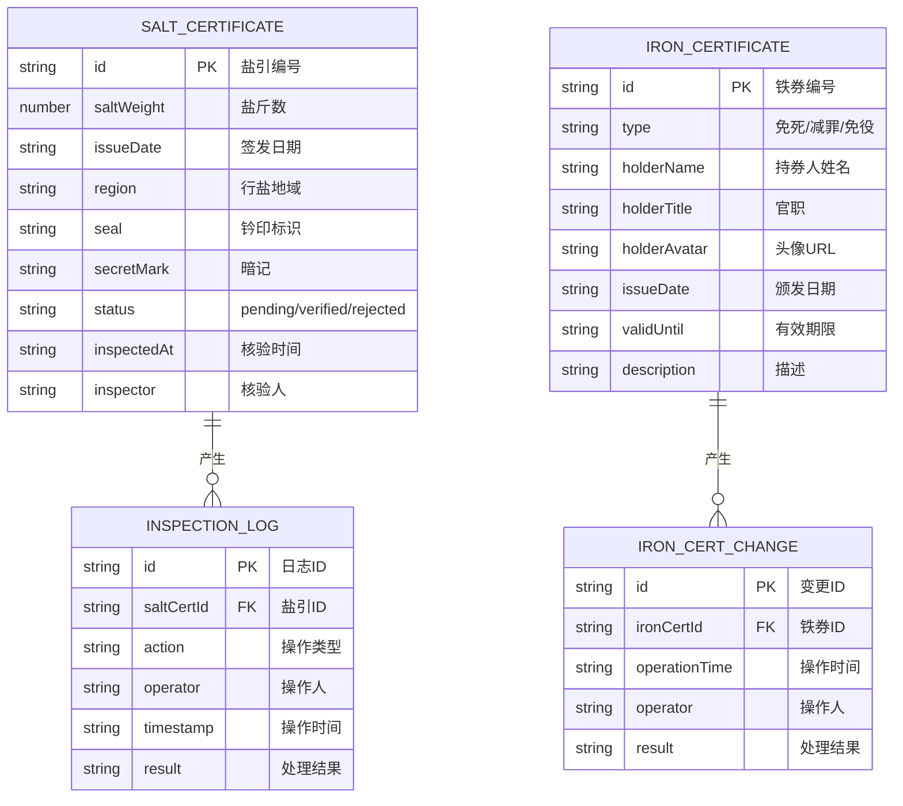

## 1. 架构设计



## 2. 技术描述

- **前端**：React@18 + TypeScript@5 + Vite@5
- **后端**：Express@4 + TypeScript@5
- **状态管理**：zustand@4
- **动画库**：framer-motion@11
- **图表库**：recharts@2
- **路由**：react-router-dom@6
- **HTTP客户端**：axios@1
- **ID生成**：uuid@9
- **跨域**：cors@2
- **构建配置**：base='./'，代理/api到后端3001端口

## 3. 路由定义

| 路由 | 用途 |
|-------|---------|
| / | 主场景（转运司衙门） |

## 4. API 定义

### 4.1 盐引接口

#### GET /api/salt-certificates
获取盐引列表，支持搜索和排序

**Query参数：**
- `search` (string, optional): 模糊匹配编号
- `sort` (string, optional): 'asc' | 'desc' 按时间排序

**响应：**
```typescript
SaltCertificate[]
```

#### POST /api/salt-certificates
创建新盐引

**请求体：**
```typescript
{
  id: string;
  saltWeight: number;
  issueDate: string;
  region: string;
  seal: string;
  secretMark: string;
  status: 'pending' | 'verified' | 'rejected';
}
```

#### PUT /api/salt-certificates/:id
更新盐引状态（核验结果）

**请求体：**
```typescript
{
  status: 'verified' | 'rejected';
  inspectedAt: string;
  inspector: string;
}
```

### 4.2 铁券接口

#### GET /api/iron-certificates
获取铁券列表，支持搜索和排序

**Query参数：**
- `search` (string, optional): 模糊匹配持有人姓名
- `sort` (string, optional): 'asc' | 'desc'

**响应：**
```typescript
IronCertificate[]
```

#### POST /api/iron-certificates
创建新铁券

#### PUT /api/iron-certificates/:id
更新铁券信息

### 4.3 月终结算接口

#### GET /api/report?month=YYYY-MM
生成月度对账报表

**响应：**
```typescript
{
  month: string;
  totalIssued: number;
  totalVerified: number;
  totalRejected: number;
  ironCertChanges: IronCertChange[];
  anomalies: ReportItem[];
  normalItems: ReportItem[];
}
```

## 5. 服务器架构



## 6. 数据模型

### 6.1 数据模型定义



### 6.2 TypeScript 类型定义

```typescript
// src/types.ts

interface SaltCertificate {
  id: string;
  saltWeight: number;
  issueDate: string;
  region: string;
  seal: string;
  secretMark: string;
  status: 'pending' | 'verified' | 'rejected';
  inspectedAt?: string;
  inspector?: string;
}

interface IronCertificate {
  id: string;
  type: 'death-exemption' | 'sentence-reduction' | 'corvee-exemption';
  typeName: string;
  holderName: string;
  holderTitle: string;
  holderAvatar: string;
  issueDate: string;
  validUntil: string;
  description: string;
}

interface InspectionLog {
  id: string;
  saltCertId: string;
  action: string;
  operator: string;
  timestamp: string;
  result: 'verified' | 'rejected';
}

interface IronCertChange {
  id: string;
  ironCertId: string;
  operationTime: string;
  operator: string;
  result: string;
}

interface DailyStats {
  date: string;
  issued: number;
  verified: number;
  rejected: number;
}

interface ReportItem {
  id: string;
  description: string;
  expected: number;
  actual: number;
  difference: number;
  isAnomaly: boolean;
}

interface MonthlyReport {
  month: string;
  totalIssued: number;
  totalVerified: number;
  totalRejected: number;
  ironCertChanges: IronCertChange[];
  anomalies: ReportItem[];
  normalItems: ReportItem[];
}
```

### 6.3 初始数据

后端启动时初始化模拟数据：
- 10条待核验盐引，包含随机的钤印和暗记（70%匹配率）
- 3条不同品级的铁券（免死、减罪、免役各一）
- 最近7天的统计数据用于图表展示
