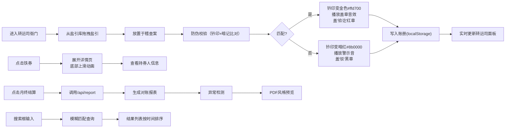

## 1. 产品概述

宋代盐铁官营体系数字化监管平台，通过现代Web技术模拟古代盐引与铁券流转监管流程，解决传统盐铁专卖管理中盐引核发、铁券铸造和转运司稽查之间难以实时对账和防止伪造的核心问题。

- 目标用户：历史爱好者、教育工作者、文化传播者
- 核心价值：以沉浸式交互体验展示中国古代经济监管制度的智慧

## 2. 核心功能

### 2.1 用户角色

| 角色 | 注册方式 | 核心权限 |
|------|----------|----------|
| 转运司官员 | 直接使用（模拟） | 盐引稽查、铁券管理、月终结算、记录查询 |

### 2.2 功能模块

1. **主场景（转运司衙门）**：宋代风格建筑背景，三列布局交互界面
2. **盐引库**：盐引列表展示、拖拽签发、防伪校验
3. **稽查案**：盐引核验、防伪比对动画、验讫结果展示
4. **铁券架**：三级铁券展示、SVG券面绘制、详情弹窗
5. **转运司面板**：统计图表、变更记录、稽查报告
6. **月终结算**：对账报表生成、异常检测、PDF风格预览
7. **搜索系统**：历史记录模糊查询、时间排序

### 2.3 页面详情

| 页面名称 | 模块名称 | 功能描述 |
|-----------|-------------|---------------------|
| 主场景 | 盐引库 | 展示当日定额盐引列表，支持拖拽到稽查区，每项显示编号、盐斤数、签发日期、行盐地域 |
| 主场景 | 稽查案 | 中央交互区，显示盐引防伪比对过程，钤印变色动画，音效反馈，盖章效果 |
| 主场景 | 铁券架 | 右侧展示免死、减罪、免役三级铁券，SVG绘制券面纹路，点击展开详情 |
| 主场景 | 转运司面板 | 底部面板，柱状图展示每日核发量、表格记录铁券变更、卡片显示稽查报告 |
| 主场景 | 搜索框 | 右上角搜索，支持模糊匹配盐引编号或铁券持有人姓名 |
| 详情弹窗 | 铁券详情 | 显示持券人信息、圆形头像、颁发日期、有效期限 |
| 结算弹窗 | 月终结算 | PDF风格报表，异常条目红色闪烁，正常条目绿色显示 |

## 3. 核心流程

## 4. 用户界面设计

### 4.1 设计风格

- **主色调**：暖色调木色系 - 主色#5d3a1a、辅色#8b5e3c、强调色#b8860b
- **背景色**：#8b9a8b（青瓦灰）
- **按钮风格**：木质边框、圆角8px、悬停时轻微上浮阴影
- **字体**：思源宋体（标题）、系统宋体（正文）
- **布局风格**：三列纵向结构，左300px、中flex-grow、右250px
- **装饰元素**：《盐铁论》山水画屏风背景、木质纹理边框、篆刻印章元素

### 4.2 页面设计概述

| 页面名称 | 模块名称 | UI Elements |
|-----------|-------------|-------------|
| 主场景 | 盐引库 | 木质卷轴卡片、拖拽弹性动画、悬停缩放1.05倍 |
| 主场景 | 稽查案 | 仿古书桌纹理、盐引展开动画、钤印金色脉冲、盖章下落动画 |
| 主场景 | 铁券架 | SVG铁质纹路、金色#d4a017楷体刻字、悬停发光效果 |
| 主场景 | 转运司面板 | 卷轴背景、recharts柱状图（#a8d08a到#6b8e23渐变）、framer-motion逐行淡入 |
| 详情弹窗 | 铁券详情 | 半透明遮罩rgba(0,0,0,0.5)、底部上滑动画、CSS clip-path圆形头像 |
| 结算弹窗 | 月终结算 | 仿宣纸背景、PDF分页效果、异常#e74c3c闪烁、正常#27ae60 |
| 全局 | 搜索框 | 右上角悬浮、模糊匹配高亮、排序切换按钮 |

### 4.3 响应性

- **桌面端**：三列布局，左300px、中自适应、右250px
- **窄屏（<1024px）**：左右列折叠为顶部导航栏，中央区域占满宽度
- **触摸优化**：拖拽区域增大40px点击热区，按钮最小44x44px

### 4.4 动画与性能

- **拖拽动画**：framer-motion drag系列API，弹性缩放效果
- **盐引验讫**：1s金色光晕脉冲动画，@keyframes pulse-gold
- **铁券详情**：y轴从100%到0%上滑，duration 0.4s，ease-out
- **日志列表**：framer-motion staggered 0.1s逐行淡入
- **性能要求**：所有动画帧率≥45fps，单次校验响应<200ms

## 5. 交互细节

- 盐引拖拽时显示缩略图跟随光标，缩放0.8倍
- 钤印匹配时播放清脆盖章音效，不匹配时低沉警示音
- 铁券点击时展开详情，点击遮罩或关闭按钮收起
- 搜索结果支持升序/降序切换，带平滑过渡动画
- 月终结算按钮点击后加载动画，报表生成后淡入显示
