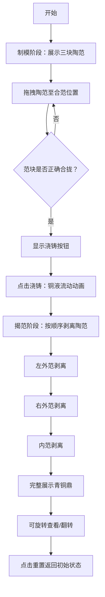

## 1. 产品概述
本应用是一款基于浏览器的古代青铜鼎铸造工艺三维交互可视化工具，用户将扮演殷商时期的铸铜匠师，在虚拟铸造作坊中通过拖拽和拼接陶范来模拟块范法铸造饕餮纹鼎的全过程，实现从制模、合范、浇铸到揭范取器的完整体验。

- 核心目标：以沉浸式3D交互形式还原古代青铜铸造工艺，让用户直观了解中国古代青铜文明的技术成就
- 目标用户：历史爱好者、文博教育从业者、学生群体

## 2. 核心功能

### 2.1 功能模块
1. **3D铸造场景**：殷商铸造作坊环境、可交互陶范组件、铜液粒子系统、青铜鼎模型
2. **拖拽拼合系统**：三块陶范（左外范、右外范、内范）的自由拖拽与磁吸合范
3. **浇铸动画系统**：铜液流动粒子效果、温度变化、范体发热效果
4. **揭范交互系统**：按固定顺序剥离陶范，逐步展现青铜鼎
5. **控制面板**：阶段提示、进度展示、重置与视角切换

### 2.2 页面详情
| 页面名称 | 模块名称 | 功能描述 |
|-----------|-------------|---------------------|
| 主界面 | 3D场景区域 | 居中显示铸造作坊场景，支持陶范拖拽、视角旋转缩放 |
| 主界面 | 控制面板 | 右侧显示当前阶段、操作指南、温度/进度条、功能按钮 |
| 主界面 | 浇铸按钮 | 合范完成后中央出现的"浇铸"触发按钮 |

## 3. 核心流程
用户进入应用后，首先看到工作台上的三块陶范，通过鼠标拖拽将其合拢；合范成功后点击"浇铸"按钮触发铜液浇铸动画；浇铸完成后进入揭范阶段，按顺序拖拽剥离三块陶范；最后完整展示青铜鼎，可360度旋转查看。

## 4. 界面设计

### 4.1 设计风格
- **主色调**：夯土色#c4a882、土黄色#d4b88a、青铜色#b87333、米白色#f5e6d3、深棕色#4a2e1b
- **点缀色**：淡金色#d4af37（悬停效果）、亮橙色#ff6b35（铜液）、暗红色#8b3a3a（发热）
- **字体**：衬线体（如Noto Serif SC）模拟古风
- **按钮风格**：米白底+深棕文字，悬停变淡金，圆角适中
- **整体风格**：暖色调工业风，殷商铸造作坊氛围，粗粝质感与精细纹饰结合

### 4.2 页面设计概述
| 页面名称 | 模块名称 | UI元素 |
|-----------|-------------|-------------|
| 主界面 | 3D场景 | 夯土地面、粗木梁柱、熔炉火光背景、工作台、三块陶范 |
| 主界面 | 控制面板 | 阶段标题、圆形进度条、文字提示、温度条、功能按钮组 |
| 主界面 | 浇铸按钮 | 红色发光按钮，居中悬浮，带脉动动画 |

### 4.3 响应式设计
- 桌面优先设计，适配1280x720和1920x1080分辨率
- 控制面板宽度自适应，最小宽度250px
- 3D场景区域随窗口大小自动调整
- 触屏设备支持基础拖拽操作

### 4.4 3D场景指引
- **环境**：暖色调环境光，背景透入熔炉橙红色火光，营造铸造作坊氛围
- **光照**：主光源模拟熔炉火光（暖橙色），环境光提供基础照明，点光源突出鼎身金属光泽
- **相机**：初始视角略微俯视工作台，支持OrbitControls环绕旋转（360度）、滚轮缩放
- **材质**：范块使用带噪点纹理的Lambert材质，铜鼎使用金属质感的Standard材质
- **动画**：铜液粒子流动、范块发热颜色渐变、陶范剥离过渡、铜鼎光泽变化
- **性能**：帧率不低于45fps，粒子数≤800，纹理≤1024x1024
