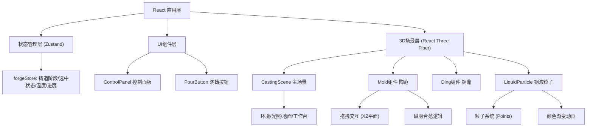

## 1. 架构设计



## 2. 技术选型

* **前端框架**：React 18 + TypeScript

* **构建工具**：Vite 5

* **3D渲染**：Three.js + @react-three/fiber + @react-three/drei

* **状态管理**：Zustand

* **动画库**：Framer Motion

* **无后端、无数据库，纯前端单页应用**

## 3. 目录结构

```
src/
├── main.tsx              # React入口
├── App.tsx               # 主布局组件
├── store/
│   └── forgeStore.ts     # Zustand全局状态
├── scene/
│   └── CastingScene.tsx  # R3F 3D场景
├── components/
│   ├── ControlPanel.tsx  # 右侧控制面板
│   ├── PourButton.tsx    # 浇铸按钮
│   └── FlipButton.tsx    # 翻转按钮
├── effects/
│   └── LiquidParticle.ts # 铜液粒子系统
├── utils/
│   ├── textures.ts       # Canvas纹理生成
│   └── audio.ts          # 音效处理
└── types/
    └── index.ts          # TypeScript类型定义
```

## 4. 核心状态定义 (forgeStore)

```typescript
type CastingPhase = 'modeling' | 'assembling' | 'pouring' | 'opening' | 'complete';

interface ForgeState {
  phase: CastingPhase;
  selectedMold: 'left' | 'right' | 'inner' | null;
  moldsPosition: {
    left: { x: number; z: number };
    right: { x: number; z: number };
    inner: { x: number; z: number };
  };
  moldsAssembled: {
    left: boolean;
    right: boolean;
    inner: boolean;
  };
  moldsRemoved: {
    left: boolean;
    right: boolean;
    inner: boolean;
  };
  temperature: number;
  progress: number;
  isPouring: boolean;
  isFlipped: boolean;
  assembleMold: (mold: 'left' | 'right' | 'inner') => void;
  removeMold: (mold: 'left' | 'right' | 'inner') => void;
  startPouring: () => void;
  finishPouring: () => void;
  toggleFlip: () => void;
  reset: () => void;
  setProgress: (p: number) => void;
  setTemperature: (t: number) => void;
}
```

## 5. 核心技术实现要点

### 5.1 陶范拖拽交互

* 使用`@react-three/drei`的`Draggable`组件或自定义射线检测

* 限制拖拽在XZ平面移动，Y轴固定

* 拖拽时设置material.transparent=true和opacity=0.6

* 添加outlineEffect实现白色外发光

* 鼠标松开时检测与目标位置距离，<0.5则磁吸

### 5.2 铜液粒子系统

* 自定义`LiquidParticle`类，基于`THREE.Points`

* 粒子数500-800，大小随机0.05-0.15

* 使用BufferGeometry管理粒子位置、颜色、速度

* 每帧更新粒子位置，沿腔体路径流动

* 颜色从#ff6b35渐变为#8b4513，基于粒子生命周期

### 5.3 合范与揭范逻辑

* 三块范目标位置：左外范(-1,0,0)、右外范(1,0,0)、内范(0,0,0)

* 全部到位后phase变为assembling，显示浇铸按钮

* 揭范顺序固定：left → right → inner，前置未完成时后续拖拽无效

* 每移除一块范，对应鼎身部位可见度增加

### 5.4 青铜鼎模型

* 使用Three.js内置几何体组合（CylinderGeometry + TorusGeometry等）

* 饕餮纹使用凹凸贴图（bumpMap）或置换贴图（displacementMap）

* 鼎身材质：MeshStandardMaterial，金属度0.6，粗糙度0.3

* 底部铭文使用CanvasTexture生成

### 5.5 性能优化

* 粒子系统使用BufferGeometry，减少draw call

* 纹理贴图通过Canvas动态生成，控制分辨率≤1024

* 合范后禁用陶范拖拽事件监听

* 使用React.memo减少不必要重渲染

