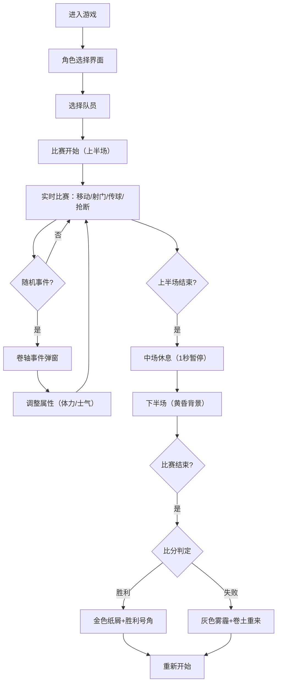

## 1. 产品概述

本项目是一款古代蹴鞠比赛模拟交互游戏，让用户体验宋代宫廷筑球军士的角色，在传统鞠场上进行足球竞技。通过逼真的物理模拟、精美的古典视觉设计和流畅的操作体验，展现中华传统体育文化的魅力。

- 核心价值：以游戏化方式传承和展示中国古代蹴鞠文化，提供沉浸式的历史体育竞技体验
- 目标用户：对中国传统文化、体育游戏感兴趣的玩家和文化爱好者

## 2. 核心特性

### 2.1 用户角色
| 角色 | 注册方式 | 核心权限 |
|------|----------|----------|
| 玩家 | 无需注册，直接进入 | 选择球员、控制比赛、查看状态、重玩游戏 |

### 2.2 功能模块
1. **角色选择界面**：三名不同属性球员供选择，木质纹理UI，悬停动效
2. **比赛主场景**：标准鞠场、球网、球员、鞠的实时渲染与物理模拟
3. **状态面板**：左侧显示球员体力、射门力度，右侧显示比赛时间
4. **比赛流程控制**：上下半场切换、中场休息、胜负判定
5. **事件系统**：随机触发意外事件，影响球员状态
6. **结算界面**：胜负展示、特效动画

### 2.3 页面详情
| 页面名称 | 模块名称 | 功能描述 |
|---------|----------|----------|
| 角色选择页 | 球员卡片 | 展示三名队员属性，点击选择进入比赛 |
| 比赛主场景 | 鞠场渲染 | 绘制球场、球网、边界线，背景随时间变化 |
| 比赛主场景 | 球员控制 | WASD移动、J射门、K传球、L抢断 |
| 比赛主场景 | 物理模拟 | 鞠的抛物线运动、弹性形变、球网碰撞反馈 |
| 左侧面板 | 状态显示 | 体力条（绿到红渐变）、射门力度条（蓝到紫渐变） |
| 右侧面板 | 时间显示 | 三颗星星倒计时，中场休息过渡动画 |
| 事件弹窗 | 卷轴动画 | 随机事件触发，影响体力/士气 |
| 结算界面 | 胜负展示 | 金色纸屑/灰色雾霾特效，鼓励文字 |

## 3. 核心流程

## 4. 用户界面设计

### 4.1 设计风格
- **主色调**：宣纸色 `#f5e6c8`（背景）、深木色 `#5d3a1a`（按钮面板）、墨色 `#2c2c2c`（文字）
- **点缀色**：朱红色 `#c0392b`（球网、队服）、夯土黄 `#d4a76a`（场地）、金色 `#ffd700`（描边、胜利特效）
- **按钮风格**：深木色质感，点击下沉2px后弹起，圆角适中
- **字体**：标题使用 Noto Serif SC（楷体/宋体风格），正文清晰易读
- **布局风格**：古典对称布局，主场景居中，左右面板均衡分布
- **动效风格**：卷轴展开、纸张质感、流畅过渡，体现古典韵味

### 4.2 页面设计概览
| 页面名称 | 模块名称 | UI 元素 |
|---------|----------|---------|
| 角色选择页 | 球员卡片 | 木质纹理 `#8b5e3c`，悬停放大1.05倍+金色描边，宋体文字展示属性 |
| 比赛主场景 | 鞠场 | 夯土黄地面 `#d4a76a`，白色边界线 `#f0f0f0`，朱红网 `#c0392b` 带龙纹立柱 |
| 比赛主场景 | 球员 | CSS绘制火柴人，高80px，红色圆领袍 `#c0392b`，束带 `#5d3a1a`，跑动动画 |
| 比赛主场景 | 鞠 | 直径16px，黑白放射渐变，抛物线运动，落地形变动画 |
| 左侧面板 | 状态条 | 体力条绿 `#27ae60`→红 `#e74c3c` 渐变，力度条蓝 `#2980b9`→紫 `#8e44ad` 渐变 |
| 右侧面板 | 时间星 | 三颗星星倒计时，漏完触发中场休息，上下半场背景渐变2秒 |
| 事件弹窗 | 卷轴 | 顶部展开动画，宋体文字，2秒后收起 |
| 结算界面 | 特效 | 胜利：金色纸屑飘落3秒；失败：灰色雾霾渐入2秒 |

### 4.3 响应式设计
- 采用桌面端优先设计，固定比例鞠场（16:9）
- 移动设备自动缩放适配，保留核心操作区域
- 触控设备支持虚拟按键替代键盘操作

### 4.4 动效与交互细节
- 球员移动：双腿交替迈步，臂膀自然摆动，地面留下半透明足迹（持续2秒）
- 射门蓄力：按键蓄力超过1.5秒后力度衰减，体现用力过猛
- 球过网：球网向受力方向鼓起10px然后回弹
- 镜头跟随：射门瞬间镜头跟随鞠短暂拉近放大0.3秒
- 帧率保证：使用 requestAnimationFrame 确保不低于50fps
