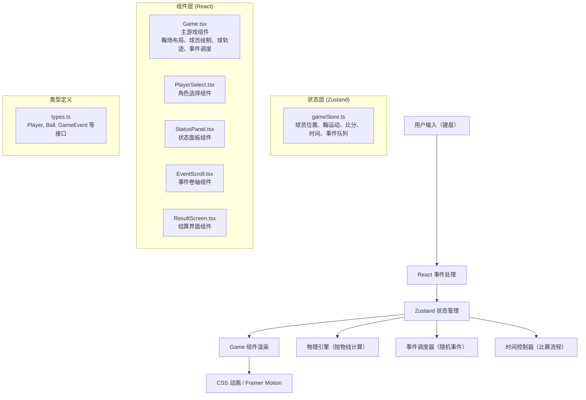

## 1. 架构设计



## 2. 技术栈说明

- **前端框架**：React@18 + TypeScript@5
- **构建工具**：Vite@5 + @vitejs/plugin-react@4
- **状态管理**：zustand@4
- **动画库**：framer-motion@11
- **样式方案**：CSS Modules + 内联样式（复杂动画）
- **字体**：Google Fonts - Noto Serif SC

## 3. 核心数据结构与类型定义

### 3.1 类型定义 (types.ts)

```typescript
// 球员接口
interface Player {
  id: string;
  name: string;
  x: number;
  y: number;
  rotation: number; // 朝向角度
  speed: number;
  stamina: number;
  maxStamina: number;
  morale: number; // 士气 0-100
  isUser: boolean;
  color: string;
  height: number; // CSS 像素
}

// 鞠（球）接口
interface Ball {
  x: number;
  y: number;
  z: number; // 高度（用于抛物线）
  vx: number;
  vy: number;
  vz: number;
  rotation: number;
  isMoving: boolean;
}

// 游戏事件接口
interface GameEvent {
  id: string;
  type: 'ball_out' | 'player_fall' | 'crowd_noise';
  message: string;
  effect: {
    stamina?: number;
    morale?: number;
  };
  duration: number;
}

// 比赛状态
type GamePhase = 'select' | 'playing' | 'halftime' | 'finished';
type Half = 'first' | 'second';

// 游戏状态接口
interface GameState {
  phase: GamePhase;
  currentHalf: Half;
  score: { user: number; opponent: number };
  timeRemaining: number; // 秒
  stars: number; // 剩余星星数 0-3
  player: Player;
  opponent: Player;
  ball: Ball;
  events: GameEvent[];
  currentEvent: GameEvent | null;
  shotPower: number; // 0-100
  isCharging: boolean;
  chargeStartTime: number;
  backgroundTime: 'day' | 'dusk';
}
```

### 3.2 游戏状态切片 (gameStore.ts)

```typescript
// Actions:
- selectPlayer(playerId: string)
- startGame()
- movePlayer(direction: 'forward' | 'backward' | 'left' | 'right')
- startCharge()
- updateCharge()
- shoot()
- pass()
- tackle()
- updateBallPhysics(deltaTime: number)
- triggerRandomEvent()
- updateTime(deltaTime: number)
- nextHalf()
- finishGame()
```

## 4. 文件结构

```
d:\Solocoder\VersionFast\tasks\auto55\
├── package.json
├── vite.config.js
├── tsconfig.json
├── index.html
├── src/
│   ├── main.tsx          # 入口文件
│   ├── App.tsx           # 根组件
│   ├── Game.tsx          # 主游戏组件
│   ├── gameStore.ts      # Zustand 状态管理
│   ├── types.ts          # 类型定义
│   ├── components/
│   │   ├── PlayerSelect.tsx
│   │   ├── StatusPanel.tsx
│   │   ├── TimePanel.tsx
│   │   ├── EventScroll.tsx
│   │   └── ResultScreen.tsx
│   └── styles/
│       ├── global.css
│       └── animations.css
```

## 5. 核心算法

### 5.1 抛物线运动计算
```
z(t) = z0 + vz0 * t - 0.5 * g * t²
x(t) = x0 + vx0 * t
y(t) = y0 + vy0 * t
其中 g = 9.8 * scale_factor（像素/秒²）
```

### 5.2 射门力度计算
```
蓄力时间 t ∈ [0, T]  T = 1.5秒
if t <= T: power = (t / T) * 100
if t > T:  power = 100 - ((t - T) / T) * 50  // 力度衰减
```

### 5.3 精度修正（士气影响）
```
base_accuracy = 0.85
morale_factor = morale / 100
final_accuracy = base_accuracy + (morale_factor - 0.5) * 0.4
高士气 (>80): +20% 精度
低士气 (<30): +15% 传球失误率
```

## 6. 性能优化策略

1. 使用 `requestAnimationFrame` 进行游戏循环，确保60fps
2. 状态更新采用批量处理，减少 React 重渲染
3. CSS 动画优先使用 `transform` 和 `opacity`，触发 GPU 加速
4. 使用 `useMemo` 和 `useCallback` 优化组件性能
5. 足迹等临时元素使用对象池复用，避免频繁 DOM 创建销毁
