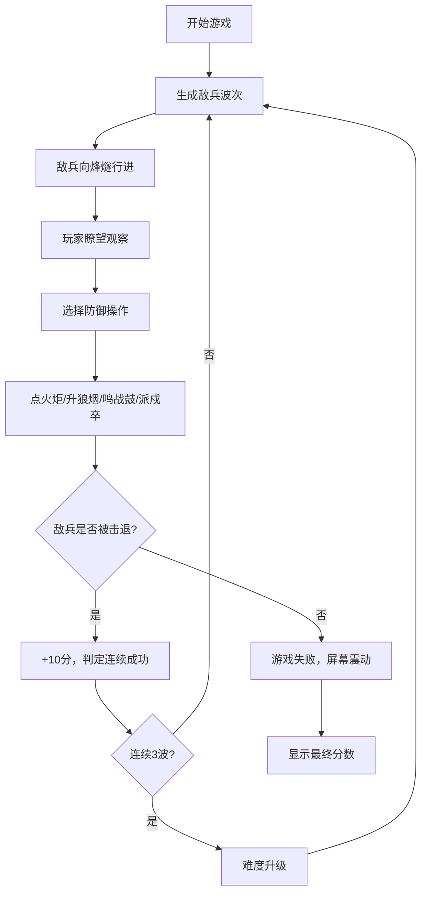

## 1. 产品概述
唐代烽燧戍守策略模拟游戏，玩家扮演边塞烽帅，通过瞭望敌情、点燃烽火、鸣鼓示警和调度戍卒来抵御外敌入侵。
- 以唐代边塞烽燧为历史背景，融合策略与实时操作玩法
- 目标用户：对历史军事题材感兴趣的休闲游戏玩家
- 产品价值：沉浸式体验古代边塞防御体系，考验玩家的策略调度和反应能力

## 2. 核心功能

### 2.1 用户角色
| 角色 | 注册方式 | 核心权限 |
|------|----------|----------|
| 烽帅（玩家） | 无需注册，直接进入 | 瞭望敌情、操控烽火、鸣鼓、派遣戍卒、标记威胁、查看分数 |

### 2.2 功能模块
1. **瞭望区域**：边塞荒漠场景渲染、敌兵行进动画、悬停信息展示、威胁等级标记
2. **操控面板**：点火炬、升狼烟、鸣战鼓、派戍卒四个带冷却的操作按钮
3. **敌情系统**：波次自动生成敌兵、难度递增机制
4. **戍卒管理**：戍卒部署与召回、疲劳度系统
5. **计分与胜负**：防御得分、失败判定、连续成功奖励

### 2.3 页面详情
| 页面名称 | 模块名称 | 功能描述 |
|----------|----------|----------|
| 主游戏页面 | 瞭望区域 | 60%屏幕宽度，等距俯视视角35度倾斜，展示荒漠场景、烽燧台、敌兵行进、戍卒位置 |
| 主游戏页面 | 操控面板 | 40%屏幕宽度，深木色背景，四个操作按钮带冷却进度、戍卒状态显示、分数显示 |
| 主游戏页面 | 信息提示 | 成功防御绿色闪光、失败屏幕震动模糊、按钮按压弹性动画 |

## 3. 核心流程
玩家进入游戏后，瞭望区域开始自动生成敌兵波次。玩家通过观察敌情，在敌兵到达烽燧前合理使用四种防御手段：点火炬示警、升狼烟传讯、鸣战鼓鼓舞士气、派戍卒阻击。成功防御一波得10分，敌兵抵达则游戏结束。连续成功3波后难度升级。

## 4. 用户界面设计

### 4.1 设计风格
- **主色调**：土黄#d4c3a3、赭石#a67c52、暗红#8b0000、深木#5d3a1a
- **点缀色**：火光橙#ff8c00、火焰红#ff4500、威胁红#ff0000、警告黄#ffff00、安全绿#00ff00
- **按钮风格**：木质纹理边框，圆角8px，点击时scale(0.95)弹性动画，冷却时灰度蒙版+进度条
- **字体**：思源宋体，标题24px加粗，正文14px
- **布局风格**：左侧60%等距俯视场景，右侧40%固定操控面板
- **视觉效果**：水墨风沙地噪点纹理、火焰径向渐变脉动、敌兵深色剪影、3D倾斜变换

### 4.2 页面设计概述
| 页面名称 | 模块名称 | UI元素 |
|----------|----------|--------|
| 主游戏页面 | 瞭望区域 | 渐变天空（#2a1a0a→#5a3a1a）、噪点沙地（#d4c3a3）、烽燧台（土墙#a67c52+锥体）、敌兵（6px黑点#1a1a1a）、戍卒小人、标记光环 |
| 主游戏页面 | 操控面板 | 深木色背景#5d3a1a、纹理边框、四个操作按钮（带图标和冷却进度）、戍卒状态栏（6个小人图标+疲劳条）、分数显示、波次信息 |
| 主游戏页面 | 交互反馈 | 按钮按压动画、悬停信息气泡、威胁等级光环（红/黄/绿发光）、成功绿色闪光、失败震动模糊 |

### 4.3 响应式
- **桌面端**：左侧60%瞭望区域，右侧40%固定操控面板
- **移动端（<768px）**：瞭望区域100%宽度，操控面板变为底部可收起抽屉（高度30%）
- **触摸优化**：按钮最小44x44px，拖拽部署支持触摸事件

### 4.4 3D场景指导
- **环境**：唐代边塞荒漠，黄昏日落氛围，沙尘颗粒效果
- **光照**：暖色调落日余晖，火光动态光源
- **相机设置**：等距俯视，rotateX(35deg)，固定视角
- **构图**：烽燧台位于场景中心偏右，敌兵从左侧进入
- **交互动画**：火焰脉动、烟雾飘散、戍卒行走、敌兵行进、鼓声震动
- **后处理**：噪点纹理模拟水墨风格，火光辉光效果
- **性能预算**：总活动实体≤50，FPS≥30，状态更新≤60次/秒
