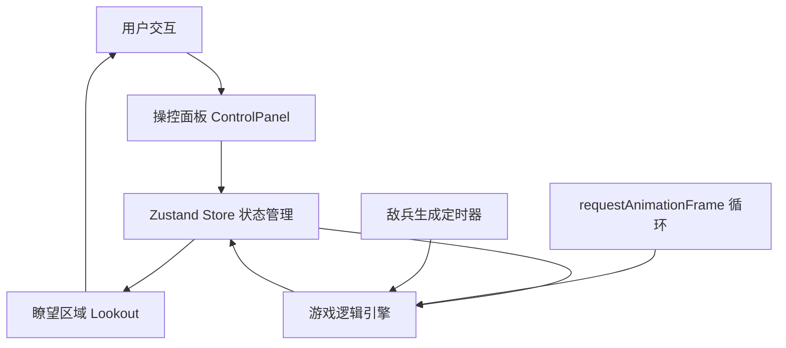

## 1. 架构设计



**模块职责与调用关系**：
- `src/main.tsx` → 入口，挂载App组件，引入全局样式
- `src/app.tsx` → 主布局容器，划分瞭望区（60%）和控制面板（40%），接收store状态分发子组件
- `src/store.ts` → Zustand状态管理，管理敌情、烽火、戍卒、分数数据
  - 接收：操控面板用户操作
  - 输出：瞭望区域渲染数据
- `src/scenes/lookout.tsx` → 瞭望区域组件
  - 读取：store中的敌兵位置、戍卒位置、烽火状态
  - 输出：Canvas/CSS动画渲染场景
- `src/scenes/control-panel.tsx` → 操控面板组件
  - 读取：store中的冷却时间、戍卒状态、分数
  - 输出：用户操作更新store
- `src/hooks/useGameLoop.ts` → 游戏循环Hook，requestAnimationFrame驱动
- `src/hooks/useEnemyWave.ts` → 敌兵波次生成Hook
- `src/utils/animation.ts` → 动画工具函数
- `src/types/index.ts` → TypeScript类型定义

**数据流向**：
用户点击 → ControlPanel → store更新 → Lookout重绘 → 游戏循环 → 状态更新 → Lookout重绘

## 2. 技术描述

- **前端框架**：React@18 + TypeScript@5
- **构建工具**：Vite@5 + @vitejs/plugin-react@4
- **状态管理**：zustand@4
- **动画库**：framer-motion@11
- **样式方案**：原生CSS + CSS Variables，不使用Tailwind（用户指定自定义颜色主题）
- **初始化方式**：npm create vite-init@latest . -- --template react-ts --force

## 3. 数据模型

### 3.1 类型定义

```typescript
// 敌兵
interface Enemy {
  id: string;
  x: number;           // 位置X (0-100相对坐标)
  y: number;           // 位置Y (0-100相对坐标)
  count: number;       // 人数
  speed: number;       // 移动速度
  threatLevel: 'low' | 'medium' | 'high';  // 威胁等级
  distance: number;    // 距烽燧步数
}

// 戍卒
interface Soldier {
  id: string;
  status: 'idle' | 'deployed' | 'returning';  // 状态
  x: number;           // 位置X
  y: number;           // 位置Y
  fatigue: number;     // 疲劳度 0-100
  targetX?: number;    // 目标位置X
  targetY?: number;    // 目标位置Y
}

// 烽火状态
interface Beacon {
  torch: boolean;      // 火炬
  smoke: boolean;      // 狼烟
}

// 冷却状态
interface Cooldowns {
  torch: number;       // 点火炬冷却剩余秒数
  smoke: number;       // 升狼烟冷却剩余秒数
  drum: number;        // 鸣战鼓冷却剩余秒数
  soldier: number;     // 派戍卒冷却剩余秒数
}

// 游戏状态
interface GameState {
  enemies: Enemy[];
  soldiers: Soldier[];
  beacon: Beacon;
  cooldowns: Cooldowns;
  score: number;
  wave: number;
  consecutiveWins: number;
  difficulty: number;
  gameStatus: 'playing' | 'won' | 'lost';
  screenEffect: 'none' | 'success' | 'fail';
}
```

### 3.2 Store Action定义

```typescript
interface GameActions {
  // 操控动作
  lightTorch: () => void;
  raiseSmoke: () => void;
  beatDrum: () => void;
  deploySoldier: (soldierId: string, x: number, y: number) => void;
  recallSoldier: (soldierId: string) => void;
  
  // 敌情操作
  markThreat: (enemyId: string, level: 'low' | 'medium' | 'high') => void;
  spawnEnemyWave: () => void;
  updateEnemyPositions: (deltaTime: number) => void;
  
  // 游戏控制
  startGame: () => void;
  resetGame: () => void;
  updateCooldowns: (deltaTime: number) => void;
  updateSoldierFatigue: (deltaTime: number) => void;
  checkCollisions: () => void;
}
```

## 4. 性能约束实现方案

1. **FPS保障**：使用requestAnimationFrame实现游戏循环，逻辑更新与渲染分离
2. **实体数量控制**：敌兵+戍卒总数限制≤50，超限时合并敌兵单位
3. **状态更新频率**：使用useRef存储高频更新数据，避免过度重渲染
4. **动画优化**：CSS transforms和opacity动画，避免触发重排
5. **内存管理**：敌兵被击退后及时清理，定时器正确销毁
6. **Canvas渲染**：场景使用Canvas绘制，减少DOM节点数量

## 5. 目录结构

```
src/
├── main.tsx              # React入口
├── app.tsx               # 主布局组件
├── store.ts              # Zustand状态管理
├── index.css             # 全局样式
├── types/
│   └── index.ts          # 类型定义
├── hooks/
│   ├── useGameLoop.ts    # 游戏循环Hook
│   └── useEnemyWave.ts   # 敌兵波次Hook
├── scenes/
│   ├── lookout.tsx       # 瞭望区域组件
│   └── control-panel.tsx # 操控面板组件
├── components/
│   ├── enemy.tsx         # 敌兵组件
│   ├── soldier.tsx       # 戍卒组件
│   ├── beacon-fire.tsx   # 烽火组件
│   └── cool-button.tsx   # 冷却按钮组件
└── utils/
    ├── animation.ts      # 动画工具
    └── constants.ts      # 游戏常量
```
