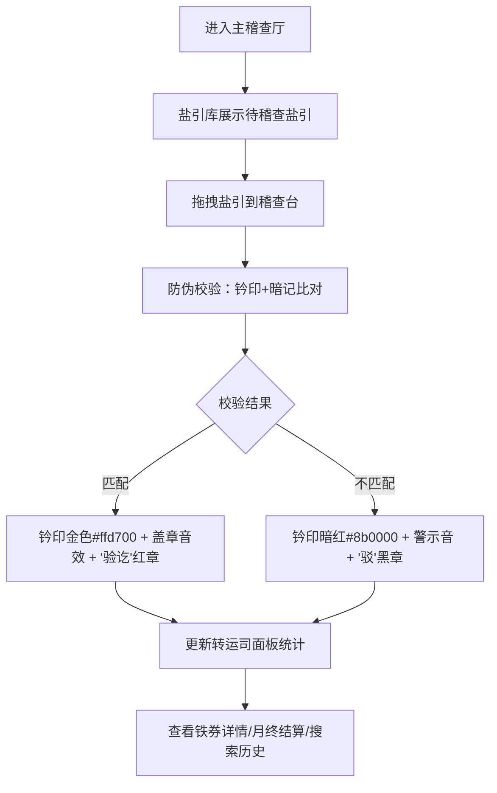

## 1. 产品概述

宋代盐铁官营体系流转监管模拟系统，解决传统盐铁专卖管理中盐引核发、铁券铸造和转运司稽查之间难以实时对账和防止伪造的问题。通过数字化仿真，实现盐引与铁券的全生命周期管理、防伪校验、实时对账和历史追溯。

- **核心价值**：还原古代盐铁官营制度，通过现代化交互技术展示盐引与铁券流转过程，实现防伪校验与对账监管
- **目标用户**：历史文化爱好者、教育机构学生、政务史研究者
- **使用场景**：历史教学演示、文化展览互动、研究数据可视化

## 2. 核心功能

### 2.1 用户角色

| 角色 | 注册方式 | 核心权限 |
|------|----------|----------|
| 转运司官员 | 无需注册（模拟登录） | 盐引稽查、铁券管理、月终结算、历史查询 |

### 2.2 功能模块

1. **盐引库**：展示待稽查盐引列表，支持拖拽到稽查台
2. **稽查台**：盐引防伪校验、验讫/驳回盖章、当日数据统计
3. **铁券架**：三级铁券展示、详情查看、月终结算
4. **转运司面板**：实时统计图表、变更记录表格、稽查报告
5. **对账报表**：月终自动汇总、异常检测、PDF风格预览
6. **搜索系统**：模糊匹配历史记录、按时间排序

### 2.3 页面详情

| 页面名称 | 模块名称 | 功能描述 |
|----------|----------|----------|
| 主稽查厅 | 盐引库 | 左侧300px列，展示定额盐引列表，每项含编号、盐斤数、签发日期，支持拖拽 |
| 主稽查厅 | 稽查台 | 中央flex区域，显示正在校验的盐引、防伪比对动画、验讫结果盖章 |
| 主稽查厅 | 铁券架 | 右侧250px列，SVG绘制三级铁券缩略图，点击展开详情 |
| 主稽查厅 | 转运司面板 | 下方区域，柱状图展示每日核发量、表格展示变更记录、卡片展示稽查报告 |
| 铁券详情 | 详情弹窗 | 从底部上滑进入，半透明遮罩，显示持券人信息、圆形头像裁剪 |
| 对账报表 | 报表预览 | PDF风格，异常条目红色闪烁、正常条目绿色显示 |
| 搜索结果 | 搜索面板 | 右上角搜索框，模糊匹配，支持按时间升降序排序 |

## 3. 核心流程

### 用户操作流程

1. 用户进入主稽查厅，左侧显示盐引库待稽查盐引
2. 用户将盐引从盐引库拖拽到中央稽查台
3. 系统自动进行防伪校验（钤印与暗记比对）
   - 匹配：钤印转金色#ffd700，播放盖章音效，盖"验讫"红章
   - 不匹配：钤印转暗红色#8b0000，播放警示音，盖"驳"黑章
4. 下方转运司面板实时更新统计数据
5. 用户可点击右侧铁券查看详情
6. 点击"月终结算"按钮生成对账报表
7. 用户可通过右上角搜索框查询历史记录

## 4. 用户界面设计

### 4.1 设计风格

- **设计理念**：宋代官署风格，青砖灰瓦，古色古香
- **主色调**：木色系暖色调，主色#5d3a1a、辅色#8b5e3c、强调色#b8860b
- **背景色**：#8b9a8b（灰绿色，模拟青砖墙面）
- **字体**：思源宋体（Source Han Serif），楷体用于铁券刻字
- **按钮风格**：木质纹理边框，圆角4px，悬停时轻微上浮阴影
- **布局风格**：三列纵向结构，古式厅堂布局
- **装饰元素**：《盐铁论》山水屏风、木质案台、朱红印章

### 4.2 页面设计概览

| 页面名称 | 模块名称 | UI元素 |
|----------|----------|--------|
| 主稽查厅 | 盐引库 | 木色边框卡片列表，编号#b8860b，日期#8b5e3c，拖拽时弹性缩放动画 |
| 主稽查厅 | 稽查台 | 案台纹理背景，盐引悬浮效果，金色光晕脉冲动画（1s），朱红/黑色印章盖印 |
| 主稽查厅 | 铁券架 | SVG绘制铁券纹路，金文字#d4a017，楷体刻字，悬停微动效 |
| 主稽查厅 | 转运司面板 | recharts柱状图（浅绿#a8d08a到深绿#6b8e23渐变），framer-motion淡入表格，木色边框卡片 |
| 铁券详情 | 详情弹窗 | 半透明遮罩rgba(0,0,0,0.5)，从底部上滑（y:100%→0%），CSS clip-path圆形头像 |
| 对账报表 | 报表预览 | 米黄纸张纹理#f5f0e1，木色左边框#8b4513，异常红色#e74c3c闪烁，正常绿色#27ae60 |

### 4.3 响应式设计

- **桌面端**（≥1024px）：三列布局，左300px / 中flex / 右250px
- **平板端**（768px-1024px）：左列可折叠，右列保留200px
- **移动端**（<768px）：左右列折叠为顶部导航标签页，稽查区占满宽度，面板改为垂直堆叠

### 4.4 动效规范

- **拖拽缩放**：framer-motion drag API，拖拽时scale: 1.05，释放时弹性回弹
- **验讫光晕**：1s金色脉冲动画，box-shadow: 0 0 20px #ffd700，3次循环
- **表格行淡入**：framer-motion staggerChildren，每行delay: 0.1s，opacity: 0→1，y: 10→0
- **弹窗进入**：animate={{ y: 0, opacity: 1 }}，初始{{ y: '100%', opacity: 0 }}，transition: { type: 'spring', damping: 25 }
- **异常闪烁**：CSS keyframes，color在#e74c3c和#ffffff之间切换，0.5s间隔

### 4.5 性能要求

- 所有动画帧率 ≥ 45fps
- 单次校验响应时间 < 200ms
- 拖拽操作无明显卡顿
- 页面加载首屏时间 < 2s
