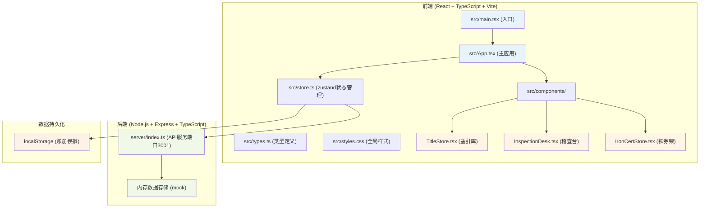
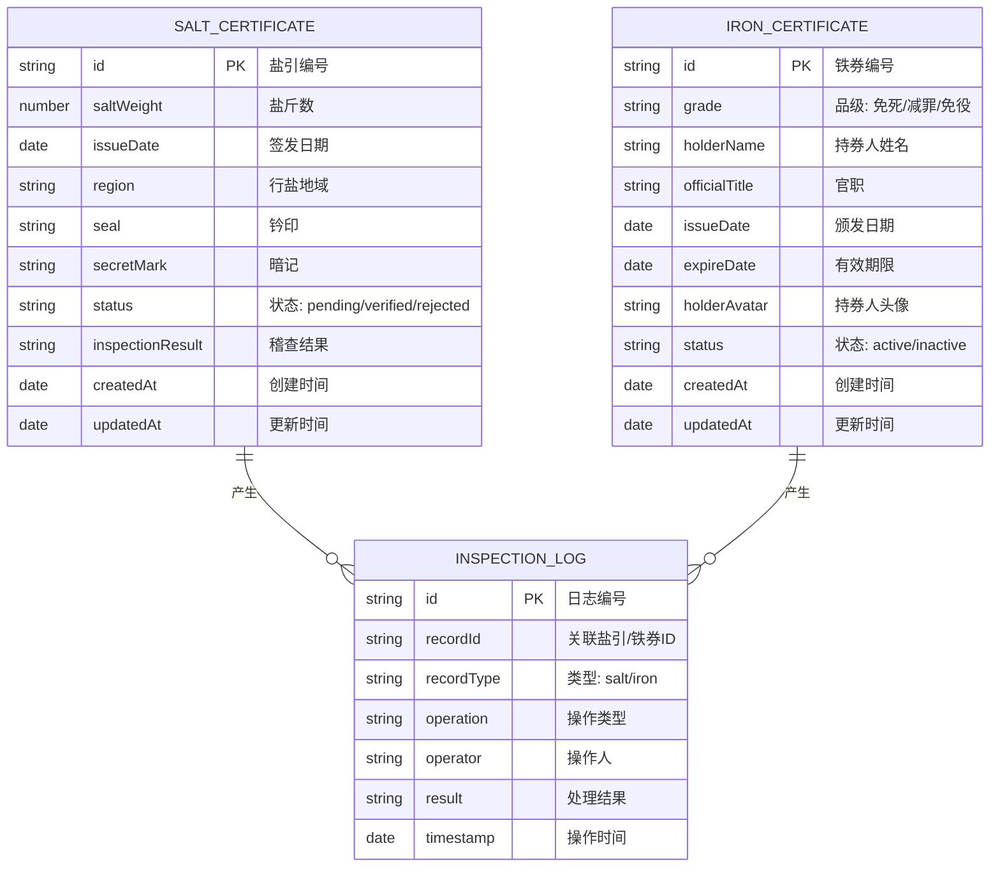
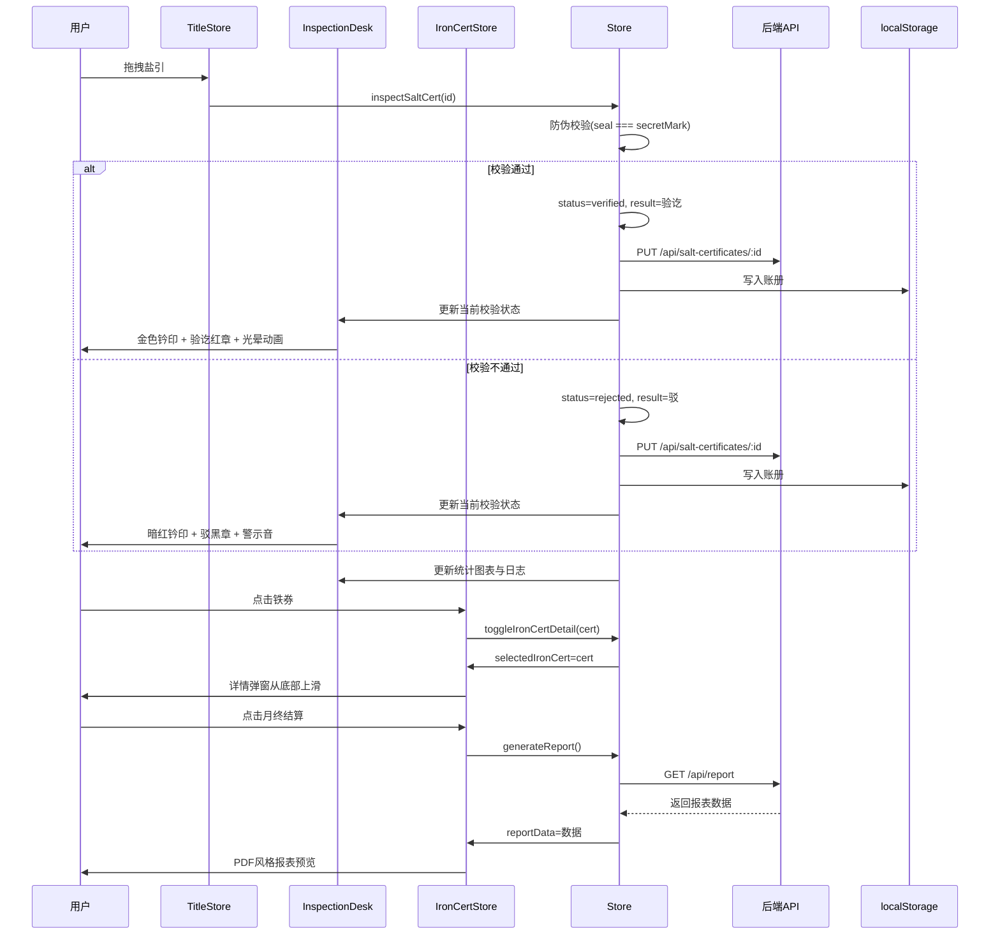
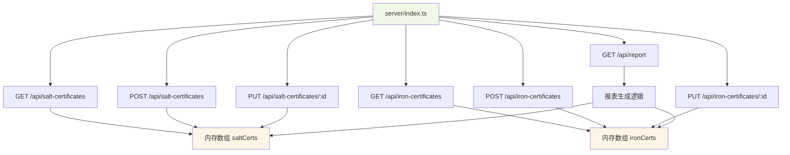

## 1. 架构设计



## 2. 技术栈说明

| 层级      | 技术选型             | 版本       | 用途            |
| ------- | ---------------- | -------- | ------------- |
| 前端框架    | React            | ^18.2.0  | UI组件库         |
| 语言      | TypeScript       | ^5.2.0   | 类型安全          |
| 构建工具    | Vite             | ^5.0.0   | 构建与开发服务器      |
| 路由      | react-router-dom | ^6.20.0  | 单页路由          |
| 状态管理    | zustand          | ^4.4.7   | 全局状态管理        |
| 动画      | framer-motion    | ^10.16.5 | 拖拽、过渡、布局动画    |
| 图表      | recharts         | ^2.10.3  | 柱状图数据可视化      |
| HTTP客户端 | axios            | ^1.6.2   | 前后端通信         |
| 后端框架    | Express          | ^4.18.2  | RESTful API服务 |
| 跨域      | cors             | ^2.8.5   | 跨域资源共享        |
| ID生成    | uuid             | ^9.0.1   | 唯一标识生成        |

## 3. 目录结构

```
auto58/
├── .trae/documents/           # 项目文档
├── src/                       # 前端源码
│   ├── main.tsx              # React入口
│   ├── App.tsx               # 主应用组件
│   ├── types.ts              # TypeScript类型定义
│   ├── store.ts              # zustand状态管理
│   ├── styles.css            # 全局样式
│   └── components/           # 组件目录
│       ├── TitleStore.tsx    # 盐引库组件
│       ├── InspectionDesk.tsx # 稽查台组件
│       └── IronCertStore.tsx # 铁券架组件
├── server/                    # 后端源码
│   └── index.ts              # Express服务器
├── index.html                 # HTML入口
├── vite.config.js             # Vite配置
├── tsconfig.json              # TypeScript配置
└── package.json               # 项目依赖
```

## 4. 路由定义

| 路由  | 页面/组件   | 用途                      |
| --- | ------- | ----------------------- |
| `/` | App.tsx | 主稽查厅（盐引库+稽查台+铁券架+转运司面板） |

## 5. API 定义

### 5.1 盐引相关接口

| 方法   | 路径                           | 描述     | 请求参数                                    | 响应                  |
| ---- | ---------------------------- | ------ | --------------------------------------- | ------------------- |
| GET  | `/api/salt-certificates`     | 获取盐引列表 | `query`: search(可选), sort(可选: asc/desc) | `SaltCertificate[]` |
| POST | `/api/salt-certificates`     | 新增盐引   | `body`: SaltCertificate                 | `SaltCertificate`   |
| PUT  | `/api/salt-certificates/:id` | 更新盐引状态 | `body`: { status, inspectionResult }    | `SaltCertificate`   |

### 5.2 铁券相关接口

| 方法   | 路径                           | 描述     | 请求参数                                    | 响应                  |
| ---- | ---------------------------- | ------ | --------------------------------------- | ------------------- |
| GET  | `/api/iron-certificates`     | 获取铁券列表 | `query`: search(可选), sort(可选: asc/desc) | `IronCertificate[]` |
| POST | `/api/iron-certificates`     | 新增铁券   | `body`: IronCertificate                 | `IronCertificate`   |
| PUT  | `/api/iron-certificates/:id` | 更新铁券   | `body`: IronCertificate                 | `IronCertificate`   |

### 5.3 报表接口

| 方法  | 路径            | 描述       | 请求参数                     | 响应           |
| --- | ------------- | -------- | ------------------------ | ------------ |
| GET | `/api/report` | 生成月终对账报表 | `query`: month(可选, 默认当月) | `ReportData` |

## 6. 数据模型

### 6.1 ER图



### 6.2 TypeScript类型定义

```typescript
// src/types.ts
export interface SaltCertificate {
  id: string;
  saltWeight: number;
  issueDate: string;
  region: string;
  seal: string;
  secretMark: string;
  status: 'pending' | 'verified' | 'rejected';
  inspectionResult?: '验讫' | '驳';
  createdAt: string;
  updatedAt: string;
}

export interface IronCertificate {
  id: string;
  grade: '免死' | '减罪' | '免役';
  holderName: string;
  officialTitle: string;
  issueDate: string;
  expireDate: string;
  holderAvatar: string;
  status: 'active' | 'inactive';
  createdAt: string;
  updatedAt: string;
}

export interface InspectionLog {
  id: string;
  recordId: string;
  recordType: 'salt' | 'iron';
  operation: string;
  operator: string;
  result: string;
  timestamp: string;
}

export interface ReportData {
  month: string;
  saltCertificates: {
    issued: number;
    verified: number;
    rejected: number;
    totalWeight: number;
  };
  ironCertificates: {
    issued: number;
    changed: number;
  };
  anomalies: Array<{
    id: string;
    type: string;
    description: string;
  }>;
  dailyStats: Array<{
    date: string;
    issued: number;
    verified: number;
    complianceRate: number;
  }>;
}

export interface StoreState {
  saltCertificates: SaltCertificate[];
  ironCertificates: IronCertificate[];
  inspectionLogs: InspectionLog[];
  currentInspecting: SaltCertificate | null;
  searchResults: Array<SaltCertificate | IronCertificate>;
  selectedIronCert: IronCertificate | null;
  showReport: boolean;
  reportData: ReportData | null;
}
```

## 7. 状态管理设计（zustand）

```typescript
// src/store.ts
import { create } from 'zustand';

const useStore = create<StoreState & StoreActions>((set, get) => ({
  // ...状态
  addSaltCert: (cert) => set(/* ... */),
  inspectSaltCert: (id) => {
    // 防伪校验逻辑
    const cert = get().saltCertificates.find(c => c.id === id);
    if (cert && cert.seal === cert.secretMark) {
      // 验讫
    } else {
      // 驳回
    }
  },
  toggleIronCertDetail: (cert) => set(/* ... */),
  searchRecords: (keyword) => set(/* ... */),
  generateReport: () => set(/* ... */),
}));
```

## 8. 核心组件数据流



## 9. 后端服务架构



## 10. 性能优化要点

1. **动画性能**：使用 `transform` 和 `opacity` 属性实现动画，避免触发重排重绘
2. **拖拽优化**：framer-motion drag 启用 `dragMomentum={false}` 减少计算
3. **列表渲染**：使用 `React.memo` 包装列表项，配合 `useMemo` 优化数据计算
4. **状态更新**：zustand 选择器订阅避免不必要的重渲染
5. **本地存储**：localStorage 写入使用防抖，避免频繁IO
6. **图表性能**：recharts 使用 `isAnimationActive={false}` 在数据量大时关闭动画

