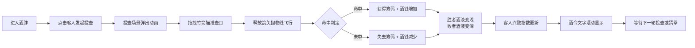

## 1. 产品概述

"醉仙居"酒肆投壶行酒令是一款模拟宋代临安酒肆文化的Web互动游戏，用户扮演酒肆掌柜，组织客人进行投壶竞技与行酒令，实时记录胜负、酒钱和客人兴致变化。

- 核心目标：通过沉浸式的CSS绘制场景和流畅的物理动画，还原古代酒肆娱乐文化
- 目标用户：对中国传统文化、古风游戏感兴趣的玩家
- 市场价值：传承投壶、行酒令等非物质文化遗产，寓教于乐

## 2. 核心功能

### 2.1 用户角色
| 角色 | 注册方式 | 核心权限 |
|------|----------|----------|
| 掌柜（用户） | 无需注册，直接访问 | 组织游戏、发起投壶、管理酒钱、观察客人兴致 |
| 客人（NPC） | 系统生成 | 参与投壶对赌、兴致变化、饮酒 |

### 2.2 功能模块
1. **酒肆主场景**：CSS绘制仿宋酒肆建筑、酒桌、酒碗、客人角色、投壶
2. **投壶游戏**：拖拽竹箭瞄准、抛物线物理动画、命中判定、音效反馈
3. **酒令系统**：胜负结算、酒钱计算、酒液动态变化、酒令行文滚动
4. **心情表盘**：SVG扇形图实时显示四位客人兴致指数、平滑动画过渡
5. **状态管理**：全局数据管理、帧率优化、历史记录

### 2.3 页面详情
| 页面名称 | 模块名称 | 功能描述 |
|-----------|-------------|---------------------|
| 主游戏页 | 酒肆场景 | CSS绘制木质门楣、红灯笼、"醉仙居"店招、酒桌、酒碗、客人、投壶 |
| 主游戏页 | 投壶交互 | 鼠标拖拽竹箭瞄准、释放发射、抛物线飞行、命中颤抖动画、叮咚音效 |
| 主游戏页 | 酒令行权 | 自动计算胜负酒钱、酒液颜色深浅变化、酒令文字滚动显示 |
| 主游戏页 | 心情表盘 | SVG扇形图展示客人兴致、三档颜色区分、0.3s平滑过渡动画 |

## 3. 核心流程

## 4. 用户界面设计

### 4.1 设计风格
- **主色调**：木质门楣 #5d3a1a、红灯笼 #c0392b、酒桌暗红 #6b3a2a、青铜色 #8b5e3c
- **辅色调**：酒液浅黄 #e8c76a、琥珀色 #d4a017、竹绿色 #4a7a4a
- **心情档位色**：闷闷不乐 #7a8b7a、兴致高昂 #f39c12、豪气冲天 #e74c3c
- **字体**：店招使用楷体，正文使用宋体，营造古风氛围
- **布局**：左侧心情表盘 + 中央酒肆场景 + 顶部店招酒令滚动
- **动画**：所有动画使用 requestAnimationFrame 或 CSS 硬件加速，确保 55+ FPS

### 4.2 页面设计概述
| 页面名称 | 模块名称 | UI元素 |
|-----------|-------------|-------------|
| 主游戏页 | 酒肆场景 | 木质门楣（CSS渐变+阴影）、红灯笼（径向渐变+晃动动画）、楷体"醉仙居"店招、长条酒桌（暗色桌面+深棕桌腿）、三只黑釉酒碗（径向渐变模拟酒液深度）、青铜投壶（圆柱体+锥形口）、三位客人（CSS人形+幞头+圆领袍） |
| 主游戏页 | 投壶交互 | 壶口放大动画（scale 过渡）、竹箭拖拽（mousedown/mousemove/mouseup 事件）、抛物线轨迹（requestAnimationFrame 计算）、命中颤抖（CSS animation shake）、音效（Web Audio API） |
| 主游戏页 | 心情表盘 | SVG扇形图（四段扇形对应四位客人）、颜色渐变（从#7a8b7a到#e74c3c）、平滑过渡（CSS transition 0.3s） |

### 4.3 响应式
- 采用固定像素布局确保CSS绘制精度
- 最小支持分辨率 1280x720
- 鼠标拖拽优化，响应延迟 < 150ms

### 4.4 性能优化
- 投壶动画使用 requestAnimationFrame，帧率锁定 60fps
- 所有变换使用 transform 属性触发 GPU 硬件加速
- 避免 layout thrashing，批量读取样式后统一写入
- 使用 will-change 提示浏览器提前优化渲染
