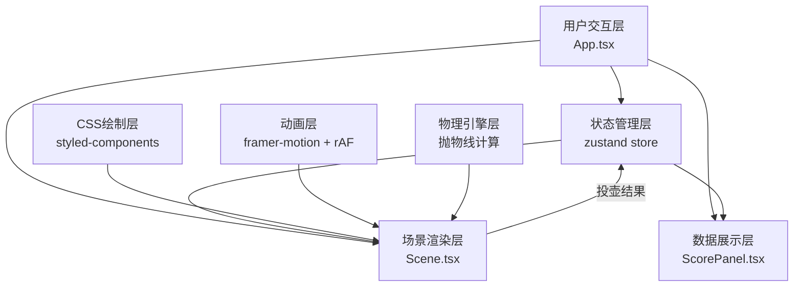

## 1. 架构设计



## 2. 技术描述

- **前端框架**：React 18 + TypeScript 5
- **构建工具**：Vite 5
- **状态管理**：zustand 4
- **动画库**：framer-motion 11
- **CSS方案**：内联样式 + CSS变量，确保硬件加速
- **音效**：Web Audio API 生成音效（无需外部音频文件）
- **初始化命令**：`npm init vite-init@latest -y . -- --template react-ts --force`

## 3. 项目结构

| 路径 | 用途 |
|------|------|
| `src/App.tsx` | 主组件，组合场景、游戏、状态管理 |
| `src/components/Scene.tsx` | 酒肆场景CSS绘制、投壶交互逻辑 |
| `src/components/ScorePanel.tsx` | 心情表盘、酒钱、酒令滚动展示 |
| `src/store/gameStore.ts` | zustand全局状态管理 |
| `src/types/` | TypeScript类型定义（按需创建） |
| `src/utils/` | 工具函数（物理计算、音效生成等） |

## 4. 数据模型

### 4.1 状态定义

```typescript
interface Guest {
  id: number;
  name: string;
  robeColor: '#3a6b8b' | '#5a7a5a' | '#8b3a3a';
  mood: number; // 0-100 兴致指数
  chips: number; // 筹码数
  wineLevel: number; // 0-100 酒液量
  wineAge: number; // 0-100 酒龄（影响颜色）
}

interface GameState {
  guests: Guest[];
  wineMoney: number; // 酒钱总额
  currentRound: number;
  currentPlayer: number | null;
  isTouhuActive: boolean;
  touhuResult: 'hit' | 'miss' | null;
  wineOrderHistory: string[];
  totalHits: number;
  totalMisses: number;
}

interface GameActions {
  startTouhu: (guestId: number) => void;
  endTouhu: (hit: boolean) => void;
  updateGuestMood: (guestId: number, delta: number) => void;
  updateWineMoney: (amount: number) => void;
  addWineOrder: (text: string) => void;
  updateWineLevel: (guestId: number, delta: number) => void;
}
```

### 4.2 投壶物理计算

```typescript
interface ArrowState {
  x: number;
  y: number;
  vx: number;
  vy: number;
  angle: number;
  isFlying: boolean;
}

// 抛物线公式: y = y0 + vy*t - 0.5*g*t²
// 其中 g = 980 px/s²（模拟重力加速度）
```

## 5. 性能保障

### 5.1 帧率控制
- 投壶动画使用 `requestAnimationFrame` 循环
- 每次更新计算时间差 `deltaTime`，确保动画速度一致
- 使用 `performance.now()` 高精度计时

### 5.2 渲染优化
- 所有位置、旋转、缩放使用 `transform` 属性
- 开启 `will-change: transform` 提示GPU加速
- 避免在动画循环中读取布局属性（如 offsetTop）
- 使用 `transform3d` 强制创建合成层

### 5.3 事件处理
- 拖拽事件使用 `pointerdown`/`pointermove`/`pointerup` 统一处理
- 添加事件节流，确保移动事件频率不超过 60fps
- 使用 `passive: true` 优化滚动和触摸性能

## 6. 核心技术要点

### 6.1 CSS绘制技术
- 人物使用 `border-radius` 组合绘制头部、身体
- 酒碗使用 `radial-gradient` 模拟釉面光泽和酒液深度
- 投壶使用 `linear-gradient` 模拟青铜质感
- 灯笼使用 `box-shadow` 模拟发光效果

### 6.2 物理引擎
- 拖拽时计算发射角度和初速度
- 飞行时逐帧更新位置和旋转角度
- 命中检测使用圆形碰撞检测算法
- 落地时模拟弹跳衰减效果

### 6.3 音效系统
- 使用 `OscillatorNode` 生成叮咚音效
- 命中时播放高频短促音（800Hz, 0.1s）
- 未中时播放低频沉闷音（200Hz, 0.05s）
- 音量控制在 0.3 避免刺耳
