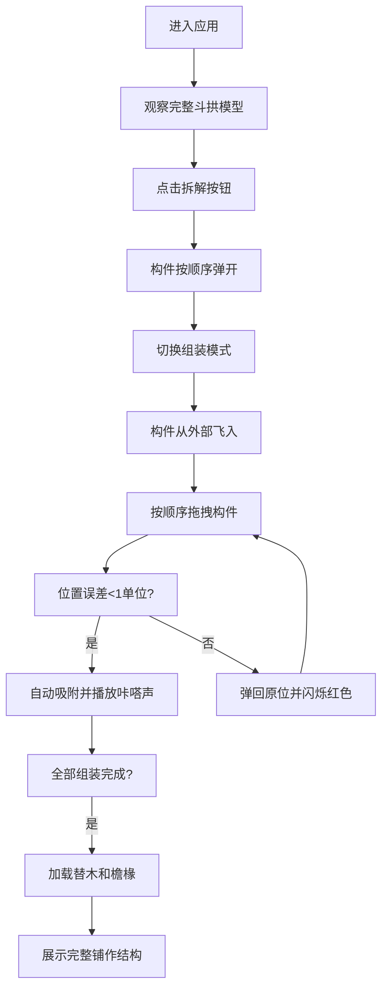

## 1. 产品概述

唐代木构斗拱拆解与组装三维交互可视化应用，让用户以第一人称视角在虚拟工坊中观察、拆解和组装中国古代五铺作斗拱模型，学习榫卯咬合与受力传递原理。

- **核心价值**：通过沉浸式3D交互体验，传承中国古代建筑技艺，让用户直观理解斗拱的结构逻辑与营造智慧
- **目标用户**：建筑爱好者、历史文化学习者、工艺美术研究者、学生群体
- **市场价值**：填补中国传统建筑数字化交互教育的空白，兼具文化传播与教育功能

## 2. 核心特性

### 2.1 用户角色

| 角色 | 注册方式 | 核心权限 |
|------|----------|----------|
| 普通用户 | 无需注册，直接使用 | 完整的3D交互体验、拆解与组装操作、学习斗拱知识 |

### 2.2 功能模块

1. **3D场景模块**：五铺作斗拱模型渲染、环境光照、木纹地面、摄像机控制
2. **拆解模式**：按反向安装顺序弹开所有构件，展示构件分离状态
3. **组装模式**：按正确顺序拖拽构件到目标位置，自动吸附锁定
4. **交互反馈**：悬停高亮、拖拽投影、吸附音效、错误提示
5. **信息展示**：构件详情面板、组装进度环、模式切换按钮
6. **完整铺作**：组装完成后自动加载替木与檐椽，呈现完整结构

### 2.3 页面详情

| 页面名称 | 模块名称 | 功能描述 |
|----------|----------|------------|
| 主场景页 | 3D场景 | 渲染五铺作斗拱模型，支持旋转、缩放、拖拽交互 |
| 主场景页 | UI控制层 | 标题展示、模式切换、进度显示、构件信息面板 |
| 主场景页 | 音效系统 | 木料摩擦声、吸附咔嗒声、错误提示音 |

## 3. 核心流程

用户进入应用后，首先看到完整组装的五铺作斗拱模型，可以旋转缩放观察。点击"拆解"按钮后，所有构件按顺序弹开，用户可以查看每个构件的独立形态。切换到"组装"模式后，构件从外部飞入，用户需要按从栌斗到耍头的顺序，依次拖拽构件到正确位置，距离小于1单位时自动吸附。全部组装完成后，自动加载替木和檐椽，展示完整铺作。

## 4. 用户界面设计

### 4.1 设计风格

- **主色调**：暖木色 #a67c52，模拟唐代木构建筑的温润质感
- **辅助色**：深木色 #5a3a1a，用于地面和阴影
- **强调色**：金色 #ffd700（高亮、吸附成功）、深红色 #c0392b（错误提示、进度起点）
- **背景色**：淡黄褐 #d4c4a8，模拟古籍纸张质感
- **按钮风格**：圆角矩形，切换时带有0.3秒透明度过渡和阴影变化
- **字体**：标题使用楷体（Noto Serif SC），详情使用宋体，体现传统文化氛围
- **布局**：3D场景全屏居中，UI控件悬浮于四角，不遮挡核心交互区域
- **动效**：所有过渡使用三次贝塞尔曲线 cubic-bezier(0.25, 0.1, 0.25, 1)

### 4.2 页面设计概览

| 页面名称 | 模块名称 | UI元素 |
|----------|----------|---------|
| 主场景页 | 标题区 | 左上角"大木作工坊"，楷体白色，带深棕色文字阴影 |
| 主场景页 | 模式切换 | 左上角标题下方，木色/深红色圆角按钮，平滑过渡 |
| 主场景页 | 进度环 | 右上角圆形进度环，红到绿渐变，中心显示百分比 |
| 主场景页 | 信息面板 | 底部中央半透明黑底圆角矩形，构件名称楷体20px，详情宋体14px |
| 主场景页 | 3D场景 | 暖木色背景，木纹地面，金色高光构件，浅蓝色选中框 |

### 4.3 响应式设计

- **桌面端**（≥768px）：场景全屏，UI控件悬浮于四角，信息面板底部居中弹出
- **移动端**（<768px）：场景视图缩小至60%并侧边显示，信息面板变为全宽底部固定条，按钮尺寸增大至48px以保证触控友好

### 4.4 3D场景设计指引

- **环境与氛围**：暖木色背景营造工坊氛围，木纹地面使用CanvasTexture生成真实纹理
- **光照设置**：环境光强度0.6，定向光强度1.2，位置(10,15,5)，模拟自然光从右上方照射
- **摄像机设置**：使用OrbitControls，限制垂直旋转-30°到60°，默认距离适中可完整观察斗拱
- **构图与焦点**：斗拱位于场景中心，地面在下方提供空间参照，无多余元素分散注意力
- **交互与动画**：
  - 拆解：构件从榫卯处弹开，速度由慢到快，伴有木纹颤动动画
  - 组装：ease-out四阶贝塞尔曲线飞入，拖拽时地面显示半透明投影
  - 吸附：绿色高亮闪烁0.3秒，金色光晕持续闪烁
  - 模式切换：背景颜色1秒渐变，摄像机Y轴2单位呼吸效果
- **性能优化**：使用InstancedMesh合并已吸附构件，每个构件顶点数不超过500，场景保持60FPS
