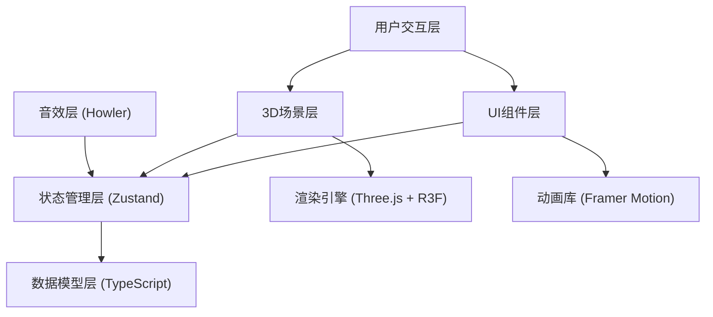

## 1. 架构设计



**模块调用关系与数据流向**：
1. `types.ts` 定义所有数据结构 → 被 `store.ts`、`Scene.tsx`、`UI.tsx` 引用
2. `store.ts` 管理全局状态 → 被 `Scene.tsx`、`UI.tsx` 订阅和调用
3. `Scene.tsx` 负责3D渲染和交互 → 调用 store 的 `selectComponent`、`moveComponent`、`snapToTarget`
4. `UI.tsx` 负责2D界面 → 调用 store 的 `toggleMode`、`playSound`，订阅 `progress`、`selectedComponentId`
5. `main.ts` 入口文件 → 组合 `Scene.tsx` 和 `UI.tsx`，包裹在 `App.tsx` 中
6. 数据流向：用户交互 → 组件调用 action → store 更新状态 → 订阅组件重新渲染

## 2. 技术选型说明

| 技术栈 | 版本 | 用途 |
|--------|------|------|
| React | ^18.2.0 | UI框架 |
| React DOM | ^18.2.0 | DOM渲染 |
| TypeScript | ^5.0.0 | 类型安全 |
| Vite | ^5.0.0 | 构建工具 |
| @vitejs/plugin-react | ^4.0.0 | React插件 |
| Three.js | ^0.160.0 | 3D渲染引擎 |
| @react-three/fiber | ^8.15.0 | React Three.js渲染器 |
| @react-three/drei | ^9.90.0 | R3F常用组件库 |
| Framer Motion | ^10.16.0 | React动画库 |
| Zustand | ^4.4.0 | 状态管理 |
| Howler | ^2.2.4 | 音频播放 |

## 3. 项目结构

```
src/
├── types.ts              # 类型定义
├── store.ts              # Zustand状态管理
├── main.tsx              # 入口文件
├── App.tsx               # 根组件
├── components/
│   ├── Scene.tsx         # 3D场景组件
│   ├── UI.tsx            # UI界面组件
│   └── DougongComponent.tsx  # 单个斗拱构件组件
├── hooks/
│   ├── useDrag.ts        # 拖拽逻辑Hook
│   └── useSound.ts       # 音效管理Hook
├── utils/
│   ├── geometries.ts     # 榫卯几何体生成
│   ├── constants.ts      # 斗拱尺寸常量
│   └── helpers.ts        # 辅助函数
└── assets/
    └── sounds/           # 音效文件目录
```

## 4. 类型定义 (types.ts)

### 4.1 核心数据结构

```typescript
// 构件种类枚举
export enum ComponentType {
  CapBlock = 'CapBlock',           // 栌斗
  CorbelBracket = 'CorbelBracket', // 斗（齐心斗、散斗）
  ArchBracket = 'ArchBracket',     // 拱（泥道拱、华拱、令拱）
  Cantilever = 'Cantilever',       // 耍头
  SubstituteWood = 'SubstituteWood', // 替木
  Rafter = 'Rafter'                // 檐椽
}

// 铺作状态枚举
export enum AssemblyMode {
  Disassemble = 'Disassemble',
  Assemble = 'Assemble'
}

// 交互事件类型
export enum InteractionType {
  DragStart = 'DragStart',
  DragEnd = 'DragEnd',
  Snap = 'Snap',
  Disassemble = 'Disassemble'
}

// 构件位置与旋转
export interface Transform {
  x: number;
  y: number;
  z: number;
}

export interface Rotation {
  x: number;
  y: number;
  z: number;
}

// 斗拱构件
export interface DougongComponent {
  id: string;
  name: string;              // 中文名称：如"栌斗"、"华拱"
  type: ComponentType;
  position: Transform;
  rotation: Rotation;
  correctPosition: Transform;
  correctRotation: Rotation;
  color: string;
  isAssembled: boolean;
  isSnapped: boolean;
  assemblyOrder: number;     // 组装顺序：1-12
  material: string;          // 材质：如"黄松木"
  tenonType: string;         // 榫头类型
  mortiseType: string;       // 卯口类型
  dimensions: {
    width: number;
    height: number;
    depth: number;
  };
}

// 音效队列项
export interface SoundQueueItem {
  id: string;
  type: 'friction' | 'snap' | 'error' | 'drag';
  volume: number;
  pitch: number;
}

// Store状态
export interface AppState {
  components: DougongComponent[];
  selectedComponentId: string | null;
  hoveredComponentId: string | null;
  progress: number;
  mode: AssemblyMode;
  isModeTransitioning: boolean;
  soundQueue: SoundQueueItem[];
  showFullAssembly: boolean; // 是否显示替木和檐椽
}
```

## 5. 状态管理 (store.ts)

### 5.1 核心 Actions

```typescript
// 选择构件
selectComponent: (id: string | null) => void;

// 悬停构件
hoverComponent: (id: string | null) => void;

// 移动构件（更新位置）
moveComponent: (id: string, position: Partial<Transform>) => void;

// 旋转构件
rotateComponent: (id: string, rotation: Partial<Rotation>) => void;

// 吸附到目标位置
snapToTarget: (id: string) => void;

// 错误吸附反馈
errorSnap: (id: string) => void;

// 切换模式
toggleMode: () => void;

// 完成模式切换
completeModeTransition: () => void;

// 播放音效
playSound: (type: SoundQueueItem['type'], volume?: number, pitch?: number) => void;

// 计算组装进度
calculateProgress: () => void;

// 触发完整铺作显示
triggerFullAssembly: () => void;

// 重置所有构件
resetComponents: () => void;
```

### 5.2 数据流

1. 用户在Scene中点击构件 → `selectComponent(id)` → store更新 `selectedComponentId` → UI组件显示构件信息
2. 用户拖拽构件 → `moveComponent(id, position)` → store更新position → Scene重新渲染构件位置
3. 构件接近目标位置 → 计算距离 < 1 → `snapToTarget(id)` → 更新 `isSnapped`、`isAssembled` → 播放吸附音效
4. 计算进度 → 更新 `progress` → 进度环动画更新
5. 全部组装完成 → `triggerFullAssembly()` → 加载替木和檐椽
6. 模式切换 → `toggleMode()` → 更新 `mode` 和 `isModeTransitioning` → 场景执行过渡动画

## 6. 斗拱构件尺寸常量 (utils/constants.ts)

参照《营造法式》五铺作单抄单下昂布局：

| 构件名称 | 宽 | 高 | 深 | 组装顺序 |
|----------|----|----|----|----------|
| 栌斗 | 32 | 24 | 24 | 1 |
| 泥道拱 | 96 | 8 | 16 | 2 |
| 华拱(第一层) | 16 | 8 | 48 | 3 |
| 齐心斗(第一层) | 16 | 12 | 16 | 4 |
| 散斗(泥道拱左) | 14 | 10 | 14 | 5 |
| 散斗(泥道拱右) | 14 | 10 | 14 | 6 |
| 华拱(第二层) | 16 | 8 | 64 | 7 |
| 令拱 | 80 | 8 | 16 | 8 |
| 齐心斗(第二层) | 16 | 12 | 16 | 9 |
| 散斗(令拱左) | 14 | 10 | 14 | 10 |
| 散斗(令拱右) | 14 | 10 | 14 | 11 |
| 耍头 | 16 | 12 | 72 | 12 |

## 7. 性能优化策略

1. **几何体优化**：每个构件使用BoxGeometry与CylinderGeometry组合，顶点数控制在500以内
2. **InstancedMesh**：已吸附的静态构件使用InstancedMesh合并，减少draw call
3. **矩阵更新**：仅动态更新正在拖拽和交互的构件的变换矩阵
4. **音效缓存**：使用Howler缓存音效到内存，播放延迟<50ms
5. **帧率监控**：使用requestAnimationFrame监控帧率，低于30FPS时降低渲染质量
6. **按需渲染**：非交互状态下适当降低渲染频率，节省资源
7. **资源复用**：材质、几何体、纹理对象复用，避免重复创建

## 8. 路由定义

| 路由 | 用途 |
|------|------|
| / | 主场景页，包含3D场景和UI |

（单页应用，无复杂路由）
