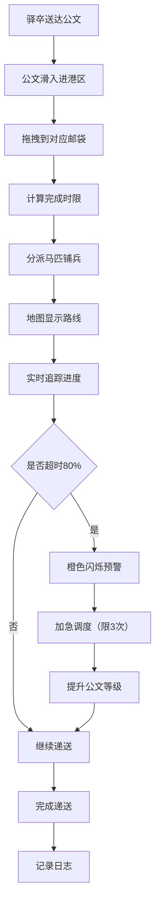

## 1. 产品概述

古代驿站公文流转与马匹调度管理系统，模拟宋代急递铺的日常运营管理。用户扮演驿站铺长，在厅堂中管理每日从各路送来的公文，完成分拣、登记、分派马匹和铺兵，并实时追踪每件公文的递送进度和延误预警。

- 主要目的：通过沉浸式的古代驿站管理体验，让用户了解古代公文传递制度，同时锻炼资源调度和应急处理能力
- 目标用户：对历史文化感兴趣的用户、模拟经营类游戏玩家
- 产品价值：融合历史文化与现代游戏化管理，提供独特的互动体验

## 2. 核心功能

### 2.1 用户角色

| 角色 | 注册方式 | 核心权限 |
|------|----------|----------|
| 铺长 | 直接进入 | 完整管理权限，包含公文分拣、马匹调度、延误处理、日志查询 |

### 2.2 功能模块

1. **驿站大厅面板**：今日公文总数、各等级分布柱状图、延误率折线图
2. **分拣案台**：拖拽公文到对应等级邮袋完成分拣
3. **马厩面板**：马匹状态管理、调度安排
4. **地图追踪区**：递送路线可视化、进度实时追踪
5. **延误预警系统**：超时预警、加急调度
6. **日志记录系统**：操作记录、历史查询

### 2.3 页面详情

| 页面名称 | 模块名称 | 功能描述 |
|---------|----------|----------|
| 主界面 | 顶部导航栏 | 驿站名称展示、模拟时钟、日期显示 |
| 主界面 | 左侧分拣区 | 驿卒进港区（公文滑入动画）、三个等级邮袋 |
| 主界面 | 中间地图区 | 网格热力图背景、递送路线动态连线 |
| 主界面 | 右侧马厩区 | 马匹列表、出勤栏、马匹详情弹窗 |
| 主界面 | 底部日志栏 | 操作日志、筛选功能、渐进式加载 |
| 主界面 | 延误预警面板 | 超时公文列表、加急调度按钮 |

## 3. 核心流程

驿卒送达公文 → 公文滑入进港区 → 铺长拖拽公文到对应邮袋 → 系统自动计算时限 → 分派马匹和铺兵 → 地图显示递送路线 → 实时追踪进度 → 超时预警 → 加急调度（可选）→ 完成递送 → 记录日志

## 4. 用户界面设计

### 4.1 设计风格

- **主色调**：木色 #8b5e3c、宣纸色 #f5e6c8、墨色 #2c2c2c
- **辅助色**：步递灰 #c0c0c0、马递棕 #8b5e3c、急脚递红 #c0392b
- **边框**：深木色 #5d3a1a，圆角 8px
- **背景**：宣纸纹理渐变（linear-gradient + 细微噪点）
- **按钮**：木质凸起效果，悬停时有轻微阴影加深
- **字体**：标题采用仿宋风格字体，正文采用清晰易读的宋体类字体
- **图标**：使用古风图标，如印章、马匹、卷轴等元素

### 4.2 页面设计概述

| 页面名称 | 模块名称 | UI元素 |
|---------|----------|--------|
| 主界面 | 顶部导航 | 木质纹理背景、仿古牌匾样式标题、数字模拟时钟 |
| 主界面 | 分拣区 | 驿卒进港区（左侧滑入动画）、三个邮袋（不同颜色区分）、拖拽阴影放大效果 |
| 主界面 | 地图区 | 网格热力图（#e8f0e8背景）、动态连线（红/橙/蓝三色）、悬停提示框 |
| 主界面 | 马厩区 | 马匹卡片（健康度颜色编码）、体力槽、拖拽出勤、详情弹窗 |
| 主界面 | 日志栏 | 卷轴样式、时间戳、渐进式加载动画 |
| 主界面 | 预警区 | 橙色闪烁边框、加急调度按钮、调度次数显示 |

### 4.3 响应式

- **桌面端（≥768px）**：三栏布局，左分拣、中地图、右马厩
- **移动端（<768px）**：右侧马厩面板折叠为底部抽屉式，地图缩小为50%高度，采用垂直堆叠布局
- **触摸优化**：拖拽区域增大，按钮最小高度44px，支持触摸滑动操作

### 4.4 动画效果

- 公文滑入：从左侧外滑入，持续0.5秒
- 拖拽放大：transform: scale(1.05)，阴影加深
- 邮袋膨胀：拖拽入袋时触发scale动画
- 屏幕抖动：操作冲突时translate随机偏移，持续0.3秒
- 连线移动：根据等级不同速度（急脚0.5s/格、马递1s/格、步递2s/格）
- 预警闪烁：橙色边框脉冲动画
- 日志加载：渐入式动画，逐条显示
