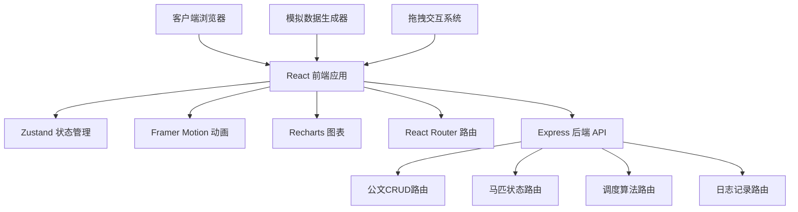
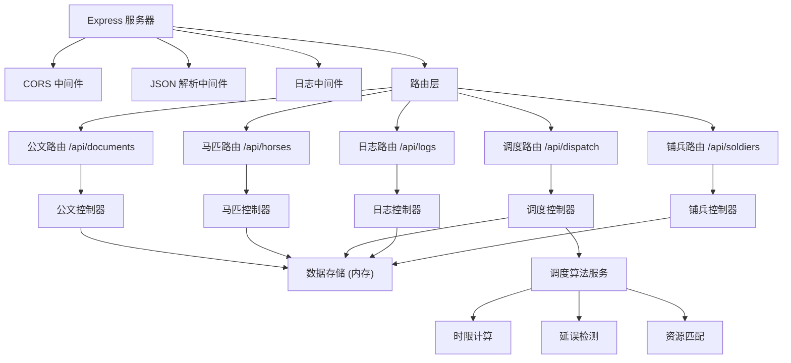
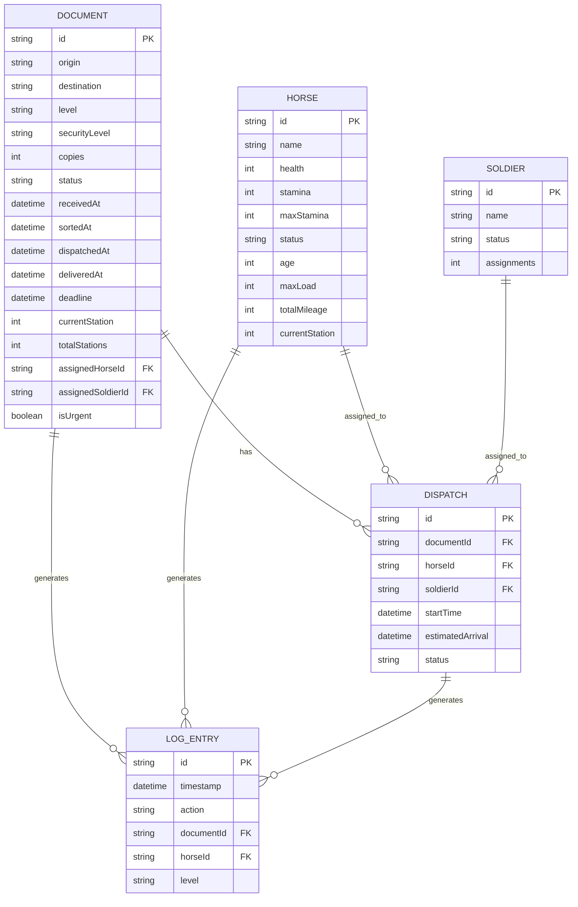

## 1. 架构设计



## 2. 技术描述

- **前端框架**：React@18 + TypeScript
- **构建工具**：Vite@5
- **状态管理**：Zustand@4
- **动画库**：Framer Motion@11
- **图表库**：Recharts@2
- **路由**：React Router DOM@6
- **后端框架**：Express@4
- **后端语言**：TypeScript
- **HTTP客户端**：Fetch API（原生）
- **开发服务器**：Vite Dev Server + Express 后端（代理转发）

## 3. 路由定义

| 路由路径 | 组件/页面 | 用途 |
|---------|----------|------|
| / | App.tsx | 主布局，管理全局状态和路由 |
| /dashboard | Dashboard.tsx | 驿站大厅仪表板 |
| /desk | Desk.tsx | 分拣案台 |
| /stable | Stable.tsx | 马厩面板 |

## 4. API 定义

### 4.1 类型定义

```typescript
// 公文等级
type DocumentLevel = '步递' | '马递' | '急脚递';

// 密级
type SecurityLevel = '普通' | '机密' | '绝密';

// 公文状态
type DocumentStatus = '待分拣' | '已分拣' | '派送中' | '已送达' | '延误';

// 马匹状态
type HorseStatus = '空闲' | '在役' | '疲惫' | '休息中';

// 公文接口
interface Document {
  id: string;
  origin: string;
  destination: string;
  level: DocumentLevel;
  securityLevel: SecurityLevel;
  copies: number;
  status: DocumentStatus;
  receivedAt: Date;
  sortedAt?: Date;
  dispatchedAt?: Date;
  deliveredAt?: Date;
  deadline: Date;
  currentStation: number;
  totalStations: number;
  assignedHorseId?: string;
  assignedSoldierId?: string;
  isUrgent: boolean;
}

// 马匹接口
interface Horse {
  id: string;
  name: string;
  health: number;
  stamina: number;
  maxStamina: number;
  status: HorseStatus;
  age: number;
  maxLoad: number;
  totalMileage: number;
  currentStation: number;
}

// 铺兵接口
interface Soldier {
  id: string;
  name: string;
  status: '空闲' | '在役' | '休息';
  assignments: number;
}

// 日志接口
interface LogEntry {
  id: string;
  timestamp: Date;
  action: string;
  documentId?: string;
  horseId?: string;
  level: 'info' | 'warning' | 'error';
}

// 调度接口
interface Dispatch {
  id: string;
  documentId: string;
  horseId: string;
  soldierId: string;
  startTime: Date;
  estimatedArrival: Date;
  status: '进行中' | '完成' | '延误';
}
```

### 4.2 API 端点

| 方法 | 路径 | 描述 | 请求体 | 响应 |
|-----|------|------|--------|------|
| GET | /api/documents | 获取所有公文 | - | Document[] |
| POST | /api/documents | 创建新公文 | Partial<Document> | Document |
| PUT | /api/documents/:id | 更新公文 | Partial<Document> | Document |
| DELETE | /api/documents/:id | 删除公文 | - | { success: boolean } |
| GET | /api/documents/generate | 模拟生成新公文 | - | Document[] |
| GET | /api/horses | 获取所有马匹 | - | Horse[] |
| PUT | /api/horses/:id | 更新马匹状态 | Partial<Horse> | Horse |
| POST | /api/horses/:id/assign | 分派马匹任务 | { documentId: string } | { success: boolean } |
| POST | /api/horses/:id/return | 马匹归还 | - | { success: boolean } |
| GET | /api/soldiers | 获取所有铺兵 | - | Soldier[] |
| POST | /api/dispatch | 创建调度 | { documentId: string, horseId: string, soldierId: string } | Dispatch |
| GET | /api/dispatch/optimize | 调度优化建议 | - | { recommendations: string[] } |
| POST | /api/dispatch/urgent | 加急调度 | { documentId: string } | { success: boolean, remainingUrgentCount: number } |
| GET | /api/logs | 获取日志 | { date?: string, level?: string } | LogEntry[] |
| POST | /api/logs | 记录日志 | Partial<LogEntry> | LogEntry |

## 5. 服务器架构图



## 6. 数据模型

### 6.1 数据模型 ER 图



### 6.2 初始数据

```typescript
// 古代名马数据
const initialHorses: Horse[] = [
  { id: 'h1', name: '赤兔', health: 95, stamina: 100, maxStamina: 100, status: '空闲', age: 8, maxLoad: 150, totalMileage: 5000, currentStation: 0 },
  { id: 'h2', name: '的卢', health: 88, stamina: 100, maxStamina: 100, status: '空闲', age: 7, maxLoad: 140, totalMileage: 4200, currentStation: 0 },
  { id: 'h3', name: '乌骓', health: 92, stamina: 100, maxStamina: 100, status: '空闲', age: 6, maxLoad: 160, totalMileage: 3800, currentStation: 0 },
  { id: 'h4', name: '绝影', health: 85, stamina: 100, maxStamina: 100, status: '空闲', age: 9, maxLoad: 130, totalMileage: 6100, currentStation: 0 },
  { id: 'h5', name: '爪黄飞电', health: 90, stamina: 100, maxStamina: 100, status: '空闲', age: 5, maxLoad: 145, totalMileage: 2500, currentStation: 0 },
  { id: 'h6', name: '照夜玉狮子', health: 87, stamina: 100, maxStamina: 100, status: '空闲', age: 7, maxLoad: 135, totalMileage: 3900, currentStation: 0 },
  { id: 'h7', name: '乌云踏雪', health: 93, stamina: 100, maxStamina: 100, status: '空闲', age: 6, maxLoad: 155, totalMileage: 3200, currentStation: 0 },
  { id: 'h8', name: '赤兔驹', health: 78, stamina: 100, maxStamina: 100, status: '空闲', age: 10, maxLoad: 125, totalMileage: 7200, currentStation: 0 },
  { id: 'h9', name: '黄骠马', health: 91, stamina: 100, maxStamina: 100, status: '空闲', age: 5, maxLoad: 140, totalMileage: 2100, currentStation: 0 },
  { id: 'h10', name: '白龙驹', health: 86, stamina: 100, maxStamina: 100, status: '空闲', age: 8, maxLoad: 130, totalMileage: 4500, currentStation: 0 },
];

// 古代地名
const locations = [
  '开封府', '洛阳城', '长安城', '应天府', '大名府',
  '杭州城', '苏州城', '扬州城', '成都府', '江陵府',
  '襄阳城', '潭州城', '福州城', '广州城', '桂州城',
  '太原府', '真定府', '京兆府', '凤翔府', '河中府'
];

// 初始铺兵
const initialSoldiers: Soldier[] = [
  { id: 's1', name: '张三', status: '空闲', assignments: 0 },
  { id: 's2', name: '李四', status: '空闲', assignments: 0 },
  { id: 's3', name: '王五', status: '空闲', assignments: 0 },
  { id: 's4', name: '赵六', status: '空闲', assignments: 0 },
  { id: 's5', name: '钱七', status: '空闲', assignments: 0 },
];
```
