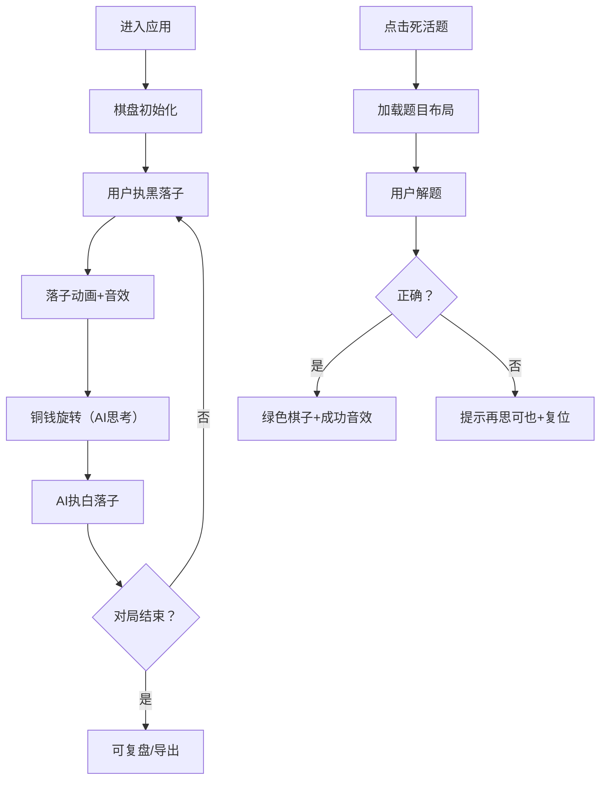

## 1. 产品概述

唐代围棋对弈与死活题训练应用，解决传统围棋教学中布局思路、中盘攻防和官子计算难以直观演示和反复练习的问题。用户可在虚拟唐代棋院场景中与AI国手对弈，并通过经典死活题训练提升棋力。

- 核心目标：为围棋爱好者提供沉浸式的古代围棋学习与对弈体验
- 目标用户：围棋初学者、爱好者、希望提升棋力的玩家
- 市场价值：将传统文化与现代交互技术结合，使围棋学习更直观有趣

## 2. 核心功能

### 2.1 用户角色

| 角色 | 注册方式 | 核心权限 |
|------|----------|----------|
| 普通用户 | 无需注册，直接使用 | 对弈、死活题训练、复盘、导出棋谱 |

### 2.2 功能模块

1. **主对弈场景**：虚拟唐代棋院环境，19路棋盘，AI对弈
2. **死活题训练**：10道经典唐代死活题，限时解答
3. **实时信息显示**：目差进度条、AI思考状态、落子坐标
4. **复盘系统**：按落子顺序回放、进度条跳转、SGF导出
5. **棋局统计**：总手数、提子数、阶段划分

### 2.3 页面详情

| 页面名称 | 模块名称 | 功能描述 |
|-----------|-------------|---------------------|
| 主对弈页 | 棋盘渲染 | 19x19网格、星位、落子动画、玉石撞击音效 |
| 主对弈页 | AI对弈 | 王积薪风格AI，交替落子，思考动画 |
| 主对弈页 | 目差显示 | 渐变色进度条，光标指示当前目数差距 |
| 主对弈页 | 复盘系统 | R键触发回放，进度条跳转，落子闪烁提示 |
| 右侧面板 | 死活题训练 | 10道经典题，高亮待解区域，正误反馈 |
| 左侧面板 | 棋局统计 | 总手数、提子数、落子坐标、阶段色块 |
| 导出功能 | SGF导出 | 卷轴展开动画，自动下载文本文件 |

## 3. 核心流程

### 3.1 对弈流程
用户进入应用 → 棋盘初始化 → 用户执黑落子 → 播放落子动画与音效 → AI思考（显示铜钱旋转）→ AI执白落子 → 循环直到对局结束 → 可随时按R键复盘或点击导出棋谱

### 3.2 死活题流程
用户点击右侧面板题目 → 棋盘加载预设棋子 → 高亮待解区域（金色边框闪烁）→ 用户在规定步数内落子 → 正确则棋子变绿播放成功音效 → 错误则提示"再思可也"并复位

### 3.3 复盘流程
按R键进入复盘模式 → 显示回放进度条 → 自动逐手回放（当前落子闪烁黄光0.3秒）→ 可拖拽进度条跳转 → 再次按R键退出复盘

## 4. 用户界面设计

### 4.1 设计风格
- **整体色调**：唐代宫廷青绿山水画风格，背景墙淡米色#f5e6d3
- **棋枰**：深檀色#4a2e1b，铜色包角#c49a6c
- **棋子**：黑子墨色#1a1a1a带光泽，白子乳白色#f5f0e1带光泽
- **按钮**：仿古铜色#c49a6c，悬停变深#a67c52，按压动画（压扁10%再弹回）
- **字体**：楷体，引入Google Fonts的"ZCOOL KuaiLe"或系统楷体
- **动画风格**：落子放大回弹（0.15秒）、铜钱旋转（0.5秒/圈）、卷轴展开（0.5秒）

### 4.2 页面设计概述

| 页面名称 | 模块名称 | UI元素 |
|-----------|-------------|----------|
| 主对弈页 | 棋院背景 | 木格纸窗#f5e6d3、青石地面#9a8a7a、光线效果 |
| 主对弈页 | 中央棋盘 | 占屏幕60%，檀木色，铜色包角，19x19网格 |
| 主对弈页 | 目差进度条 | 左上，黑#1a1a1a到白#f5f0e1渐变，光标指示差距 |
| 主对弈页 | AI思考 | 右上，古钱#8b5e3c旋转动画 |
| 右侧面板 | 死活题列表 | 10道题目，选中高亮金色边框#ffd700闪烁 |
| 左侧面板 | 统计信息 | 总手数、提子数（黑石/白石计数）、落子坐标（格式：黑 17·三） |
| 左侧面板 | 阶段色块 | 布局#2980b9 → 中盘过渡 → 官子#c0392b渐变 |
| 导出动画 | 卷轴效果 | 从中间向两侧展开0.5秒 |

### 4.3 响应式设计
- **桌面端**：棋盘占中央60%，左右面板分列两侧
- **移动端**（宽度<768px）：棋盘自适应宽度，交叉点间距按比例缩小，面板改为上下布局
- **触摸优化**：增大点击区域，支持触摸落子

### 4.4 场景细节
- **环境氛围**：柔和光线从木格纸窗透入，青石地面纹理
- **棋枰细节**：檀木纹理，铜色包角磨损质感，棋盘线条清晰
- **棋子细节**：玉石光泽，落子时阴影变化，接触棋盘时的细微弹跳
