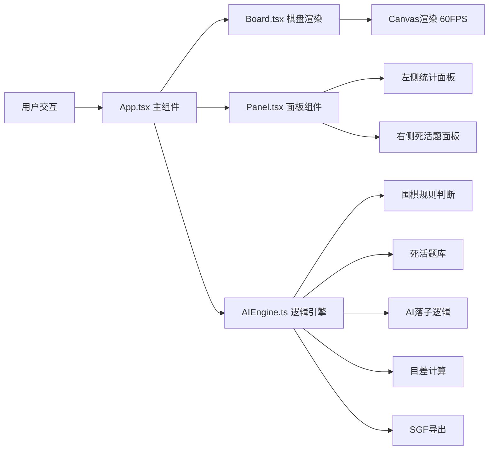

## 1. 架构设计



## 2. 技术描述

- **前端框架**：React@18 + TypeScript@5
- **构建工具**：Vite@5 + @vitejs/plugin-react@4
- **动画库**：framer-motion@11
- **状态管理**：React useState/useReducer（轻量级，无需额外状态库）
- **渲染方式**：Canvas 2D API 实现棋盘高性能渲染
- **音效**：Web Audio API 生成玉石撞击音效
- **响应式**：CSS Media Queries + 动态计算棋盘尺寸

## 3. 项目文件结构

| 文件路径 | 职责描述 |
|---------|----------|
| `package.json` | 项目依赖与脚本配置 |
| `vite.config.js` | Vite构建配置，React插件 |
| `tsconfig.json` | TypeScript严格模式配置 |
| `index.html` | 入口HTML，引入Google Fonts |
| `src/App.tsx` | 主组件，状态管理，数据流调度 |
| `src/Board.tsx` | 棋盘Canvas渲染，交互事件处理 |
| `src/AIEngine.ts` | 围棋逻辑，死活题库，AI，SGF导出 |
| `src/Panel.tsx` | 左右面板，统计信息与死活题列表 |

## 4. 核心数据结构

```typescript
// 棋子颜色
type StoneColor = 'black' | 'white' | null;

// 棋盘位置
interface Position {
  x: number;  // 0-18
  y: number;  // 0-18
}

// 落子记录
interface Move {
  position: Position;
  color: StoneColor;
  moveNumber: number;
  timestamp: number;
}

// 棋局状态
interface GameState {
  board: StoneColor[][];  // 19x19
  moves: Move[];
  currentTurn: 'black' | 'white';
  capturedBlack: number;  // 白方提黑子数
  capturedWhite: number;  // 黑方提白子数
  isReviewMode: boolean;
  reviewMoveIndex: number;
  isAIThinking: boolean;
  gamePhase: 'opening' | 'middle' | 'endgame';
}

// 死活题
interface LifeDeathProblem {
  id: number;
  name: string;
  description: string;
  initialBoard: StoneColor[][];
  targetArea: Position[];  // 待解答区域
  solutionMoves: Position[];
  maxMoves: number;
  playerColor: 'black' | 'white';
}

// 统计信息
interface GameStats {
  totalMoves: number;
  capturedBlack: number;
  capturedWhite: number;
  lastMove: Position | null;
  lastMoveColor: StoneColor;
  scoreDiff: number;  // 黑目 - 白目
  currentPhase: 'opening' | 'middle' | 'endgame';
}
```

## 5. 核心算法

### 5.1 围棋规则判断
- **落子合法性**：检查是否为空位、是否自杀（无气）、是否打劫
- **气的计算**：BFS/DFS遍历连通块，统计相邻空位
- **提子逻辑**：落子后检查对方无气棋子并移除

### 5.2 目差计算
- 区域判定：使用flood fill算法确定黑白领地
- 贴目：默认贴7.5目
- 实时更新：每手落子后重新计算

### 5.3 AI逻辑（王积薪风格）
- **布局阶段**：优先星位、小目等传统开局点
- **中盘阶段**：优先攻击、防守要点
- **官子阶段**：计算官子价值，选择最大官子
- **简化实现**：基于规则的启发式AI，非深度学习

### 5.4 死活题判断
- 匹配用户落子与正解序列
- 支持多种正解路径（可配置）
- 超时检测（每步限时）

### 5.5 SGF格式导出
```
(;GM[1]FF[4]SZ[19]
;B[aa];W[ab]
;B[ac];W[ad]
)
```

## 6. 性能优化

- **Canvas渲染**：仅重绘变化区域，使用requestAnimationFrame
- **离屏Canvas**：预渲染棋盘网格和星位
- **对象池**：复用棋子渲染对象
- **防抖**：快速点击时合并落子请求
- **Web Worker**：AI计算在后台线程执行（可选）

## 7. 样式与动画

- **CSS变量**：统一管理颜色主题
```css
:root {
  --bg-wall: #f5e6d3;
  --floor: #9a8a7a;
  --board: #4a2e1b;
  --board-corner: #c49a6c;
  --stone-black: #1a1a1a;
  --stone-white: #f5f0e1;
  --bronze: #c49a6c;
  --bronze-hover: #a67c52;
  --gold: #ffd700;
  --success: #27ae60;
  --phase-opening: #2980b9;
  --phase-endgame: #c0392b;
}
```

- **关键动画**：
  - 落子：scale(1.2) → scale(0.95) → scale(1)，0.15s
  - 铜钱旋转：rotate(360deg)，0.5s infinite
  - 高亮闪烁：opacity 0.5 ↔ 1，1s infinite
  - 按钮按压：scaleY(0.9) → scaleY(1)，0.1s
  - 卷轴展开：scaleX(0) → scaleX(1)，0.5s，transform-origin: center
