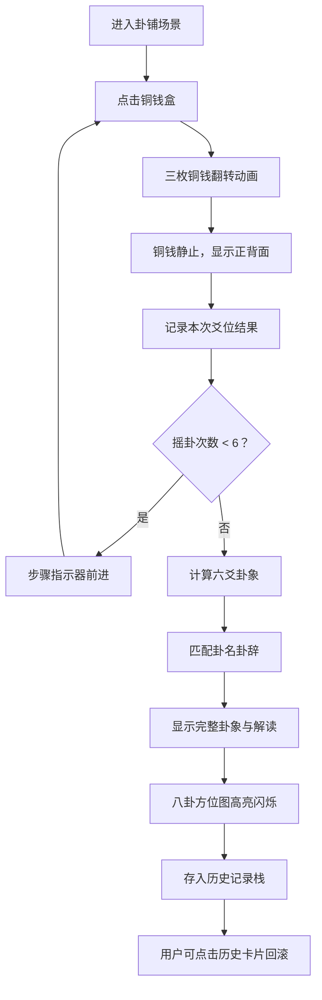

## 1. 产品概述

本产品是一个基于浏览器的宋代风格六爻起卦与卦象推演互动应用，模拟南宋临安城潘金门外卦铺的占卜场景，让用户体验传统六爻占卜的完整流程。

- 核心用途：让用户通过点击铜钱盒进行六爻起卦，获得卦象、卦辞与吉凶断语
- 目标用户：对中国传统文化、易经占卜感兴趣的普通用户
- 产品价值：以互动化、可视化的方式传承和展示中国传统占卜文化，提供沉浸式的宋代美学体验

## 2. 核心特性

### 2.1 用户角色

| 角色 | 注册方式 | 核心权限 |
|------|----------|----------|
| 普通用户 | 无需注册，直接使用 | 进行六爻起卦、查看卦象解读、浏览历史卦象记录 |

### 2.2 功能模块

1. **占卦桌区域**：檀木卦桌、铜钱盒与三枚铜钱、摇卦交互、步骤指示器
2. **卦象展示区域**：六爻卦象显示、卦名卦辞解读、八卦方位图、五行生克关系
3. **历史记录功能**：最近5卦缩略卡片展示、历史回滚、记录自动清理

### 2.3 页面详情

| 页面名称 | 模块名称 | 功能描述 |
|----------|----------|----------|
| 主页面 | 占卦桌模块 | 点击铜钱盒触发三枚铜钱翻转动画（0.5-0.7秒），随机生成阴阳爻，六次成卦，支持"再摇一卦"和"清空卦盘"操作 |
| 主页面 | 卦象展示模块 | 六爻横线排列展示（阳实阴虚），动爻红点标记，卦名卦辞显示，八卦方位圆环图（SVG绘制），五行生克箭头连线 |
| 主页面 | 历史记录模块 | 顶部最近5卦缩略卡片，悬停放大显示六爻，点击回滚恢复卦象状态，自动移除已回滚记录 |

## 3. 核心流程

用户打开应用进入卦铺场景 → 点击铜钱盒摇动三枚铜钱 → 铜钱翻转动画后静止，显示正背面 → 记录本次爻位（初爻到上爻） → 重复摇动六次 → 自动计算生成完整卦象 → 显示卦名、卦辞、动爻、吉凶 → 八卦方位图高亮对应方位 → 自动存入历史记录栈 → 用户可点击历史卡片回滚查看

## 4. 用户界面设计

### 4.1 设计风格

- **主色调**：背景米黄色 #f0e6d3（宋代绢画色调），文字深褐色 #2a1a0a，装饰金色 #ffd700 / 暗金 #b8860b
- **字体**：标题使用篆体，卦名使用楷体加粗，正文使用宋体
- **布局风格**：左右两栏式（桌面端），上下布局（移动端），宋代美学风格，典雅古朴
- **装饰元素**：云纹SVG装饰条、檀木纹理渐变、铜钱方孔造型、八卦方位圆环

### 4.2 页面设计概述

| 页面名称 | 模块名称 | UI元素 |
|----------|----------|----------|
| 主页面 | 标题栏 | "六爻占卜"篆体大字、淡金色云纹SVG装饰条横向贯穿页面 |
| 主页面 | 占卦桌区域 | 檀木卦桌（#5d3a1a木纹渐变）、铜钱盒、三枚圆形方孔铜钱、六步圆点指示器、"再摇一卦"/"清空卦盘"按钮 |
| 主页面 | 卦象展示区域 | 六条横线竖向排列（阳实阴虚）、卦名楷体24px、卦辞灰色14px、SVG八卦方位圆环（半径120px）、五行生克箭头、金色光晕闪烁效果 |
| 主页面 | 历史记录 | 顶部5张浅褐色（#e8dcc8）圆角缩略卡片，悬停放大1.1倍 |

### 4.3 响应式设计

- **桌面端（≥768px）**：左右两栏布局，左侧60%占卦桌，右侧40%卦象展示
- **移动端（<768px）**：上下布局，占卦桌在上，卦象在下，所有字体缩小80%，方位图半径缩小至80px
- **触摸优化**：铜钱盒点击区域增大至48x48px，按钮最小高度44px

### 4.4 动画与交互

- **铜钱翻转**：旋转3-4圈（360-720度随机），Z轴上下跳动，0.5-0.7秒，cubic-bezier缓动
- **卦象淡入**：0.3秒fade-in
- **光晕闪烁**：金色径向渐变持续闪烁
- **点击反馈**：铜钱盒点击时震动（translateX重复3次，0.15秒）
- **卦成音效**：Web Audio API生成440Hz正弦波，持续0.1秒
- **历史卡片悬停**：放大1.1倍，显示完整六爻
