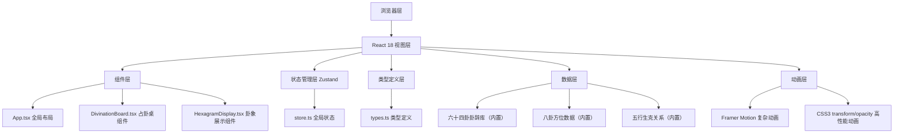

## 1. 架构设计



## 2. 技术描述

- **前端框架**：React 18 + TypeScript 5
- **构建工具**：Vite 5 + @vitejs/plugin-react
- **状态管理**：Zustand 4（轻量高性能）
- **动画库**：Framer Motion 11 + 原生CSS3动画
- **UI渲染**：SVG（八卦方位图）+ CSS渐变（木质纹理）
- **音效**：Web Audio API（无外部音频文件）
- **无后端**：所有数据内置，纯前端应用

## 3. 目录结构与文件职责

```
project-root/
├── package.json          # 依赖与启动脚本
├── vite.config.js        # Vite配置（React插件、路径别名）
├── tsconfig.json         # TypeScript配置（strict模式、ES2020）
├── index.html            # 入口页面（根容器、viewport、背景色）
└── src/
    ├── types.ts          # 类型定义：CopperCoin, Yao, Hexagram, TrigramDirection
    ├── store.ts          # Zustand状态管理：摇卦次数、爻位数组、卦象数据、历史栈
    ├── data/
    │   ├── hexagrams.ts  # 六十四卦辞库（卦名、卦辞、吉凶）
    │   ├── trigrams.ts   # 八卦方位与五行数据
    │   └── fiveElements.ts # 五行生克关系矩阵
    ├── utils/
    │   ├── coinFlip.ts   # 铜钱翻转逻辑（随机阴阳、动爻判断）
    │   ├── hexagramCalc.ts # 六爻转卦名计算逻辑
    │   └── audio.ts      # Web Audio API音效工具
    ├── App.tsx           # 全局组件：布局组合、标题栏、页脚
    ├── DivinationBoard.tsx # 占卦桌组件：铜钱盒、翻转动画、步骤指示器
    ├── HexagramDisplay.tsx # 卦象展示：六爻横线、方位图、五行生克
    └── index.css         # 全局样式、CSS变量、动画关键帧
```

**文件调用关系与数据流向**：
1. `types.ts` 被所有其他文件引用（基础类型）
2. `data/*` 提供静态卦辞和方位数据，被 `utils/*` 和组件引用
3. `store.ts` 作为单一数据源，被 `App.tsx`、`DivinationBoard.tsx`、`HexagramDisplay.tsx` 订阅
4. `DivinationBoard.tsx` 调用 `store.throwCoin()` action → 触发 `utils/coinFlip.ts` 计算 → 更新 store 状态
5. 当六爻完成时，store 自动调用 `utils/hexagramCalc.ts` 计算卦象并更新
6. `HexagramDisplay.tsx` 订阅 store 中的 hexagram 数据，自动重渲染卦象和方位图
7. 历史记录通过 store 的 `history` 数组管理，支持 O(1) 的 push/shift 操作

## 4. 核心数据模型

### 4.1 类型定义（src/types.ts）

```typescript
// 铜钱状态
interface CopperCoin {
  id: number;
  isFlipping: boolean;
  face: 'zheng' | 'bei'; // 正面=字，背面=素
  rotation: number; // 旋转角度
  jumpOffset: number; // 上下跳动偏移
}

// 爻位
interface Yao {
  position: number; // 1-6，初爻到上爻
  type: 'lao-yang' | 'lao-yin' | 'shao-yang' | 'shao-yin';
  isMoving: boolean; // 是否动爻
  coinResult: ['zheng' | 'bei', 'zheng' | 'bei', 'zheng' | 'bei'];
}

// 卦象
interface Hexagram {
  id: string;
  name: string; // 卦名，如"乾为天"
  yaoArray: Yao[]; // 六爻数组（从下往上，索引0为初爻）
  guaCi: string; // 卦辞
  xiangCi: string; // 象辞
  movingYaoIndices: number[]; // 动爻位置（1-6）
  fortuneLevel: '大吉' | '吉' | '中' | '凶' | '大凶';
  upperTrigram: string; // 上卦（八卦名）
  lowerTrigram: string; // 下卦（八卦名）
  timestamp: number;
}

// 八卦方位
interface TrigramDirection {
  name: string; // 八卦名：乾、坤、震、巽、坎、离、艮、兑
  angle: number; // 方位角度（0-360）
  color: string; // 五行对应颜色
  element: '金' | '木' | '水' | '火' | '土';
  unicodeSymbol: string; // Unicode五行符号
}
```

### 4.2 Store 状态结构

```typescript
interface DivinationState {
  throwCount: number; // 0-6，当前摇卦次数
  yaoResults: Yao[]; // 已记录的爻位结果
  currentHexagram: Hexagram | null; // 当前完整卦象
  history: Hexagram[]; // 历史记录栈（最多20条）
  coinsFlipping: boolean; // 铜钱是否正在翻转
  // Actions
  throwCoins: () => void;
  clearBoard: () => void;
  rollbackHistory: (hexagramId: string) => void;
}
```

## 5. 性能优化策略

### 5.1 动画性能
- 所有动画使用 `transform` 和 `opacity`，避免触发 layout/paint
- 铜钱翻转动画使用 `will-change: transform` 提升合成层
- 使用 CSS `cubic-bezier(0.34, 1.56, 0.64, 1)` 实现自然弹跳效果
- Framer Motion 仅用于复杂的序列动画，简单动画使用原生 CSS

### 5.2 计算性能
- 卦象计算使用纯函数，无副作用，便于缓存
- 使用 `requestAnimationFrame` 确保六爻计算在帧空闲时执行
- 历史记录使用数组，`push` 新增，`shift` 删除最早记录，均为 O(1) 操作
- 卦辞匹配使用预构建的 Map 索引，O(1) 查找时间

### 5.3 渲染性能
- React 组件使用 `React.memo` 避免不必要重渲染
- Zustand 使用 selector 精确订阅需要的状态片段
- SVG 方位图使用 `transform: rotate()` 实现拖拽旋转，避免重绘

## 6. 六十四卦数据结构

```typescript
// 卦象索引规则：将六爻转为6位二进制数（阳=1，阴=0，从下往上）
// 例如：乾为天（六爻皆阳）→ 111111 → 十进制63
const hexagramMap = new Map<number, {
  name: string;
  guaCi: string;
  xiangCi: string;
  fortune: string;
}>();
```
