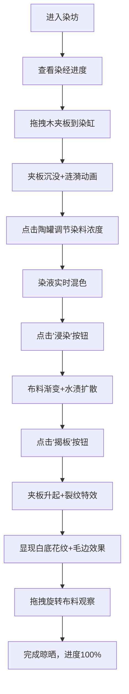

## 1. 产品概述
唐代夹缬染坊交互式Web体验项目，模拟古代防染印花工艺全过程。用户以染匠身份完成从选板、调色、浸染到揭板的完整印染流程，最终呈现精美夹缬花纹。

- 核心价值：传承非物质文化遗产，通过沉浸式交互让用户体验传统工艺之美
- 目标用户：文化爱好者、学生、设计师及对传统工艺感兴趣的大众用户
- 产品定位：教育类文化交互体验，兼具艺术性与趣味性

## 2. 核心功能

### 2.1 用户角色
| 角色 | 注册方式 | 核心权限 |
|------|----------|----------|
| 访客用户 | 无需注册 | 完整体验印染工艺流程 |

### 2.2 功能模块
1. **染坊主场景**：CSS绘制的唐代染坊环境，包含房梁、晾布竿、青砖地面、染缸、案板
2. **木夹板系统**：三块雕刻不同花纹的木板（六瓣莲花、卷草缠枝、飞凤含绶），支持拖拽
3. **染料调配系统**：三个陶罐（蓝草、茜草、苏木），滑块调节浓度，实时混色
4. **浸染动画系统**：布料颜色渐变、水渍扩散、夹板沉没涟漪效果
5. **揭板展示系统**：夹板升起动画、裂纹特效、花纹毛边渗化效果
6. **布料旋转系统**：360度旋转观察，阴影光晕联动变化
7. **进度追踪系统**："染经"进度面板，五步骤标记与完成度百分比

### 2.3 页面详情
| 页面名称 | 模块名称 | 功能描述 |
|----------|----------|----------|
| 主页面 | 染坊场景 | CSS绘制木质房梁、晾布竿、青砖地面、染缸、案板 |
| 主页面 | 木夹板组件 | 三块镂空花纹木板，拖拽到染缸，沉没涟漪动画 |
| 主页面 | 染料调配组件 | 三个陶罐点击弹出滑块，CSS mix-blend-mode实现混色 |
| 主页面 | 浸染组件 | 点击"浸染"按钮，5秒内布料变色伴水渍扩散 |
| 主页面 | 揭板组件 | 点击"揭板"按钮，夹板升起显花纹，毛边渗化效果 |
| 主页面 | 旋转展示 | 拖拽旋转布料360度，阴影光晕联动 |
| 主页面 | 进度面板 | 左上角"染经"面板，步骤标记与进度条 |

## 3. 核心流程

用户进入染坊场景 → 查看"染经"进度面板 → 从案板拖拽一块木夹板到染缸上方 → 夹板沉没产生涟漪 → 点击左侧陶罐弹出调色滑块 → 调节三种染料浓度实时混色 → 点击"浸染"按钮 → 布料渐变色伴水渍扩散 → 点击"揭板"按钮 → 夹板升起，显现白底花纹 → 拖拽旋转布料观察效果 → 完成晾晒步骤，进度100%

## 4. 用户界面设计

### 4.1 设计风格
- **主色调**：朱红#c0392b、石青#1a5276、藤黄#e8c76a、檀木#5d3a1a
- **辅助色**：靛蓝#1a5276、朱红#c0392b、紫褐#7b2d26、木纹#c49a6c/#a67c52/#8b5e3c
- **地面**：青砖#8b9a8b
- **布料初始色**：纯白#f5f0e1
- **进度标记**：金色#d4a017（已完成）、灰色#8b8b8b（未完成）

- **按钮风格**：仿唐代铜镜纹样圆形徽标，悬停旋转15度，点击播放880Hz铜镜清响
- **字体**：标题使用KaiTi（楷体），正文使用Roboto
- **布局**：中央染缸区域，左侧染料陶罐，右侧案板夹板，左上角进度面板
- **动效**：全部采用CSS动画与过渡，拖拽抖动、涟漪扩散、渐变过渡、旋转交互

### 4.2 页面设计概述
| 页面名称 | 模块名称 | UI元素 |
|----------|----------|--------|
| 主页面 | 染坊场景 | 木质房梁#5d3a1a、晾布竿、青砖地面#8b9a8b、深木色染缸#6b4e3a、长条案板 |
| 主页面 | 木夹板 | 三块不同木纹色，CSS clip-path镂空：六瓣莲花、卷草缠枝、飞凤含绶 |
| 主页面 | 染料陶罐 | 蓝草罐#1a5276、茜草罐#c0392b、苏木罐#7b2d26，点击弹出0-100%滑块 |
| 主页面 | 控制按钮 | 圆形铜镜样式"浸染"、"揭板"按钮，悬停旋转，点击音效 |
| 主页面 | 布料展示 | 中央40%区域，初始#f5f0e1，渐变染色，花纹毛边效果 |
| 主页面 | 进度面板 | 左上角"染经"面板，五步骤圆章标记，百分比进度条 |

### 4.3 响应性
- Desktop-first设计，桌面端完整交互体验
- 移动端适配：保持核心功能，优化触控拖拽体验
- 支持鼠标拖拽与触摸拖拽

### 4.4 性能要求
- 染液颜色混合计算全部在浏览器端完成，不使用外部API
- 从点击"浸染"到布料颜色完全展现不超过3秒
- 所有动画使用CSS硬件加速属性（transform、opacity）
- 帧率保持60fps流畅体验
