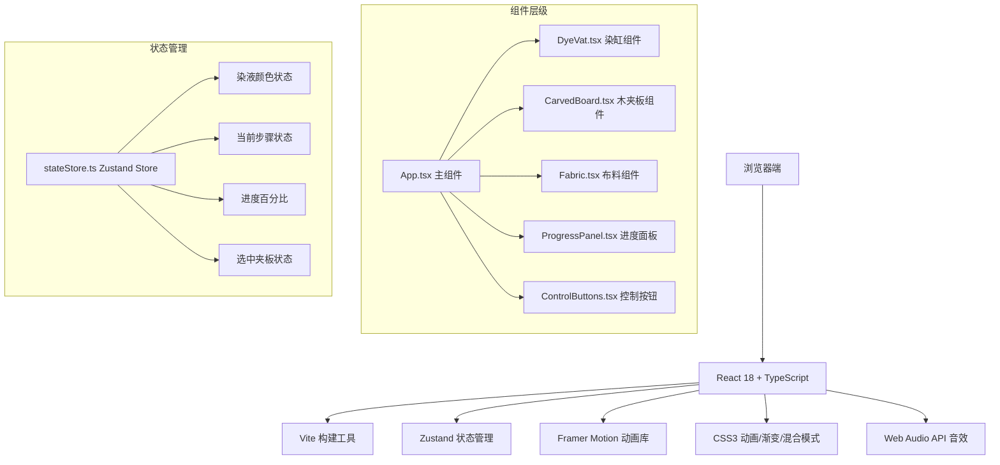

## 1. 架构设计



## 2. 技术描述

* **前端框架**: React 18 + TypeScript 4.9+

* **构建工具**: Vite 5.x

* **状态管理**: Zustand 4.x

* **动画库**: Framer Motion 11.x

* **样式方案**: 原生CSS3 + CSS Modules（内联样式与keyframes）

* **音效**: Web Audio API（原生实现，无需外部音频文件）

* **字体**: Google Fonts - Roboto, 系统字体 - KaiTi

## 3. 目录结构

```
├── index.html              # 入口HTML
├── package.json            # 项目依赖
├── vite.config.js          # Vite配置
├── tsconfig.json           # TypeScript配置
└── src/
    ├── App.tsx             # 主组件，场景组装与状态管理
    ├── main.tsx            # React入口
    ├── index.css           # 全局样式与CSS变量
    ├── components/
    │   ├── DyeVat.tsx      # 染缸组件（含调色滑块、染液渐变）
    │   ├── CarvedBoard.tsx # 木夹板组件（拖拽、沉没动画）
    │   ├── Fabric.tsx      # 布料组件（浸染、揭板、旋转）
    │   ├── DyePot.tsx      # 染料陶罐组件（点击弹出滑块）
    │   ├── ProgressPanel.tsx # "染经"进度面板
    │   └── BronzeButton.tsx # 铜镜样式按钮
    ├── store/
    │   └── stateStore.ts   # Zustand全局状态管理
    ├── types/
    │   └── index.ts        # TypeScript类型定义
    └── utils/
        ├── colorUtils.ts   # 颜色混合计算工具
        └── audioUtils.ts   # Web Audio音效工具
```

## 4. 核心数据模型与类型定义

```typescript
// 工艺步骤枚举
export type DyeStep = 'select' | 'mix' | 'dye' | 'reveal' | 'dry';

// 夹板类型
export interface BoardConfig {
  id: string;
  name: string;
  woodColor: string;
  clipPath: string;
  patternName: string;
}

// 染料配置
export interface DyeConfig {
  id: string;
  name: string;
  color: string;
  concentration: number; // 0-100
}

// 全局状态
export interface DyeState {
  currentStep: DyeStep;
  completedSteps: DyeStep[];
  progress: number; // 0-100
  selectedBoard: string | null;
  isBoardSubmerged: boolean;
  dyes: DyeConfig[];
  mixedColor: string;
  fabricColor: string;
  isDyed: boolean;
  isRevealed: boolean;
  fabricRotation: number;
}
```

## 5. 状态管理（Zustand）

```typescript
// src/store/stateStore.ts
import { create } from 'zustand';
import { DyeState, DyeStep, DyeConfig } from '../types';
import { mixColors } from '../utils/colorUtils';

const initialDyes: DyeConfig[] = [
  { id: 'indigo', name: '蓝草', color: '#1a5276', concentration: 0 },
  { id: 'madder', name: '茜草', color: '#c0392b', concentration: 0 },
  { id: 'sappan', name: '苏木', color: '#7b2d26', concentration: 0 },
];

export const useDyeStore = create<DyeState & {
  setDyeConcentration: (id: string, value: number) => void;
  selectBoard: (boardId: string) => void;
  submergeBoard: () => void;
  completeStep: (step: DyeStep) => void;
  startDyeing: () => void;
  revealPattern: () => void;
  setFabricRotation: (deg: number) => void;
  reset: () => void;
}>((set, get) => ({
  currentStep: 'select',
  completedSteps: [],
  progress: 0,
  selectedBoard: null,
  isBoardSubmerged: false,
  dyes: initialDyes,
  mixedColor: '#f5f0e1',
  fabricColor: '#f5f0e1',
  isDyed: false,
  isRevealed: false,
  fabricRotation: 0,

  setDyeConcentration: (id, value) => {
    set((state) => {
      const newDyes = state.dyes.map((d) =>
        d.id === id ? { ...d, concentration: value } : d
      );
      const mixedColor = mixColors(newDyes);
      return { dyes: newDyes, mixedColor };
    });
  },

  selectBoard: (boardId) => set({ selectedBoard: boardId }),
  submergeBoard: () => set({ isBoardSubmerged: true }),
  
  completeStep: (step) => {
    set((state) => {
      if (state.completedSteps.includes(step)) return state;
      const newCompleted = [...state.completedSteps, step];
      const progress = Math.min(newCompleted.length * 25, 100);
      return {
        completedSteps: newCompleted,
        progress,
      };
    });
  },

  startDyeing: () => {
    const { mixedColor } = get();
    set({ fabricColor: mixedColor, isDyed: true });
  },

  revealPattern: () => set({ isRevealed: true }),
  setFabricRotation: (deg) => set({ fabricRotation: deg }),
  reset: () => set({ /* 重置所有状态 */ }),
}));
```

## 6. 颜色混合算法（浏览器端计算）

```typescript
// src/utils/colorUtils.ts
export interface DyeConfig {
  color: string;
  concentration: number;
}

// 将十六进制颜色转换为RGB
export const hexToRgb = (hex: string): [number, number, number] => {
  const result = /^#?([a-f\d]{2})([a-f\d]{2})([a-f\d]{2})$/i.exec(hex);
  return result
    ? [
        parseInt(result[1], 16),
        parseInt(result[2], 16),
        parseInt(result[3], 16),
      ]
    : [245, 240, 225]; // 默认布料色
};

// 将RGB转换为十六进制
export const rgbToHex = (r: number, g: number, b: number): string => {
  return (
    '#' +
    [r, g, b]
      .map((x) => {
        const hex = Math.round(Math.max(0, Math.min(255, x))).toString(16);
        return hex.length === 1 ? '0' + hex : hex;
      })
      .join('')
  );
};

// 按浓度比例混合多种颜色
export const mixColors = (dyes: DyeConfig[]): string => {
  const totalConcentration = dyes.reduce((sum, d) => sum + d.concentration, 0);
  
  if (totalConcentration === 0) {
    return '#f5f0e1'; // 无染料时返回布料本色
  }

  let r = 0, g = 0, b = 0;
  
  for (const dye of dyes) {
    const [dr, dg, db] = hexToRgb(dye.color);
    const weight = dye.concentration / totalConcentration;
    r += dr * weight;
    g += dg * weight;
    b += db * weight;
  }

  return rgbToHex(r, g, b);
};
```

## 7. 关键技术实现要点

### 7.1 CSS clip-path 镂空花纹

* 六瓣莲花：使用polygon定义六个花瓣形状

* 卷草缠枝：使用path定义复杂曲线

* 飞凤含绶：组合多个基础形状

### 7.2 CSS mix-blend-mode 叠色

* 染缸内使用多层半透明div叠加

* `mix-blend-mode: multiply` 实现颜料混合效果

* 结合`opacity`与`concentration`动态调整

### 7.3 拖拽交互（Framer Motion）

* 使用`useDrag` hook实现夹板拖拽

* 拖拽过程中添加抖动动画（`animate: { rotate: [-1, 1, -1] }`）

* 检测释放位置是否在染缸区域内

### 7.4 布料旋转与光影联动

* `transform: rotateZ(${rotation}deg)` 实现旋转

* `box-shadow` 随旋转角度动态变化

* 动态计算高光位置模拟光照变化

### 7.5 Web Audio API 铜镜音效

* 创建`AudioContext`

* 生成880Hz正弦波

* 快速Attack + 指数Decay模拟金属清响

## 8. 性能优化策略

1. **CSS硬件加速**：所有动画使用`transform`和`opacity`属性
2. **will-change**：为频繁动画元素添加`will-change: transform`
3. **requestAnimationFrame**：颜色渐变使用RAF控制帧率
4. **事件节流**：滑块调节和拖拽事件使用节流
5. **组件memo**：使用`React.memo`避免不必要重渲染
6. **状态细粒度**：Zustand选择器只订阅需要的状态片段

