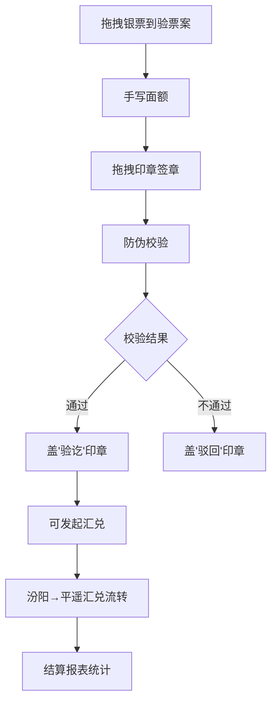

## 1. 产品概述

古代票号银票汇兑系统是一款在浏览器中模拟清代山西票号银票签发、兑付与跨号汇兑流转监管的全栈Web应用，解决传统银票在异地汇兑时票据真伪难辨、账目核对滞后以及防止伪造冒领的问题。

- 核心功能：银票签发、防伪校验、跨号汇兑流转、每日结算报表
- 目标用户：历史爱好者、金融史研究者、教育演示场景
- 产品价值：通过数字化手段还原古代票号运作机制，展示传统金融智慧与现代防伪技术的结合

## 2. 核心 Features

### 2.1 功能模块
1. **主场景界面**：清代山西票号柜房虚拟场景，包含银票架、验票案、印鉴架、账本图标
2. **银票签发模块**：拖拽银票、手写面额、签章交互
3. **防伪校验模块**：水印比对、骑缝编号校验、真伪判定
4. **跨号汇兑模块**：汾阳-平遥汇兑流转、地图可视化、进度展示
5. **结算报表模块**：当日交易统计、柱状图展示、近一周存量折线图

### 2.2 页面详情
| 页面名称 | 模块名称 | 功能描述 |
|-----------|-------------|---------------------|
| 主场景页面 | 银票架 | 展示空白银票，支持拖拽、悬停预览 |
| 主场景页面 | 验票案 | 银票放置区域，支持手写面额、签章 |
| 主场景页面 | 防伪校验 | 自动校验银票真伪，显示光晕/警报效果 |
| 主场景页面 | 地图面板 | SVG山西地图，展示汇兑流转过程 |
| 主场景页面 | 结算报表 | 弹窗展示当日交易数据和图表 |

## 3. 核心流程

### 3.1 银票签发流程
用户从左侧银票架拖拽空白银票到中央验票案 → 在银色书写区用鼠标手写面额 → 从右侧印鉴架拖拽印章到指定区域 → 系统自动播放盖章音效和高亮动画

### 3.2 防伪校验流程
银票放置到验票案后自动触发校验 → 比对水印、骑缝编号与后台数据库 → 匹配：翠绿色光晕 + 风声 + "验讫"印章；不匹配：暗红色光晕 + 鼓声 + "驳回"印章

### 3.3 跨号汇兑流程
点击汇兑按钮 → 银票从票架消失 → 汾阳闪烁变绿 → 进度条从0%到100%（8秒） → 平遥逐渐点亮 → 平遥票号出现对应银票 → 烟花粒子效果

### 3.4 结算报表流程
点击账本图标 → 弹出报表面板 → 展示当日签发/兑付/汇兑/库存数据 → 柱状图展示分类数据 → 折线图展示近一周存量

## 4. 用户界面设计

### 4.1 设计风格
- **主色调**：青砖灰瓦背景 #8b9a8b，檀木柜台 #4a2e1b，仿旧纸色 #f5e6d3
- **强调色**：朱红按钮 #c0392b，金色描边 #d4a017，金色高亮 #ffd700，翠绿光晕 #2ecc71，暗红警报 #8b0000，青瓷色 #16a085，深蓝色 #2c3e50
- **字体**：引入复古中文字体，体现清代票号风格
- **按钮风格**：中式古风圆角设计，朱红底色配金色描边，悬停转为深红 #96281b 并放大 1.05 倍，点击有 0.1 秒按压动画
- **布局风格**：左中右三栏布局（20% / 60% / 20%），桌面优先设计

### 4.2 页面设计概览
| 页面名称 | 模块名称 | UI 元素 |
|-----------|-------------|-------------|
| 主场景 | 银票架 | 悬停上浮效果、预览气泡（票号/金额/日期） |
| 主场景 | 验票案 | 银色书写区（Canvas 笔迹捕获）、签章区域、防伪光晕效果 |
| 主场景 | 印鉴架 | 可拖拽印章、盖章音效、金色高亮动画 |
| 主场景 | 地图面板 | SVG 山西地图、城池标记、折线路线、烟花粒子效果 |
| 主场景 | 结算报表 | Canvas 柱状图（青瓷→深蓝渐变）、折线图、交易列表 |

### 4.3 响应式设计
- 桌面端：左中右三栏布局（20% / 60% / 20%）
- 移动端（<768px）：左右栏折叠为汉堡菜单，主内容区域占满宽度
- 触控优化：支持触摸拖拽操作

### 4.4 动效设计
- 银票拖拽：使用 framer-motion 实现流畅拖拽
- 盖章效果：播放音效 + 金色 #ffd700 短暂高亮
- 校验通过：翠绿色 #2ecc71 光晕 + 清脆风声
- 校验失败：暗红色 #8b0000 光晕 + 低沉鼓声
- 汇兑流转：城池闪烁、进度条动画、烟花粒子效果（2秒）
- 按钮交互：悬停放大 1.05 倍、点击按压动画 0.1 秒
