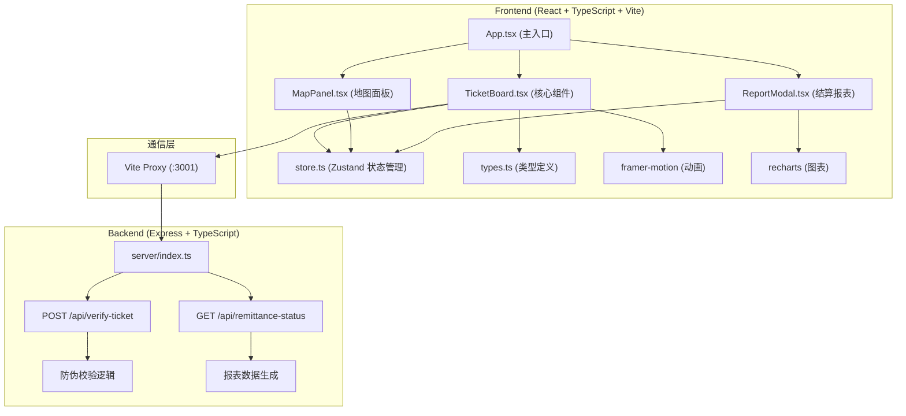
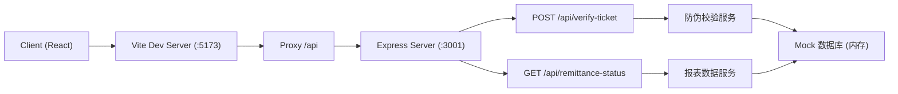
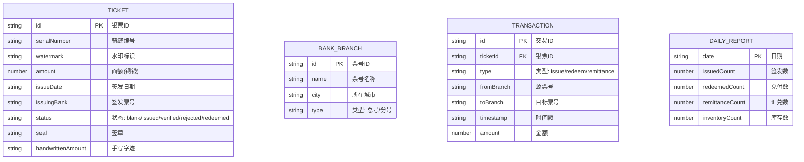

## 1. 架构设计



## 2. 技术描述

### 2.1 技术栈选型
- **前端框架**: React 18 + TypeScript
- **构建工具**: Vite 5.x
- **状态管理**: Zustand 4.x
- **动画库**: Framer Motion 11.x
- **图表库**: Recharts 2.x
- **后端框架**: Express 4.x + TypeScript
- **唯一标识**: uuid 9.x
- **CSS方案**: 原生CSS + CSS变量（不使用Tailwind，保持中式古风定制化）

### 2.2 项目初始化
- 使用 `vite-init` 脚手架创建 `react-express-ts` 模板
- 前端运行端口：5173（Vite默认）
- 后端运行端口：3001
- Vite配置代理 `/api` 到后端端口

## 3. 文件结构

```
auto68/
├── package.json
├── vite.config.js
├── tsconfig.json
├── index.html
├── src/
│   ├── types.ts          # 类型定义
│   ├── store.ts          # Zustand 状态管理
│   ├── App.tsx           # 主应用组件
│   ├── main.tsx          # 入口文件
│   ├── index.css         # 全局样式
│   └── components/
│       ├── TicketBoard.tsx    # 核心组件（银票架、验票案、印鉴架）
│       ├── MapPanel.tsx       # 地图面板组件
│       └── ReportModal.tsx    # 结算报表弹窗
└── server/
    └── index.ts          # Express 后端服务
```

## 4. 路由定义

| 路由 | 层 | 用途 |
|-------|------|---------|
| / | 前端 | 主场景页面（唯一页面） |
| POST /api/verify-ticket | 后端 | 银票防伪校验 |
| GET /api/remittance-status | 后端 | 获取汇兑进度和报表数据 |

## 5. API 定义

### 5.1 POST /api/verify-ticket
银票防伪校验接口，响应时间 ≤ 200ms

**请求体**:
```typescript
interface VerifyTicketRequest {
  ticketId: string;
  serialNumber: string;
  watermark: string;
  amount: number;
}
```

**响应体**:
```typescript
interface VerifyTicketResponse {
  success: boolean;
  verified: boolean;
  message: string;
  ticketId: string;
}
```

### 5.2 GET /api/remittance-status
获取汇兑进度和报表数据

**查询参数**:
- `?type=progress` - 获取汇兑进度
- `?type=report` - 获取结算报表数据

**响应体 (progress)**:
```typescript
interface RemittanceProgress {
  progress: number;      // 0-100
  fromCity: string;
  toCity: string;
  status: 'pending' | 'in_progress' | 'completed';
  ticketId: string;
}
```

**响应体 (report)**:
```typescript
interface ReportData {
  issuedCount: number;       // 当日签发
  redeemedCount: number;     // 当日兑付
  remittanceCount: number;   // 汇兑中转
  inventoryCount: number;    // 库存数量
  dailyData: Array<{
    date: string;
    issued: number;
    redeemed: number;
    inventory: number;
  }>;
  weeklyInventory: Array<{
    day: string;
    amount: number;
  }>;
}
```

## 6. 服务器架构



## 7. 数据模型

### 7.1 数据模型定义



### 7.2 核心 TypeScript 类型定义

```typescript
// src/types.ts
interface BankTicket {
  id: string;
  serialNumber: string;
  watermark: string;
  amount: number | null;
  issueDate: string;
  issuingBank: string;
  status: 'blank' | 'draft' | 'issued' | 'verified' | 'rejected' | 'redeemed';
  seal: string | null;
  handwrittenAmount: string | null;
  signaturePoints: Array<{ x: number; y: number }>;
}

interface BankBranch {
  id: string;
  name: string;
  city: 'fenyang' | 'pingyao' | 'taigu';
  type: 'headquarters' | 'branch';
  position: { x: number; y: number };
}

interface Transaction {
  id: string;
  ticketId: string;
  type: 'issue' | 'redeem' | 'remittance';
  fromBranch: string;
  toBranch: string | null;
  timestamp: string;
  amount: number;
}

interface VerificationResult {
  verified: boolean;
  message: string;
  edgeColor: '#2ecc71' | '#8b0000';
  sound: 'wind' | 'drum';
}

interface RemittanceState {
  inProgress: boolean;
  progress: number;
  fromCity: string;
  toCity: string;
  ticketId: string | null;
}
```

## 8. 性能指标

- **银票校验响应时间**: ≤ 200ms（后端模拟数据库查询）
- **汇兑动画帧率**: ≥ 50fps（使用 framer-motion 硬件加速）
- **页面首次加载时间**: ≤ 3秒（代码分割、资源优化）
- **动画流畅度**: 使用 CSS transform 和 opacity 属性，避免重排重绘
