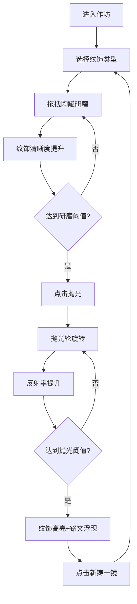

## 1. 产品概述

本项目是一个古代铜镜研磨与纹饰复现的Web交互体验应用，让用户以唐代铸镜匠人的身份，在虚拟镜作坊中完成铜镜从粗磨到精抛的完整工艺过程，沉浸式体验中华传统铸镜技艺的魅力。

- 核心价值：通过数字化交互重现古代铜镜制作工艺，兼具教育意义与艺术欣赏价值
- 目标用户：传统文化爱好者、文博学习者、普通互联网用户

## 2. 核心功能

### 2.1 功能模块

1. **主作坊场景**：CSS 3D构建的木质工作台、磨料陶罐、铜镜本体、抛光轮装置
2. **研磨交互系统**：拖拽陶罐研磨、纹饰渐进清晰、铜色渐变过渡
3. **抛光交互系统**：旋转抛光轮、反射率提升、动态高光跟随
4. **成就触发系统**：纹饰高亮勾勒、唐代铭文浮现、磨镜音效播放
5. **状态监控面板**：实时显示研磨进度、目数、反射率、抛光剩余时间
6. **重置系统**：一键新铸铜镜，带过渡动画

### 2.2 页面详情

| 页面名称 | 模块名称 | 功能描述 |
|---------|---------|----------|
| 主作坊页 | 3D场景渲染 | CSS 3D变换构建木质长案、陶罐、铜镜、抛光轮的立体场景 |
| 主作坊页 | 研磨交互 | 拖拽陶罐到铜镜上方释放，触发磨料粒子动画和研磨进度提升 |
| 主作坊页 | 纹饰渲染 | SVG绘制海兽葡萄纹、十二生肖纹、双鸾衔绶纹，blur值随进度降低 |
| 主作坊页 | 抛光交互 | 点击抛光按钮启动旋转动画，反射率渐进提升，高光点可交互跟随 |
| 主作坊页 | 成就系统 | 达到阈值后纹饰绿色高亮、铭文浮现、音效播放 |
| 主作坊页 | 信息面板 | 左侧显示实时数据，每100ms刷新 |
| 主作坊页 | 重置功能 | "新铸一镜"按钮重置所有状态，带淡出淡入过渡 |

## 3. 核心流程

用户进入作坊 → 选择纹饰类型 → 从左侧拖拽陶罐到铜镜上研磨（重复更换不同目数磨料）→ 观察纹饰逐渐清晰 → 点击抛光按钮启动抛光 → 观察反射率提升和高光效果 → 达到阈值触发铭文高亮成就 → 点击"新铸一镜"重置重新开始

## 4. 用户界面设计

### 4.1 设计风格

- **主色调**：暖色木质感，背景#3a2a1a，案面#7a5a3a，墙面#d4c4a8
- **铜器色**：暗铜色#8b6b4b → 明亮铜色#e8d4a0，高亮#b8860b和#ffd700
- **按钮风格**：仿古铜色渐变边框，hover时内发光效果，悬停放大1.05倍，点击缩小0.95倍
- **字体**：目数标签楷体，铭文行楷，数字信息面板使用等宽字体
- **布局**：非对称布局，左侧信息面板+磨料区，中央铜镜，右侧抛光轮
- **动画**：所有交互带过渡动画，拖拽缓动跟随，1秒淡出淡入重置效果

### 4.2 页面设计概述

| 页面名称 | 模块名称 | UI元素 |
|---------|---------|--------|
| 主作坊页 | 3D场景 | 木质长案透视效果、陶罐径向渐变砂粒、铜镜双层磨砂层、SVG纹饰路径 |
| 主作坊页 | 交互元素 | 可拖拽陶罐（5只，120/400/800/1200/2000目）、可点击抛光轮、重置按钮 |
| 主作坊页 | 信息面板 | 研磨进度条、当前目数标签、反射率数值、抛光倒计时 |
| 主作坊页 | 成就特效 | 绿色轮廓描边动画、行楷铭文浮入、磨镜音效 |
| 主作坊页 | 高光效果 | 40px椭圆形白色光斑、鼠标悬停跟随移动 |

### 4.3 响应性

- 桌面端优先设计，主场景居中显示
- 适配1280px及以上屏幕分辨率
- 鼠标拖拽优化，支持精准操作

### 4.4 CSS 3D场景指南

- **环境氛围**：唐代作坊暖光效果，柔和阴影模拟油灯照明
- **光照设置**：顶部主光源+环境漫反射，铜镜高光用radial-gradient实现
- **3D变换**：长案使用perspective和rotateX构建透视，陶罐和铜镜独立3D层
- **视角控制**：鼠标拖拽铜镜区域可旋转视角（rotateY）
- **动画性能**：使用transform和opacity属性动画，保证60fps流畅度
- **后处理效果**：CSS filter实现纹饰模糊、光泽度、阴影效果
