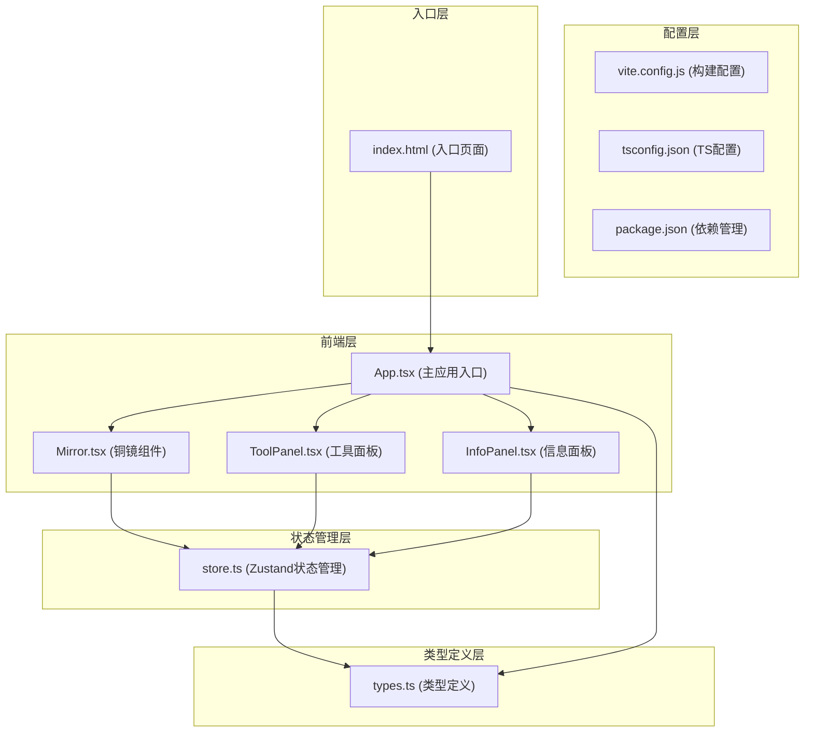

## 1. 架构设计



## 2. 技术描述

- **前端框架**: React@18 + TypeScript@5
- **构建工具**: Vite@5 + @vitejs/plugin-react@4
- **状态管理**: Zustand@4 (轻量高性能状态管理)
- **动画库**: framer-motion@11 (流畅的拖拽和过渡动画)
- **数据验证**: Zod@3 (运行时类型安全)
- **样式方案**: CSS Modules + CSS Variables + CSS 3D Transform
- **音效**: Web Audio API (程序化生成磨镜音效)

## 3. 核心文件结构

| 文件路径 | 职责说明 |
|---------|----------|
| `src/types.ts` | 定义镜面状态接口、研磨参数类型、纹饰枚举等 |
| `src/store.ts` | Zustand store管理铜镜状态、研磨进度、反射率、视角角度，提供重置动作 |
| `src/components/Mirror.tsx` | 渲染铜镜及纹饰SVG，接收研磨进度和反射率props，控制blur和高光效果 |
| `src/components/ToolPanel.tsx` | 渲染研磨罐拖拽区、抛光轮和重置按钮，触发状态变更 |
| `src/components/InfoPanel.tsx` | 实时显示研磨进度、目数、反射率、抛光剩余时间 |
| `src/App.tsx` | 组装场景布局，挂载store和组件，处理3D场景和视角旋转 |
| `src/main.tsx` | React应用入口 |
| `src/index.css` | 全局样式和CSS变量定义 |

## 4. 数据模型

### 4.1 类型定义 (types.ts)

```typescript
// 纹饰类型枚举
export enum PatternType {
  HAISHOU_PUTAO = 'haishou_putao',      // 海兽葡萄纹
  SHIERSHENGXIAO = 'shiershengxiao',    // 十二生肖纹
  SHUANGLUAN_XIANSHOU = 'shuangluan_xianshou'  // 双鸾衔绶纹
}

// 铜料材质
export enum CopperMaterial {
  TIN_BRONZE = 'tin_bronze',     // 锡青铜
  LEAD_BRONZE = 'lead_bronze'    // 铅青铜
}

// 磨料目数
export type GritSize = 120 | 400 | 800 | 1200 | 2000;

// 陶罐配置
export interface GrindingJar {
  id: string;
  grit: GritSize;
  color: string;
  label: string;
}

// 铜镜状态
export interface MirrorState {
  material: CopperMaterial;
  patternType: PatternType;
  grindingProgress: number;     // 0-100
  currentGrit: GritSize | null;
  reflectivity: number;         // 0-85
  isPolishing: boolean;
  polishingTimeRemaining: number;
  viewAngleY: number;           // 视角Y轴旋转角度
  isHighlighted: boolean;       // 成就高亮状态
  showInscription: boolean;     // 显示铭文
  inscriptionText: string;
  mirrorColor: string;
  patternBlur: number;          // 纹饰模糊值 0-8px
}

// Store动作
export interface MirrorActions {
  setMaterial: (material: CopperMaterial) => void;
  setPatternType: (pattern: PatternType) => void;
  grind: (grit: GritSize, amount: number) => void;
  startPolishing: () => void;
  updatePolishing: (delta: number) => void;
  setViewAngle: (angle: number) => void;
  triggerAchievement: () => void;
  hideInscription: () => void;
  reset: () => void;
}

export type MirrorStore = MirrorState & MirrorActions;
```

### 4.2 状态管理设计 (store.ts)

- 使用Zustand创建集中式store
- 每100ms刷新UI数据
- 研磨进度影响：铜色渐变、纹饰blur值降低
- 抛光过程影响：反射率提升、高光尺寸增加
- 成就触发条件：研磨进度≥85% 且 抛光完成(反射率≥85%)

## 5. 核心交互实现

### 5.1 拖拽研磨
- 使用framer-motion的useDrag hook实现陶罐拖拽
- 拖拽时罐身倾斜45度transform: rotate(45deg)
- 释放时检测是否在铜镜区域上方，触发磨料粒子动画
- 每次研磨根据目数增加进度值（高目数增加精细度，进度增长较慢）

### 5.2 抛光动画
- CSS @keyframes 实现抛光轮旋转，速度曲线ease-in
- 旋转周期从2秒加速到0.5秒，持续10秒
- 反射率每100ms增加0.85，10秒达到85%

### 5.3 高光跟随
- 鼠标悬停铜镜时，使用onMouseMove监听坐标
- 通过CSS变量动态更新高光位置transform: translate(x, y)
- 使用requestAnimationFrame确保60fps流畅度

### 5.4 3D视角旋转
- 铜镜区域绑定鼠标拖拽事件
- 水平拖拽更新viewAngleY状态
- 所有3D元素应用transform: perspective(1000px) rotateY(angle)

### 5.5 音效生成
- 使用Web Audio API的OscillatorNode生成金属摩擦声
- 频率范围：800-2000Hz，随研磨进度线性升高
- 音量范围：0.1-0.5，随进度线性增加
- 研磨时循环播放，停止后fade-out

## 6. 性能优化

- 使用CSS transform和opacity动画，触发GPU加速
- 状态更新使用Zustand的selector避免不必要重渲染
- 粒子动画使用CSS animation而非JS逐帧更新
- 信息面板使用memo包裹，仅依赖数据变化时更新
- requestAnimationFrame处理鼠标跟随和视角旋转
- 严格控制重渲染，目标帧率≥60fps，动画帧率≥30fps
